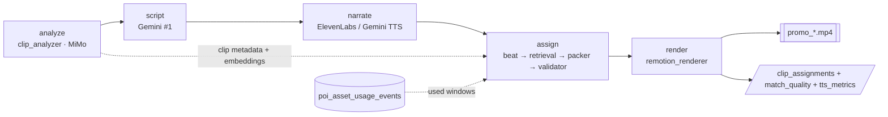
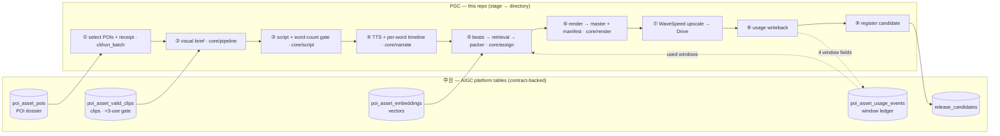

# PGC Pipeline Architecture

> **Engineer-facing project bible.** New readers: see [`README.md`](README.md) → [`promo/core/architecture.md`](promo/core/architecture.md) first. This doc assumes you already know what `narration_end`, `final_display_end`, sidecars, and the two-space model are — those are introduced in the umbrella's Vocabulary section.

Single source of truth for the pipeline's **load-bearing invariants**: which modules hold which responsibility, which sidecars cross module boundaries, and the correctness rules that must never silently drift. Read this before proposing any structural change to `promo/core/`.

**How this doc divides labor** (the discipline that keeps it honest): this file carries **invariants + pointers**; per-stage *internals* live in each subfolder's `architecture.md`. When a rule below concerns clip assignment, the verbatim mechanism lives in [`promo/core/assign/architecture.md`](promo/core/assign/architecture.md) — this file states the invariant and points there, it does **not** re-document the packer's house rules. Re-copying internals here is exactly how a bible drifts out of sync with the code; we don't.

## Pipeline overview (0 → mp4)

The end-to-end journey for a single `compile_promo` invocation. Each stage is a step in `promo.core.pipeline.full_pipeline`; sidecars on the side are what each stage writes or reads.



Clip assignment (stage 4) is **deterministic code** — it runs after real TTS timing exists, so its display-span math is measured, not predicted. The why-and-how is §The assignment engine below.

## Life of a video (data flow across the platform seam)

A different altitude from the pipeline overview: that one shows how code flows *inside this repo*; this one shows where the *data* comes from and goes — the seam between PGC (this repo) and the中台 platform tables (the AIGC repo). Left column = platform tables; right column = PGC stages mapped to directories.



**How to read it**: every left↔right line is a platform seam that must be backed by a `CONTRACT.md` entry — adding any new cross-line means a contract PR first (see `asset_platform/CONTRACT.md` in the AIGC repo). The window ledger (`poi_asset_usage_events`) is both read (stage ⑤, to rotate windows) and written (stage ⑧, the four window fields). Distribution-performance feedback (翻转三) is the deferred future bridge — the manifest already records enough to join it later; no line is drawn until it's built.

## Two-space model

**Plain English first.** The script and the video can have different lengths. The clip assignment is only responsible for *covering the script* — it stops worrying when the narrator stops speaking. The renderer is responsible for covering the full target duration; the gap between them is filled by extra clips called **bridges**. The **two-space model** names this split: assigner space stops at `narration_end`; renderer space goes to `final_display_end = max(target_duration_sec, narration_end)`.

**Engineering rigor.** The **#1 non-obvious invariant** in this pipeline is that the assigner and the renderer operate in different coordinate spaces.

- **Assigner space** — ceiling = `narration_end = word_timestamps[-1].end`. The hard constraint (`promo/core/assign/clip_assignment_validator.py::_enforce_hard_constraint_and_enrich`) requires each phrase's clip source to cover its `display_span_sec` up to `narration_end`. The last phrase's span stops at `narration_end`, NOT at `final_display_end`.
- **Renderer space** — ceiling = `final_display_end = max(target_duration_sec, narration_end)`. The renderer (`promo/core/render/remotion_renderer.py`) holds the last clip past `narration_end`; when the last clip's source runs out before `final_display_end`, the bridge pool fills the remaining delta.
- **Bridge tail** — `bridge_tail = max(0, target_duration_sec − narration_end)`. Renderer-only territory. Filled by either (a) last-clip extension or (b) bridge clips from the unused-clip pool. A `bridge_tail > 0` with **0 bridges fired** is a healthy render — it means the last clip's source duration happened to cover the delta.

**Who owns the invariant — and why it can't drift.** The two-space ceiling is enforced in **code**, not in any prompt: the **packer produces** assignments and the **validator arbitrates** them. Every assignment — no matter how it was produced — passes through `_enforce_hard_constraint_and_enrich`, the single arbiter.

```
packer picks clips ──▶ validator (_enforce_hard_constraint_and_enrich) ──▶ render
                          └ why: the validator is the ONLY arbiter of the renderer-facing
                            contract. If the packer's span math is wrong, it fails loud HERE
                            (ClipAssignmentError), so a freeze-prone assignment can never reach
                            the renderer. 〔mechanism → assign/architecture.md〕
```

Tying an assigner hard-constraint to `final_display_end` would collapse the distinction and convert unrecoverable assigner errors into territory the bridge mechanism is explicitly designed to handle — which is why the last-phrase ceiling is `narration_end`, full stop.

## The assignment engine

**What it is.** Stage 4 is a **deterministic chain — beat planner → per-beat retrieval → packer → validator** — with **zero generative-LLM calls** (no script/clip-picking model in the loop). One embedding call per video remains — the beat-query vectorization (`clip_retriever` → `clip_embedder` → OpenRouter `text-embedding-3-small`) — after which ranking and packing are pure numpy. The full mechanism (the packer's house rules, the embeddings ladder, window-field conventions) lives in [`promo/core/assign/architecture.md`](promo/core/assign/architecture.md); this section states only the invariants the rest of the bible depends on.

- **Measured, not predicted.** Assignment runs *after* TTS, so it works on real `word_timestamps` rather than a prompt-time guess. This is why a script→clip mismatch can't be smuggled in by timing drift.
- **Determinism.** Same inputs → same assignment, forever. No randomness, no generative model in the loop; the one embedding call is a deterministic function of beat text. Reproducibility and `--resume` correctness both depend on this.
- **Validator is the sole arbiter** (see Two-space model). Packer output is *always* re-validated; packer bugs fail loud, never silently ship.
- **Two eligibility rules, two different jobs**:
  - **Use-count is the only hard door** — the platform's `poi_asset_valid_clips` `<3-use` gate decides whether a clip may appear at all (enforced upstream). 
  - **Window rotation is a soft preference** — when a clip *is* reused, the packer avoids source windows already recorded in the usage ledger, to dodge TikTok's repeated-footage dedup. Exhaustion degrades to least-overlap + a provenance flag; it never rejects a clip. 〔why these are separate: use-count governs "can it play"; window governs "which seconds show" — conflating them would either starve thin pools or ship dedup-flagged repeats.〕
- **Fail-closed ledger reads** (设计契约 ②): if the window-ledger query fails in production, the variant fails (and `--resume` recovers) — it never silently degrades to naive playback.

**Why deterministic instead of an LLM picker** (conclusion + the short why; the full five-argument verdict is in [`docs/ROADMAP.md`](docs/ROADMAP.md) §翻转二): an LLM picker is blind to the window ledger, draws on the same information the deterministic chain already has, costs an entire immune-system of retries/validation to keep honest, and makes the narrative-variety rules implicit rather than explicit. The deterministic chain is auditable, reproducible, and free of LLM latency. The bible records *what is*; the decision debate lives in the ROADMAP.

## Module graph

**Responsibility boundaries**:

- `compile_promo.py` is the CLI shell. It owns argparse wiring, `load_dotenv()`, backend construction, and the `--render-props` shortcut; it delegates full-pipeline execution to `promo.core.pipeline.full_pipeline`. It does not own pipeline step ordering.
- `promo/core/pipeline/` is the orchestrator subpackage. `pipeline.py::full_pipeline` is the only module allowed to know the ordering of all pipeline steps; it calls `steps.py` helpers (including `_build_variant_selections` and `_assign_clips_packer`), delegates the per-variant body to `variant_loop.py::_run_variant_loop`, and emits the three per-run sidecars via `sidecar_writer.py::_emit_run_sidecars`. `bgm_voice_resolver.py` holds BGM discovery / voice-rotation helpers.
- `backend.py` — `PromoBackend` Protocol + `LocalBackend` implementation. The Protocol exposes `clips_dir()` and `output_dir()` so sibling-path derivations (`.mimo_cache/`, `.embedding_cache/`, sidecar staging) do not reach into private attrs. Concrete impls return `str | None`; `None` means "no backing directory" and callers fall back to per-file `os.path.dirname(output_path)`.
- `clip_analyzer.py` writes its own `.mimo_cache/*.json` atomically via `os.replace`; caching is internal to this module.
- The `assign/` stage makes **no generative-LLM call** — its modules (`beat_planner`, `clip_retriever`, `usage_windows`, `packer`, `clip_assignment_validator`) pick deterministically; the only external-model touch is `clip_embedder`'s single OpenRouter embedding call (beat-query vectorization), after which ranking is pure numpy. The **validator** holds the assigner-space hard constraint; the **packer** is the only module that picks clips. See [`assign/architecture.md`](promo/core/assign/architecture.md) for the per-module surface.
- `remotion_renderer.py` is the only module that knows about `final_display_end` and the bridge pool. Everything past `narration_end` is its responsibility. It imports `HARD_CONSTRAINT_TOL_SEC` from the validator so the two spaces agree on tolerance.
- `tts_engine.py` owns the dual-backend dispatch seam — exactly one `backend ==` check inside `generate_narration` routes per-batch audio to either `_generate_segment_audio_elevenlabs` or `_generate_segment_audio_gemini`. Both return `(path, duration_sec, word_timestamps)` of identical shape, so `_back_allocate_timestamps` and every downstream consumer (`_ffmpeg_concat_mp3s`, the assign stage, captions) are backend-agnostic. Backend resolves from `VOICE_CATALOG[voice_key]["backend"]`; the Gemini path prepends a directorial `style_prompt` and runs MMS_FA on the rendered mp3.
- `forced_aligner.py` wraps `torchaudio.pipelines.MMS_FA` (wav2vec2 CTC). Invoked ONLY on the Gemini backend path — ElevenLabs continues to use the API's returned alignment. Bypasses `torchaudio.load` (which now requires `torchcodec`) via ffmpeg preconvert + stdlib `wave`. Below-0.60 avg CTC scores log a warning (diagnostic only).

  Structural failures — empty normalization (non-alphabetic token) or empty span list from MMS_FA — surface as `ForcedAlignmentError`, naming the offending token + script position.
- `clip_embedder.py` owns the embedding-cache sidecars (atomic `os.replace`). Four-axis invalidation: model + dim + MiMo-prompt SHA1 + composition version — so any change to the MiMo prompt OR to the embedding composition formula produces a fresh filename rather than silently overwriting. It also embeds the per-beat retrieval queries (the same `text-embedding-3-small`@1536 model+dim as the platform table).
- `clip_retriever.py` is stateless by design — no `@lru_cache`, no module-level memo. It re-embeds queries + re-ranks on every invocation; a memoized top-k could return stale candidates and there is no reason to risk it in a deterministic path.
- `arsenal_loader.py` is the **single thin reader** for the 4 arsenal sub-libraries (system prompts / voices / personas / script skeletons) under `promo/arsenal/`. Every consumer (`clip_analyzer`, `script_generator`, `tts_engine`, `format_profiles`, `persona_selectors`) imports through here — no consumer reads `arsenal/*.md` or `arsenal/*.yaml` directly. Loaders are LRU-cached so module-import I/O happens once per process. `.rstrip()` on system-prompt reads is the load-bearing guard against editor-added trailing newlines (the MiMo cache `_cache_version_suffix` would silently drift otherwise — see Pool conventions ::Arsenal).

## Sidecar producer/consumer

Every sidecar JSON file that crosses a module boundary is listed here with its producer AND at least one consumer. Orphan sidecars (written but never read, or read but never written) violate this section's invariant.

**Sidecar inventory**:

| Sidecar | Producer | Primary consumer(s) | Purpose |
|---|---|---|---|
| `clip_assignments_<slug>_<dur>s.json` | `promo.core.pipeline.sidecar_writer._emit_run_sidecars` (wraps the packer output via `_write_sidecar`) | `clip_assignment_sidecar.load_latest_clip_assignments` (debug/replay tests) | Frozen packer assignment per variant + provenance (`picks`, `beat_count`/`unique_clip_count`, `window_exhausted_beats`); the handoff surface from assign to downstream. |
| `tts_metrics_<slug>_<dur>s.json` | `promo.core.pipeline.sidecar_writer._emit_run_sidecars` | `pause_budget.load_calibrated_wpm` (NEXT run's bootstrap) | Per-variant `measured_wpm`, `narration_coverage`, `duration_sec`; enables POI-scoped WPM self-calibration after run 1. |
| `match_quality_<slug>_<dur>s.json` | `promo.core.pipeline.sidecar_writer._emit_run_sidecars` (from `match_quality.build_match_quality_entries`) | Human review (luxury-bias + low-overlap diagnostic) | Per-phrase clip/MiMo-description keyword overlap signal. Consumed out-of-band — no automated reader. |
| `.mimo_cache/<content_hash>-<version_suffix>.json` | `clip_analyzer._save_cached_analysis` (atomic `os.replace`) | `clip_analyzer._load_cached_analysis` (same-prompt+model reruns) | Prompt+model version-locked MiMo cache. Any prompt/model change invalidates the cache via the 8-hex suffix. |
| `.embedding_cache/<model>-<dim>-<mimo_prompt_sha1>-v<composition_version>.json` | `clip_embedder._save_sidecar` (atomic `os.replace`) | `clip_embedder.load_embeddings_for_poi` + `clip_retriever` via `attach_embeddings_to_metadata` | Per-POI OpenAI `text-embedding-3-small` vectors (1536-D) over `"<scene_description> \| <category>"`, keyed by clip_id. Four-axis invalidation: any MiMo prompt/model change bumps `mimo_prompt_sha1`; any composition-formula change bumps `COMPOSITION_VERSION`. Payload stores `{vector, input}` per clip so embedding inputs are auditable without re-deriving. |

Collision-bumped variants (`<stem>-2.json`, `-3.json`, ...) may exist alongside the base filename when multiple runs share an `output_dir`; readers glob for the stem + bumped forms and pick the most recent by mtime. The same `-N` algorithm applies to the MP4 output path (`backend.LocalBackend.save_output`) so a back-to-back same-POI same-duration rerun produces `promo_<slug>-2.mp4` paired with the bumped sidecar JSONs by suffix.

## Error taxonomy

The named exceptions all live in `promo/core/errors.py`. Each carries a recovery contract — if a stage's "Raises" disagrees with this taxonomy, one of the docs is wrong.

- `ClipAssignmentError` — raised in the assign stage when a phrase's `display_span_sec` cannot be covered (`clip_dur − trim_start + TOL`): the **packer** raises it when no coverable unused candidate exists, and the **validator** raises it if packer output violates the hard constraint. **Assigner-space** violation. **No retry** — it aborts the variant directly; `--resume` re-renders. (The deterministic chain has no script-regeneration loop; a coverage failure is a real "this POI's pool can't cover this beat," surfaced loud rather than papered over.)
- `FreezeWouldOccurError` — raised by `remotion_renderer._bind_clips_to_narration` when the bridge pool is exhausted before `final_display_end`. **Renderer-space** violation. No retry; the render aborts.
- `MimoAnalysisError` — raised by `clip_analyzer.analyze_single_clip` on persistent MiMo failure after the retry budget. The first failure aborts the concurrent pool; the pipeline exits non-zero naming the clip.
- `NoSuitableBGMError` — raised by `_discover_bgm_files` when no BGM in `--bgm-dir` meets `min_duration_sec`. Aborts before any variant runs.
- `ForcedAlignmentError` — surfaces from `forced_aligner.align_words` on structural alignment failures (empty normalization or empty span list from MMS_FA). Attribute-bearing (`.token`, `.position`, `.reason`). Below-threshold per-word CTC scores (< 0.60) are warn-only and never abort — the warn-only policy preserves best-effort timestamps so a single low-confidence token does not cascade into a variant-level failure.

## Selector seams

Per-variant format and persona selection live behind two runtime-checkable Protocols so the variant loop in `promo.core.pipeline.full_pipeline` reads as `selector.select(n_variants, poi_name=..., clip_metadata=...)` regardless of which selector implementation is active.

Format axis: `SingleFormatSelector` (default — pins every variant to the profile derived from `--target-duration-sec`) and `RandomFormatSelector` (samples per variant from `FORMAT_TEMPLATES` when `PROMO_FORMAT_SELECTOR=random`).

Persona axis: `SinglePersonaSelector` and `RandomPersonaSelector`. `RandomPersonaSelector` becomes observable when ≥2 persona YAMLs ship in `promo/arsenal/personas/`.

A future `SmartFormatSelector` / `SmartPersonaSelector` (clip-metadata + POI-aware) drops in without touching the variant loop.

**Protocol locations** (both `runtime_checkable`):

- `promo/core/selection/protocols.py::FormatSelector` — `select(n_variants, *, poi_name, clip_metadata) -> list[PromoFormatProfile]`.
- `promo/core/selection/protocols.py::PersonaSelector` — `select(n_variants, *, poi_name, clip_metadata) -> list[NarratorPersona]`.

**Adding a new selector implementation**:

1. Create a class with the matching `select` signature (no inheritance required — Protocols are structural). Place it in `promo/core/selection/format_selectors.py` or `persona_selectors.py` so the package's `__init__.py` re-exports it.
2. Wire it into `promo.core.pipeline.steps._build_variant_selections` behind a new `PROMO_FORMAT_SELECTOR` (or `PROMO_PERSONA_SELECTOR`) value, and teach `promo.core.config.promo_format_selector` to accept the new string. Reject unknown values with `ConfigError` so misconfigured env vars fail fast at pipeline startup.
3. Keep the selector's PRNG isolated via `promo.core.selection._seed.make_seeded_random(seed)` — never reach for the process-global `random` state.

**Adding a new format template**:

1. Drop a fresh `*.yaml` in `promo/arsenal/script_skeletons/` (mirror `short_30s.yaml` / `long_65s.yaml`). The YAML must declare a unique `mode` field — that becomes the dispatch key. `arsenal_loader.load_format_templates()` picks it up automatically at the next module-import; no Python edit required.
2. Populate the new mode-specific fields `sentence_rule` (per-mode RULES bullet that fills `$sentence_rule` in `gemini1_script_v1.md`) and `extra_rules` (additional RULES bullets joined into `$extra_rules_block`) per the `PromoFormatProfile` schema. Persona is mode-agnostic — do NOT inline format-specific cadence rules into a persona YAML.
3. Re-validate the random selector tests in `promo/tests/test_selection.py` — the random distribution test pins a seed against the current key set.

**Cold-reader entry points**:

- `promo/core/format_profiles.py::FORMAT_TEMPLATES` — the discoverable registry of every format template the random selector samples (rebuilt from `arsenal/script_skeletons/*.yaml` at module import).
- `promo/arsenal/personas/*.yaml` — manually-curated persona library (the `RandomPersonaSelector` resolves YAMLs by file path; no code changes needed when a new persona drops in).
- `promo/core/selection/__init__.py` — public re-exports for `FormatSelector`, `PersonaSelector`, default implementations, and `make_seeded_random`.
- `promo/core/config.py::promo_format_selector` — the `PROMO_FORMAT_SELECTOR` resolver that names the active `FormatSelector` implementation; rejects unknown values.

**Two-space invariant under per-variant duration**: when a variant mix contains both short (30s) and long (65s) profiles, the assigner ceiling and renderer ceiling math (see "Two-space model" above) apply per variant against the variant's own profile target — `narration_end` is per-script, `bridge_tail = max(0, profile.target_duration_sec − narration_end)` is per-variant, and `final_display_end = max(profile.target_duration_sec, narration_end)` is per-variant. The sidecar `script.json::target_duration_sec` field records the variant's own target so post-hoc tools can recover the per-variant ceiling without re-running the selector.

## LLM quarantine

Two network quarantine lanes carry the pipeline's external-service traffic. Both follow the project's Pluggability Charter — narrowly scoped (one Gemini SDK + two TTS vendors) so a future second LLM provider drops in by adding a sibling module, not by re-architecting.

**Charter Rule 1 — `google.generativeai` quarantine.** `promo/core/llm/gemini_client.py` is the only allowed `import google.generativeai` site in the repo. Every other file calls Gemini through the helpers re-exported there (`configure_gemini`, `reset_for_tests`, `resolve_gemini_model`) plus the `GeminiModel` type alias. The sole production Gemini consumer is `promo/core/script/script_generator.py` (Gemini #1, the script writer) via `model_adapters/gemini.py`. The companion helpers `promo/core/llm/retry.py` (`retry_with_backoff`) and `promo/core/llm/json_response.py` (`parse_json_response`) are LLM-call utilities; their consumers are `clip_analyzer` (MiMo, retry only), `script_gemini_caller` (Gemini, retry + JSON parse), `clip_embedder` (OpenRouter embeddings, retry only), and `tts_elevenlabs` (retry only). The assign stage is intentionally absent — it makes no Gemini call.

**Charter Rule 2 — single config resolver.** `promo/core/config.py` is the single place production code reads env vars. Resolvers are typed (`_require` / `_require_int` / `_require_float`) and fail fast on missing/whitespace values. The LLM quarantine module (`promo/core/llm/gemini_client.py`) is carved out for `GEMINI_MODEL` only — read directly via `os.getenv`, defaulting to `model_adapters.registry.GEMINI_TEXT_MODEL` (the model contacts book — see §Environment). `GEMINI_API_KEY` still routes through the resolver.

**Second quarantine lane — TTS.** Both narrate-stage backend modules (`promo/core/narrate/tts_elevenlabs.py` and `promo/core/narrate/tts_gemini.py`) import `requests` directly to call their respective vendors. The facade `promo/core/narrate/tts_engine.py` owns the dispatch seam — a single `backend ==` check inside `generate_narration` routes to the correct backend module. The `narrate/` folder is the bounded scope of this quarantine lane. Protocol typing is applied where a seam has multiple implementations from day one and a stable interface (`FormatSelector`, `PersonaSelector`); it is deferred for the TTS dispatch because the dispatch shape is co-evolving and structural Protocols would freeze it without removing a line of dispatch logic.

## Pool conventions

Three sibling pools live under each `material/<slug>/`:

- **`material/<slug>/clips/`** — live clip pool consumed by `compile_promo --local-clips`. Supplied out-of-band; gitignored.
- **`material/<slug>/.mimo_cache/`** — MiMo analysis cache. Key: `<content_hash>-<version_suffix>.json` where `<version_suffix>` is the first 8 hex of SHA1 over `_ANALYSIS_PROMPT + PROMO_CLIP_MODEL`. Any prompt or model change invalidates the cache automatically.
- **`material/<slug>/.embedding_cache/`** — clip-text embedding vectors. Key: `text-embedding-3-small-1536-<mimo_prompt_sha1>-v<composition_version>.json`. ONE sidecar per POI (not per clip). Four-axis invalidation: model + dim + `mimo_prompt_sha1` (matches the MiMo cache suffix exactly, so embeddings invalidate in lockstep with MiMo) + `composition_version` (manually-bumped integer in `clip_embedder.COMPOSITION_VERSION`). Payload shape: `{"model", "dim", "mimo_prompt_sha1", "composition_version", "embeddings": {clip_id: {"vector": [...], "input": str}}}`. Populate with `python3 -m promo.cli.build_embedding_index --poi <slug>`.

### Arsenal

`promo/arsenal/` is the single home for the 4 "library-shape" data assets the operator extends over time. Logic stays in Python; data leaves Python. Every file under `arsenal/` is read through `promo/core/arsenal_loader.py` — no consumer reads `arsenal/*.md` or `arsenal/*.yaml` directly. Each sub-library has a fixed slot in the pipeline:

- **`arsenal/system_prompts/*.md`** — the 2 LLM prompts: `mimo_clip_analysis_v1.md` (MiMo clip analysis; the `_cache_version_suffix` baseline is the first 8 hex of SHA1 over its content + clip model) and `gemini1_script_v1.md` (Gemini #1 script body — `string.Template` placeholders; literal `$` escaped as `$$`). MD files MUST be stored without trailing newline so the MiMo cache invariant survives editor saves; `arsenal_loader.load_system_prompt` `.rstrip()`s on read as a defensive belt.
- **`arsenal/voices/catalog.yaml`** — the voice catalog (4 entries: `kore` Gemini, `jarnathan`/`hope`/`heather` ElevenLabs). Order matters — Gemini-first preserves the dispatch rotation contract `compile_promo._resolve_voice_keys` reads. Required fields: `id`, `name`, `gender`, `age`, `accent`, `description`, `backend`. Optional: `style_prompt` (Gemini-only directorial instruction).
- **`arsenal/personas/*.yaml`** — narrator personas. Persona is voice/perspective only — no format/segment-specific rules (those live in skeletons). Adding a persona = drop a YAML.
- **`arsenal/script_skeletons/*.yaml`** — promo format templates (currently `short_30s.yaml` + `long_65s.yaml`). Each YAML constructs one `PromoFormatProfile` via `arsenal_loader.load_format_template(key)`, and carries the per-type personality (segment plan, word-count band, pacing `beat_min/max_sec`, `pause_cap_ms`, asset floors) on the card itself — adding a type = drop a YAML + format-tagged examples, zero Python. Per-mode RULES content lives here in `sentence_rule` (single-line cadence bullet) and `extra_rules` (list of additional bullets).

**Versioning rule**: prompts are filename-versioned (`*_v1.md`, `*_v2.md`, ...). Bumping a version invalidates per-POI MiMo cache automatically (the `_cache_version_suffix` changes), which is the correct behaviour when the prompt changes. See `promo/arsenal/README.md` for the operator-facing recipe.

## Slug conventions

Two slug forms exist and are not interchangeable:

- **Material directory** — lowercase + hyphens: `material/hotel-xcaret-arte/clips/`.
- **Sidecar filename** — lowercase + underscores: `tts_metrics_hotel_xcaret_arte_65s.json`.

The conversion is `promo.core.sanitize_poi_name(display_name)` — the single source of truth. The `compile_promo --poi` argument takes the display name with spaces (`"Hotel Xcaret Arte"`) and routes through `sanitize_poi_name` at sidecar write time.

External callers of `pause_budget.load_calibrated_wpm`, `clip_assignment_sidecar.load_latest_clip_assignments`, or any other sidecar reader MUST route the display name through `sanitize_poi_name`. Passing the material slug (with hyphens) silently misses the sidecar and returns `None`.

## Extension points

- **Multi-clip-per-phrase schema**: extend the assignment schema from a single `clip_id` per phrase to `{clip_ids: [...], trim_starts: [...]}`, enabling phrase-level cuts when a single clip cannot cover `display_span_sec`. Assigner-space ceiling stays at `narration_end`; the validator already tiles per-phrase spans, so the change is localized to the packer + schema.
- **Per-voice WPM calibration**: `load_calibrated_wpm` averages across variants within one sidecar; per-voice averaging (separating ElevenLabs voices from Gemini Kore) is a known gap. Trigger condition: observed WPM variance > 15% across voice × text.
- **Smart selectors**: clip-metadata + POI-aware `SmartFormatSelector` / `SmartPersonaSelector` drop in behind the existing `FormatSelector` / `PersonaSelector` Protocols without touching the variant loop.
- **Shot-pacing knobs on the card**: the packer's beat ceiling/floor (`beat_planner.DEFAULT_MAX/MIN_BEAT_SEC`, 4.0/2.0) are surfaced per-type on the skeleton card's `pacing` block — tune cadence by editing the YAML, not the code.
- **`tts_engine` Protocol**: a `TTSBackend` Protocol is deferred until a third TTS vendor lands. The single-file dual-backend dispatch is the correct shape today.

## Environment

Env vars are resolved through `promo/core/config.py` (typed resolvers, fail-fast on missing/whitespace). The three required-for-compile keys (`OPENROUTER_API_KEY`, `GEMINI_API_KEY`, `ELEVENLABS_API_KEY`) and operational knobs (`GEMINI_MODEL`, `PROMO_RENDER_CONCURRENCY`, `PROMO_FORMAT_SELECTOR`, etc.) are documented in `README.md` and `.env.example`.

Model identifiers (which Gemini/MiMo/embedding/TTS model each stage calls) live in one place — `promo/core/model_adapters/registry.py`, the **model contacts book**. Swap a model there (or via the env override noted alongside, e.g. `GEMINI_MODEL` overrides `GEMINI_TEXT_MODEL`, `PROMO_CLIP_MODEL` overrides `MIMO_CLIP_MODEL`); no model-name string literal should live outside that module.

Forced-aligner runtime requires `torch >= 2.8` + `torchaudio >= 2.8`. `torchcodec` is deliberately NOT required: `forced_aligner` bypasses `torchaudio.load` via ffmpeg preconvert + stdlib `wave`.

## Retirement archive

Retired machinery, kept here so the rollback story survives without scattering obituaries through the live text. This repo has **no `archive/`/`legacy/` directory** — git history is the cold storage.

- **Gemini #2 clip-assignment chain** (retired 2026-06-11, commit `1f28902`). Was the LLM clip-picker: `clip_assigner.py` (`assign_clips` / `assign_clips_with_f3_retry`), the `gemini2_assign_v1.md` prompt, the **F3 retry** (on `ClipAssignmentError`, regenerate the script via a `build_tighten_hint` message to Gemini #1, re-TTS, retry once), the `gemini1_f3_retry_v1.md` prompt, and the deterministic **split-repair** stopgap. Replaced wholesale by the deterministic chain (beat planner → retrieval → packer → validator) after the same-script A/B verdict went to the packer. **Rollback** = `git revert 1f28902` + redeploy the worktree (`cd promo/remotion && npm install` before preflight). The two-space invariant the old Gemini #2 prompt used to carry now lives in code — the validator — and in `assign/architecture.md`.
