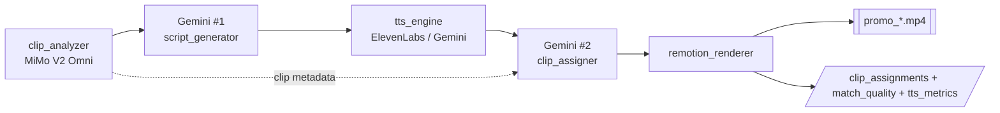
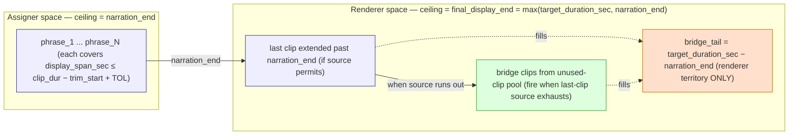

# Promo Lab Architecture

> **Engineer-facing project bible.** New readers: see [`README.md`](README.md) → [`promo/core/architecture.md`](promo/core/architecture.md) first. This doc assumes you already know what `narration_end`, `final_display_end`, sidecars, F3 retry, the soft-hint contract, and the two-space model are — those are introduced in the umbrella's Vocabulary section.

Single source of truth for how the standalone promo-video pipeline is structured: which modules hold which responsibility, which sidecars cross module boundaries, and where the load-bearing invariants live. Read this before proposing any structural change to `promo/core/`.

## Pipeline overview (0 → mp4)

The end-to-end journey for a single `compile_promo` invocation. Each stage is a step in `promo.core.pipeline.full_pipeline`; sidecars on the side are what each stage writes or reads.

Three lenses follow:

- **Two-space model** — the most load-bearing invariant: assigner vs renderer coordinate spaces.
- **Module graph** — ownership boundaries, who orchestrates whom.
- **Sidecar producer/consumer** — every JSON that crosses a module boundary, producer paired with consumer.

## Two-space model

**Plain English first.** The script and the video can have different lengths. The clip-picker (Gemini #2) is only responsible for covering the script — it stops worrying when the narrator stops speaking. The renderer is responsible for covering the full target duration; the gap between them is filled by extra clips called **bridges**. The **two-space model** names this split: assigner space stops at `narration_end`; renderer space goes to `final_display_end = max(target_duration_sec, narration_end)`.

**Engineering rigor.** The **#1 non-obvious invariant** in this pipeline is that the assigner and the renderer operate in different coordinate spaces.

- **Assigner space** — ceiling = `narration_end = word_timestamps[-1].end`. Every assigner hard-constraint (`promo/core/assign/clip_assigner.py::_enforce_hard_constraint_and_enrich`) requires each phrase's clip source to cover `display_span_sec` up to `narration_end`. The last phrase's span stops at `narration_end`, NOT at `final_display_end`.
- **Renderer space** — ceiling = `final_display_end = max(target_duration_sec, narration_end)`. The renderer (`promo/core/render/remotion_renderer.py`) holds the last clip past `narration_end`; when the last clip's source runs out before `final_display_end`, the bridge pool fills the remaining delta.
- **Bridge tail** — `bridge_tail = max(0, target_duration_sec − narration_end)`. Renderer-only territory. Filled by either (a) last-clip extension or (b) bridge clips from the unused-clip pool. A `bridge_tail > 0` with **0 bridges fired** is a healthy render — it means the last clip's source duration happened to cover the delta.

**Failure modes and their correct homes**:

- `ClipAssignmentError` — assigner space violation (a phrase's clip cannot cover its `display_span_sec`). Raised by `_enforce_hard_constraint_and_enrich`.
- `FreezeWouldOccurError` — renderer space exhaustion (bridge pool empty AND last clip source exhausted before `final_display_end`). Raised by `_bind_clips_to_narration`.

Tying an assigner hard-constraint to `final_display_end` collapses the distinction and converts unrecoverable assigner errors into territory the bridge mechanism is explicitly designed to handle.

The Gemini #2 prompt is the load-bearing prose surface for this invariant — `promo/arsenal/system_prompts/gemini2_assign_v1.md` carries the verbatim two-space-model phrasing ("PRECOMPUTED CONSTANTS", "ARITHMETIC CHECK", "the last phrase's constraint uses the last word's end, NOT target_duration_sec", "bridge mechanism"). Past iterations have turned on Gemini drifting these exact phrases when the MD wording shifted; if you edit the MD, preserve the wording or update this section in the same commit.

## Module graph

**Responsibility boundaries**:

- `compile_promo.py` is the CLI shell. It owns argparse wiring, `load_dotenv()`, backend construction, and the `--render-props` shortcut; it delegates full-pipeline execution to `promo.core.pipeline.full_pipeline`. It does not own pipeline step ordering.
- `promo/core/pipeline/` is the orchestrator subpackage. `pipeline.py::full_pipeline` is the only module allowed to know the ordering of all pipeline steps; it calls `steps.py` helpers (including `_build_variant_selections`), delegates the per-variant body to `variant_loop.py::_run_variant_loop`, and emits the three per-run sidecars via `sidecar_writer.py::_emit_run_sidecars`. `bgm_voice_resolver.py` holds BGM discovery / voice-rotation helpers.
- `backend.py` — `PromoBackend` Protocol + `LocalBackend` implementation. The Protocol exposes `clips_dir()` and `output_dir()` so sibling-path derivations (`.mimo_cache/`, `.embedding_cache/`, sidecar staging) do not reach into private attrs. Concrete impls return `str | None`; `None` means "no backing directory" and callers fall back to per-file `os.path.dirname(output_path)`.
- `clip_analyzer.py` writes its own `.mimo_cache/*.json` atomically via `os.replace`; caching is internal to this module.
- `clip_assigner.py` is **Gemini #2** — it runs AFTER real TTS timing exists, so its display-span math is measured, not predicted. Its hard constraint lives in assigner space.
- `remotion_renderer.py` is the only module that knows about `final_display_end` and the bridge pool. Everything past `narration_end` is its responsibility.
- `tts_engine.py` owns the dual-backend dispatch seam — exactly one `backend ==` check inside `generate_narration` routes per-batch audio to either `_generate_segment_audio_elevenlabs` or `_generate_segment_audio_gemini`. Both return `(path, duration_sec, word_timestamps)` of identical shape, so `_back_allocate_timestamps` and every downstream consumer (`_ffmpeg_concat_mp3s`, `clip_assigner`, captions) are backend-agnostic. Backend resolves from `VOICE_CATALOG[voice_key]["backend"]`; the Gemini path prepends a directorial `style_prompt` and runs MMS_FA on the rendered mp3.
- `forced_aligner.py` wraps `torchaudio.pipelines.MMS_FA` (wav2vec2 CTC). Invoked ONLY on the Gemini backend path — ElevenLabs continues to use the API's returned alignment. Bypasses `torchaudio.load` (which now requires `torchcodec`) via ffmpeg preconvert + stdlib `wave`. Below-0.60 avg CTC scores log a warning (diagnostic only).

  Structural failures — empty normalization (non-alphabetic token) or empty span list from MMS_FA — surface as `ForcedAlignmentError`, naming the offending token + script position.
- `clip_embedder.py` owns the embedding-cache sidecars (atomic `os.replace`). Four-axis invalidation: model + dim + MiMo-prompt SHA1 + composition version — so any change to the MiMo prompt OR to the embedding composition formula produces a fresh filename rather than silently overwriting. `attach_embeddings_to_metadata` merges sidecar vectors onto MiMo metadata at the `_step_assign_clips` closure-construction site; missing entries (sidecar pool smaller than MiMo pool) drop out with a WARNING and trigger the full-pool fallback in the retrieval closure.
- `clip_retriever.py` is stateless by design — no `@lru_cache`, no module-level memo. The F3 retry path (Gemini #1 script regeneration on `ClipAssignmentError`) rewrites the narration segments; a memoized top-k would return stale candidates after the retry. Consumers re-embed queries + re-rank on every invocation.
- `arsenal_loader.py` is the **single thin reader** for the 4 arsenal sub-libraries (system prompts / voices / personas / script skeletons) under `promo/arsenal/`. Every consumer (`clip_analyzer`, `script_generator`, `clip_assigner`, `tts_engine`, `format_profiles`) imports through here — no consumer reads `arsenal/*.md` or `arsenal/*.yaml` directly. Loaders are LRU-cached so module-import I/O happens once per process. `.rstrip()` on system-prompt reads is the load-bearing guard against editor-added trailing newlines (the MiMo cache `_cache_version_suffix` would silently drift otherwise — see Pool conventions ::Arsenal).
- **Retrieval is a soft hint**: the retrieved subset is what Gemini #2 *sees* in its prompt, but its reply is NOT rejected when it names a `clip_id` outside that subset. `clip_assigner.assign_clips_with_f3_retry` catches retrieval-closure exceptions defensively; `_enforce_hard_constraint_and_enrich` carries no `clip_id in retrieved_ids` guard. Four `fallback_reason` codes (`no_sidecar`, `m4_attach_shrinkage`, `h2_union_shortfall`, `retrieval_exception`) encode cases where retrieval did not narrow the pool. The `clip_assignments_*.json` sidecar records this contract via the `retrieval_contract: "soft_hint"` field. See `docs/schemas/clip_assignments.md` for the plain-language summary.

## Sidecar producer/consumer

Every sidecar JSON file that crosses a module boundary is listed here with its producer AND at least one consumer. Orphan sidecars (written but never read, or read but never written) violate this section's invariant.

**Sidecar inventory**:

| Sidecar | Producer | Primary consumer(s) | Purpose |
|---|---|---|---|
| `clip_assignments_<slug>_<dur>s.json` | `promo.core.pipeline.sidecar_writer._emit_run_sidecars` (wraps `clip_assigner.assign_clips` output via `_write_sidecar`) | `clip_assigner.load_latest_clip_assignments` (debug/replay tests) | Frozen Gemini #2 output per variant; the handoff surface from assigner to downstream. |
| `tts_metrics_<slug>_<dur>s.json` | `promo.core.pipeline.sidecar_writer._emit_run_sidecars` | `pause_budget.load_calibrated_wpm` (NEXT run's bootstrap) | Per-variant `measured_wpm`, `narration_coverage`, `duration_sec`; enables POI-scoped WPM self-calibration after run 1. |
| `match_quality_<slug>_<dur>s.json` | `promo.core.pipeline.sidecar_writer._emit_run_sidecars` (from `match_quality.build_match_quality_entries`) | Human review (luxury-bias + low-overlap diagnostic) | Per-phrase clip/MiMo-description keyword overlap signal. Consumed out-of-band — no automated reader. |
| `.mimo_cache/<content_hash>-<version_suffix>.json` | `clip_analyzer._save_cached_analysis` (atomic `os.replace`) | `clip_analyzer._load_cached_analysis` (same-prompt+model reruns) | Prompt+model version-locked MiMo cache. Any prompt/model change invalidates the cache via the 8-hex suffix. |
| `.embedding_cache/<model>-<dim>-<mimo_prompt_sha1>-v<composition_version>.json` | `clip_embedder._save_sidecar` (atomic `os.replace`) | `clip_embedder.load_embeddings_for_poi` + `clip_retriever` via `attach_embeddings_to_metadata` | Per-POI OpenAI `text-embedding-3-small` vectors (1536-D) over `"<scene_description> \| <category>"`, keyed by clip_id. Four-axis invalidation: any MiMo prompt/model change bumps `mimo_prompt_sha1`; any composition-formula change bumps `COMPOSITION_VERSION`. Payload stores `{vector, input}` per clip so embedding inputs are auditable without re-deriving. |

Collision-bumped variants (`<stem>-2.json`, `-3.json`, ...) may exist alongside the base filename when multiple runs share an `output_dir`; readers glob for the stem + bumped forms and pick the most recent by mtime. The same `-N` algorithm applies to the MP4 output path (`backend.LocalBackend.save_output`) so a back-to-back same-POI same-duration rerun produces `promo_<slug>-2.mp4` paired with the bumped sidecar JSONs by suffix.

**Why two Gemini passes**: Gemini #1 produces text + pause tiers; TTS turns tiers into measured word-by-word timing; Gemini #2 assigns clips on that measured timing. A one-pass Gemini would have to predict post-TTS inter-segment silence at prompt time, which drifts in ways that drive bridges at render. The two-pass architecture removes the prediction. Gemini #2 is wrapped by `assign_clips_with_f3_retry`: on `ClipAssignmentError` it issues ONE retry to Gemini #1 via a `build_tighten_hint(exc)` structured message naming the offending segment, then re-runs TTS and Gemini #2. A second failure aborts the variant.

## Error taxonomy

The named exceptions all live in `promo/core/errors.py`:

- `ClipAssignmentError` — raised by `clip_assigner._enforce_hard_constraint_and_enrich` when any phrase's `display_span_sec` exceeds `clip_dur − trim_start + TOL`. **Assigner space** violation. Caught by `assign_clips_with_f3_retry` → triggers ONE Gemini #1 retry with tighten-hint.
- `FreezeWouldOccurError` — raised by `remotion_renderer._bind_clips_to_narration` when the bridge pool is exhausted before `final_display_end`. **Renderer space** violation. No retry; the render aborts.
- `MimoAnalysisError` — raised by `clip_analyzer.analyze_single_clip` on persistent MiMo failure after retry budget. Surfaced as a user-facing exit in `compile_promo.py`, not a stack trace.
- `NoSuitableBGMError` — raised by `_discover_bgm_files` when no BGM in `--bgm-dir` meets `min_duration_sec`. Surfaced by argparse error.
- `ForcedAlignmentError` — surfaces from `forced_aligner.align_words` on structural alignment failures: empty normalization (non-alphabetic token) or empty span list from MMS_FA. Attribute-bearing (`.token`, `.position`, `.reason`).

  Below-threshold scores (per-word avg CTC < 0.60) are warn-only and never abort the variant — the warn-only policy preserves best-effort timestamps so a single low-confidence token does not cascade into a variant-level failure.

## Selector seams

Per-variant format and persona selection live behind two runtime-checkable Protocols so the variant loop in `promo.core.pipeline.full_pipeline` reads as `selector.select(n_variants, poi_name=..., clip_metadata=...)` regardless of which selector implementation is active.

Format axis: `SingleFormatSelector` (default — pins every variant to the profile derived from `--target-duration-sec`) and `RandomFormatSelector` (samples per variant from `FORMAT_TEMPLATES` when `PROMO_FORMAT_SELECTOR=random`).

Persona axis: `SinglePersonaSelector` and `RandomPersonaSelector`. `RandomPersonaSelector` becomes observable when ≥2 persona YAMLs ship in `promo/arsenal/personas/`.

A future `SmartFormatSelector` / `SmartPersonaSelector` (clip-metadata + POI-aware) drops in without touching the variant loop.

**Protocol locations** (both `runtime_checkable`):

- `promo/core/selection/protocols.py::FormatSelector` — `select(n_variants, *, poi_name, clip_metadata) -> list[PromoFormatProfile]`.
- `promo/core/selection/protocols.py::PersonaSelector` — `select(n_variants, *, poi_name, clip_metadata) -> list[NarratorPersona]`.

**Adding a new selector implementation**:

1. Create a class with the matching `select` signature (no inheritance required — Protocols are structural). Place it in `promo/core/selection/format_selectors.py` or `persona_selectors.py` so the package's `__init__.py` re-exports it.
2. Wire it into `promo.core.pipeline.steps._build_variant_selections` behind a new `PROMO_FORMAT_SELECTOR` (or `PROMO_PERSONA_SELECTOR`) value, and teach `promo.core.config.promo_format_selector` to accept the new string. Reject unknown values with `ConfigError` so misconfigured env vars fail fast at pipeline startup.
3. Keep the selector's PRNG isolated via `promo.core.selection._seed.make_seeded_random(seed)` — never reach for the process-global `random` state.

**Adding a new format template**:

1. Drop a fresh `*.yaml` in `promo/arsenal/script_skeletons/` (mirror `short_30s.yaml` / `long_65s.yaml`). The YAML must declare a unique `mode` field — that becomes the dispatch key. `arsenal_loader.load_format_templates()` picks it up automatically at the next module-import; no Python edit required.
2. Populate the new mode-specific fields `sentence_rule` (per-mode RULES bullet that fills `$sentence_rule` in `gemini1_script_v1.md`) and `extra_rules` (additional RULES bullets joined into `$extra_rules_block`) per the `PromoFormatProfile` schema. Persona is mode-agnostic — do NOT inline format-specific cadence rules into a persona YAML.
3. Re-validate the random selector tests in `promo/tests/test_selection.py` — the random distribution test pins a seed against the current key set.

**Cold-reader entry points**:

- `promo/core/format_profiles.py::FORMAT_TEMPLATES` — the discoverable registry of every format template the random selector samples (rebuilt from `arsenal/script_skeletons/*.yaml` at module import).
- `promo/arsenal/personas/*.yaml` — manually-curated persona library (the `RandomPersonaSelector` resolves YAMLs by file path; no code changes needed when a new persona drops in).
- `promo/core/selection/__init__.py` — public re-exports for `FormatSelector`, `PersonaSelector`, default implementations, and `make_seeded_random`.
- `promo/core/config.py::promo_format_selector` — the `PROMO_FORMAT_SELECTOR` resolver that names the active `FormatSelector` implementation; rejects unknown values.

**Two-space invariant under per-variant duration**: when a variant mix contains both short (30s) and long (65s) profiles, the assigner ceiling and renderer ceiling math (see "Two-space model" above) apply per variant against the variant's own profile target — `narration_end` is per-script, `bridge_tail = max(0, profile.target_duration_sec − narration_end)` is per-variant, and `final_display_end = max(profile.target_duration_sec, narration_end)` is per-variant. The sidecar `script.json::target_duration_sec` field records the variant's own target so post-hoc tools can recover the per-variant ceiling without re-running the selector.

## LLM quarantine

Two network quarantine lanes carry the pipeline's external-service traffic. Both follow the project's Pluggability Charter — narrowly scoped now (one Gemini SDK + two TTS vendors) so a future second LLM provider drops in by adding a sibling module, not by re-architecting.

**Charter Rule 1 — `google.generativeai` quarantine.** `promo/core/llm/gemini_client.py` is the only allowed `import google.generativeai` site in the repo. Every other production file calls Gemini through the helpers re-exported there (`configure_gemini`, `reset_for_tests`, `resolve_gemini_model`) plus the `GeminiModel` type alias. The two production consumers are `promo/core/script/script_generator.py` (Gemini #1) and `promo/core/assign/clip_assigner.py` (Gemini #2). The companion helpers `promo/core/llm/retry.py` (`retry_with_backoff`) and `promo/core/llm/json_response.py` (`parse_json_response`) are LLM-call utilities consumed by all four LLM-touching modules (`clip_analyzer`, `script_generator`, `clip_assigner`, `clip_embedder`).

**Charter Rule 2 — single config resolver.** `promo/core/config.py` is the single place production code reads env vars. Resolvers are typed (`_require` / `_require_int` / `_require_float`) and fail fast on missing/whitespace values. The LLM quarantine module (`promo/core/llm/gemini_client.py`) is carved out for `GEMINI_MODEL` only — read directly via `os.getenv` because it sits one import-cycle hop away from `promo.core.config`. `GEMINI_API_KEY` still routes through the resolver.

**Second quarantine lane — TTS.** Both narrate-stage backend modules (`promo/core/narrate/tts_elevenlabs.py` and `promo/core/narrate/tts_gemini.py`) import `requests` directly to call their respective vendors. The facade `promo/core/narrate/tts_engine.py` owns the dispatch seam — a single `backend ==` check inside `generate_narration` routes to the correct backend module. The `narrate/` folder is the bounded scope of this quarantine lane (the dispatch was split out from a former single-file module so each backend's HTTP code lives next to its protocol-specific encoding/alignment helpers). Protocol typing is applied where a seam has multiple implementations from day one and a stable interface (`FormatSelector`, `PersonaSelector`); it is deferred for the TTS dispatch because the dispatch shape is co-evolving and structural Protocols would freeze it without removing a line of dispatch logic.

## Pool conventions

Three sibling pools live under each `material/<slug>/`:

- **`material/<slug>/clips/`** — live clip pool consumed by `compile_promo --local-clips`. Supplied out-of-band; gitignored.
- **`material/<slug>/.mimo_cache/`** — MiMo analysis cache. Key: `<content_hash>-<version_suffix>.json` where `<version_suffix>` is the first 8 hex of SHA1 over `_ANALYSIS_PROMPT + PROMO_CLIP_MODEL`. Any prompt or model change invalidates the cache automatically.
- **`material/<slug>/.embedding_cache/`** — clip-text embedding vectors. Key: `text-embedding-3-small-1536-<mimo_prompt_sha1>-v<composition_version>.json`. ONE sidecar per POI (not per clip). Four-axis invalidation: model + dim + `mimo_prompt_sha1` (matches the MiMo cache suffix exactly, so embeddings invalidate in lockstep with MiMo) + `composition_version` (manually-bumped integer in `clip_embedder.COMPOSITION_VERSION`). Payload shape: `{"model", "dim", "mimo_prompt_sha1", "composition_version", "embeddings": {clip_id: {"vector": [...], "input": str}}}`. Populate with `python3 -m promo.cli.build_embedding_index --poi <slug>`.

### Arsenal

`promo/arsenal/` is the single home for the 4 "library-shape" data assets the operator extends over time. Logic stays in Python; data leaves Python. Every file under `arsenal/` is read through `promo/core/arsenal_loader.py` — no consumer reads `arsenal/*.md` or `arsenal/*.yaml` directly. Each sub-library has a fixed slot in the pipeline:

- **`arsenal/system_prompts/*.md`** — the 4 LLM prompts: `mimo_clip_analysis_v1.md` (MiMo clip analysis; the `_cache_version_suffix` baseline is the first 8 hex of SHA1 over its content + clip model), `gemini1_script_v1.md` (Gemini #1 script body — `string.Template` placeholders; literal `$` escaped as `$$`), `gemini1_f3_retry_v1.md` (the F3-retry feedback block; single `$tighten_hint` slot), `gemini2_assign_v1.md` (Gemini #2 clip-assignment prompt; carries the verbatim two-space-model invariants from Two-space model section above — "PRECOMPUTED CONSTANTS", "ARITHMETIC CHECK", "the last phrase's constraint uses the last word's end, NOT target_duration_sec", "bridge mechanism"). MD files MUST be stored without trailing newline so the MiMo cache invariant survives editor saves; `arsenal_loader.load_system_prompt` `.rstrip()`s on read as a defensive belt.
- **`arsenal/voices/catalog.yaml`** — the voice catalog (4 entries: `kore` Gemini, `jarnathan`/`hope`/`heather` ElevenLabs). Order matters — Gemini-first preserves the dispatch rotation contract `compile_promo._resolve_voice_keys` reads. Required fields: `id`, `name`, `gender`, `age`, `accent`, `description`, `backend`. Optional: `style_prompt` (Gemini-only directorial instruction).
- **`arsenal/personas/*.yaml`** — narrator personas. Persona is voice/perspective only — no format/segment-specific rules (those live in skeletons). An earlier cleanup removed 4 historical bullets from `third_person_promo.yaml` because they were duplicating skeleton/template content. Adding a persona = drop a YAML.
- **`arsenal/script_skeletons/*.yaml`** — promo format templates (currently `short_30s.yaml` + `long_65s.yaml`). Each YAML constructs one `PromoFormatProfile` via `arsenal_loader.load_format_template(key)`. Per-mode RULES content lives here in two fields: `sentence_rule` (single-line cadence bullet, fills `$sentence_rule` slot of `gemini1_script_v1.md`) and `extra_rules` (list of additional bullets joined into `$extra_rules_block`). Adding a new format = drop a YAML; no Python edit.

**Versioning rule**: prompts are filename-versioned (`*_v1.md`, `*_v2.md`, ...). Bumping a version invalidates per-POI MiMo cache automatically (the `_cache_version_suffix` changes), which is the correct behaviour when the prompt changes. See `promo/arsenal/README.md` for the operator-facing recipe.

## Slug conventions

Two slug forms exist and are not interchangeable:

- **Material directory** — lowercase + hyphens: `material/hotel-xcaret-arte/clips/`.
- **Sidecar filename** — lowercase + underscores: `tts_metrics_hotel_xcaret_arte_65s.json`.

The conversion is `promo.core.sanitize_poi_name(display_name)` — the single source of truth. The `compile_promo --poi` argument takes the display name with spaces (`"Hotel Xcaret Arte"`) and routes through `sanitize_poi_name` at sidecar write time.

External callers of `pause_budget.load_calibrated_wpm`, `clip_assigner.load_latest_clip_assignments`, or any other sidecar reader MUST route the display name through `sanitize_poi_name`. Passing the material slug (with hyphens) silently misses the sidecar and returns `None`.

## Extension points

- **Multi-clip-per-phrase schema**: extend the assignment schema from a single `clip_id` per phrase to `{clip_ids: [...], trim_starts: [...]}`, enabling phrase-level cuts when a single clip cannot cover `display_span_sec`. Assigner space ceiling stays at `narration_end`.
- **Per-voice WPM calibration**: `load_calibrated_wpm` averages across variants within one sidecar; per-voice averaging (separating ElevenLabs voices from Gemini Kore) is a known gap. Trigger condition: observed WPM variance > 15% across voice × text.
- **Smart selectors**: clip-metadata + POI-aware `SmartFormatSelector` / `SmartPersonaSelector` drop in behind the existing `FormatSelector` / `PersonaSelector` Protocols without touching the variant loop.
- **`tts_engine` Protocol**: a `TTSBackend` Protocol is deferred until a third TTS vendor lands. The single-file dual-backend dispatch is the correct shape today.

## Environment

Env vars are resolved through `promo/core/config.py` (typed resolvers, fail-fast on missing/whitespace). The three required-for-compile keys (`OPENROUTER_API_KEY`, `GEMINI_API_KEY`, `ELEVENLABS_API_KEY`) and operational knobs (`GEMINI_MODEL`, `PROMO_RENDER_CONCURRENCY`, `PROMO_FORMAT_SELECTOR`, etc.) are documented in `README.md` and `.env.example`.

Forced-aligner runtime requires `torch >= 2.8` + `torchaudio >= 2.8`. `torchcodec` is deliberately NOT required: `forced_aligner` bypasses `torchaudio.load` via ffmpeg preconvert + stdlib `wave`.
