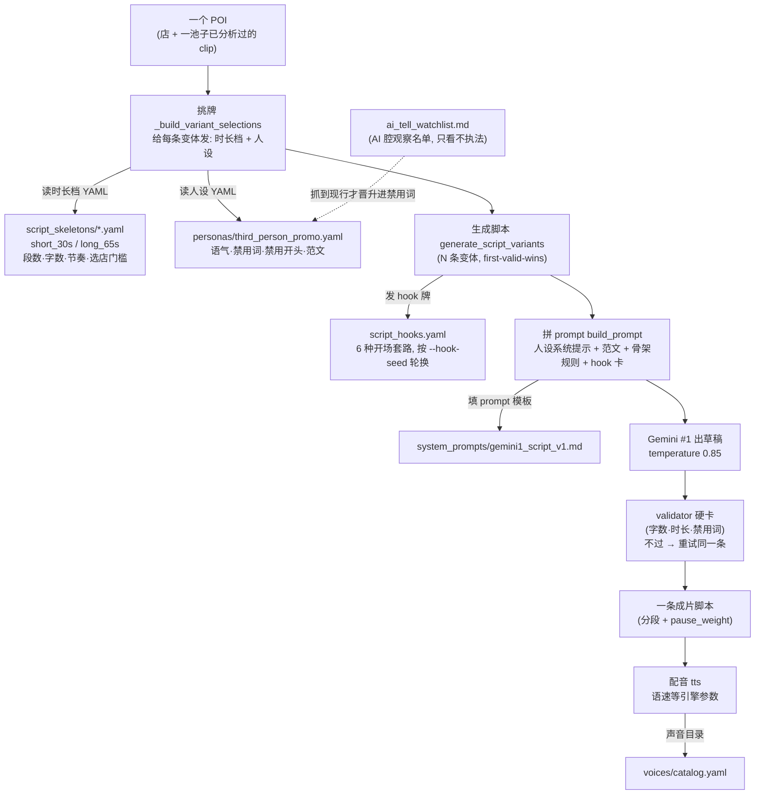
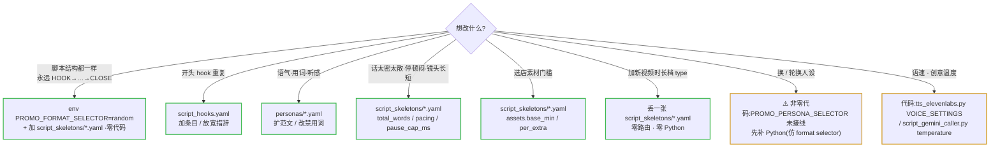

# Arsenal — operator-facing libraries

The 4 sub-directories plus `script_hooks.yaml` under `promo/arsenal/` are the libraries the operator extends over time. Logic stays in Python; data leaves Python. Every consumer (`clip_analyzer`, `script_generator`, `tts_engine`, `format_profiles`) reads through `promo/core/arsenal_loader.py` — never directly.

---

## 全景图 — 一个 POI 怎么变成一条成片脚本(每个 arsenal 文件在哪一步插进去)

打个比方:做一条片子像做一道菜。POI 是食材,arsenal 里那几个 YAML 是「菜谱抽屉」——什么火候(节奏)、谁来掌勺(人设)、开场怎么吆喝(hook)、范文长什么样,全写在抽屉里。代码只是厨师,菜谱永远从抽屉里现拿,从不背在脑子里(都经 `arsenal_loader` 读)。你想换味道,基本是换抽屉里的纸,不是换厨师。



落地坐标(每条都现场 grep 核过,2026-06-17):

- 挑牌入口:`promo/core/pipeline/pipeline.py:428` 调 `_build_variant_selections`(per-variant 选 format profile + persona);真正的选择器逻辑在 `promo/core/pipeline/steps.py` 里(`_build_variant_selections`,format 选择器约 836 行起,persona 见下方「文档 vs 现实」第 1 条)。
- 脚本入口:`promo/core/pipeline/pipeline.py:441` 调 `_step_generate_script`。真正的脚本生成函数是 `promo/core/script/script_generator.py:114 generate_script_variants()`(工单写的 `generate()` 实际叫这个名);它在第 175 行 `load_persona(...)`、第 202 行调 `_build_variant_plans`(发 hook 牌)。
- hook 轮换:`promo/core/script/script_prompt_builder.py:42` `HOOK_CARDS = arsenal_loader.load_script_hooks()`;轮换公式 `HOOK_TECHNIQUES[(hook_offset + i) % len(...)]` 在第 100 行;`hook_offset` 由 `--hook-seed` 决定(第 68 行)。
- 拼 prompt:`promo/core/script/script_prompt_builder.py:261 build_prompt`,在第 288 行拼范文(`format_examples`,函数在第 223 行)、第 290 行拼 `persona.system_prompt`,最后第 385 行套进 `gemini1_script_v1.md` 模板。
- 所有 arsenal 文件**都经 `promo/core/arsenal_loader.py` 读取**,代码从不直接 open YAML。

---

## 旋钮索引 — "想控制什么 → 改哪里" (P2)


> 绿框 = 改 YAML / env 的零代码旋钮;黄框 = 要动 Python。详情见下表。

| 想控制什么 | 改哪里 | 备注 |
|---|---|---|
| 镜头平均长度(beat 上下限) | 该 type 的 `script_skeletons/*.yaml` → `pacing.beat_min_sec` / `beat_max_sec` | 4s 顶有素材物理依据,卡上注释写明 |
| 单个停顿封顶 | 同上 → `pacing.pause_cap_ms` | 7000→3000 的历史也在卡上 |
| 选店素材门槛(50+10×extra) | 同上 → `assets.base_min` / `per_extra` | |
| 段数 / 字数 / 每段任务 | 同上 → `segment_count` / `total_words_*` / `segment_plans` | |
| 旁白人设 / 语气 / 禁用词 / 范文 | `personas/*.yaml` | 范文法规:每个 served format ≥2 篇打标范文 |
| 开头 hook 套路 | `script_hooks.yaml` | 发牌按 per-video `--hook-seed` 轮换(P2 step 5);sidecar 记 `assigned_hook` vs `self_reported_hook` |
| 声音目录 | `voices/catalog.yaml` | |
| Gemini #1 总 prompt | `system_prompts/gemini1_script_v1.md` | |
| TTS 语速等引擎参数 | 代码:`narrate/tts_elevenlabs.py` `VOICE_SETTINGS` | 尚未数据化 |
| persona / format 随机化 | env:`PROMO_PERSONA_SELECTOR` / `PROMO_FORMAT_SELECTOR` | 多丢一张 YAML 即可被选中 |

## What goes here

| Library | Contents | Loaded by |
|---|---|---|
| `system_prompts/*_v1.md` | The 2 LLM prompts: `mimo_clip_analysis`, `gemini1_script` (`gemini1_f3_retry` / `gemini2_assign` retired 2026-06-11 with the Gemini #2 chain). | `arsenal_loader.load_system_prompt(name)` |
| `voices/catalog.yaml` | Voice catalog: `kore` (Gemini), `jarnathan`/`hope`/`heather` (ElevenLabs). | `arsenal_loader.load_voice_catalog()` |
| `personas/*.yaml` | Narrator personas — voice / tone / perspective only. | `arsenal_loader.load_persona(name_or_path)` |
| `script_skeletons/*.yaml` | Promo format templates (currently `short_30s`, `long_65s`). Each YAML constructs one `PromoFormatProfile`. | `arsenal_loader.load_format_template(key)` / `load_format_templates()` |
| `script_hooks.yaml` | Ordered hook-technique seeds for multi-variant script diversity. | `arsenal_loader.load_script_hooks()` |

## How to add a voice

1. Open `voices/catalog.yaml`. Append a new top-level key.
2. Required fields: `id`, `name`, `gender`, `age`, `accent`, `description`, `backend` (`gemini` or `elevenlabs`). Optional: `style_prompt` (Gemini-only directorial instruction).
3. Position matters — `compile_promo._resolve_voice_keys` reads dict order for variant rotation when `--voice` is unset. Gemini entries should stay first to preserve the default rotation contract.

## How to add a persona

1. Drop a `*.yaml` in `personas/`. Fields: `id`, `display_name`, `perspective`, `wpm`, `voice_id`, `system_prompt`, `tone_keywords`, `forbidden_phrases`, `forbidden_openers`, `pause_guidelines`, `example_scripts`, optional `gemini.{voice, style_prompt, default_tags}`.
2. Persona is voice / tone / perspective ONLY. Format-specific rules (sentence length, segment count, "minimum N words") belong in script skeletons, not personas. Sprint Arsenal Externalization Commit 6c removed 4 historical bullets from `third_person_promo.yaml` for exactly this reason.
3. `RandomPersonaSelector` becomes observable when ≥2 persona YAMLs ship in this directory; the selector resolves YAMLs by file path.

## How to add a format template (= add a type, P2)

1. Drop a `*.yaml` in `script_skeletons/`. The YAML must declare a unique `mode` field — that becomes the dispatch key — and a unique `target_duration_sec` (duration is the routing key; two cards on one duration fail loudly at load).
2. Required fields: every field of `promo.core.schema.PromoFormatProfile` (`mode`, `target_duration_sec`, `duration_label`, `segment_count`, `total_words_min/max`, `per_segment_min/max`, `min/recommended_clip_pool_size`, `min/max_effective_wpm`, `max_narration_ratio`, `segment_plans`) plus the skeleton-owned fields:
   - `description` (str) — operator-facing one-liner; the brief entry for "make type B".
   - `pacing` (`beat_min_sec` / `beat_max_sec` / `pause_cap_ms`) — the card IS the source; no code defaults exist to fall back to.
   - `assets` (`base_min` / `per_extra`) — POI selection floor.
   - `sentence_rule` (str) — fills `$sentence_rule` in `gemini1_script_v1.md`. The per-mode RULES bullet for sentence length / cadence.
   - `extra_rules` (list[str]) — joined with `"\n- "` and dropped into `$extra_rules_block`. Empty list = empty block.
3. **范文法规**: add 2-3 examples tagged `format: <your mode>` to the persona's `example_scripts`, each INSIDE the card's word range — the model imitates examples over instruction numbers, and the prompt builder refuses to borrow another format's examples.
4. `arsenal_loader.load_format_templates()` picks up the new YAML on next module-import. No Python edit. Re-validate `promo/tests/test_selection.py` random-distribution tests if your new mode key would shift the seeded sample. New duration tiers may also need an asset-floor conversation with the AIGC side first (e.g. 120s ≈ 90-100 floor).

## How to edit hook techniques

1. Open `script_hooks.yaml`.
2. Edit the `hook_techniques` list. Order matters — variants rotate through the list by index.
3. Keep values short because the hook label is inserted directly into the Gemini #1 variant note.

## How to bump a prompt version

When you intentionally change a system prompt body:

1. Save the new text as `*_v2.md` (or `_v3.md`, etc.) — keep the old `*_v1.md` alongside.
2. Update `_KNOWN_SYSTEM_PROMPTS` in `arsenal_loader.py` if you're adding a brand-new prompt; existing prompts auto-rev when their consumer references the new name.
3. Update the consumer call: `load_system_prompt("foo")` → `load_system_prompt("foo")` continues to load `foo_v1.md` because the loader appends `_v1.md` (today). For a v2-and-onward path you would extend the loader to dispatch on a registry — that change is out of scope for the v1-only sprint.

**MiMo prompt versioning is load-bearing**: the `_cache_version_suffix` is a SHA1 of (prompt + model). Any byte change in `mimo_clip_analysis_v1.md` invalidates every existing `material/<slug>/.mimo_cache/<hash>-<suffix>.json` — across operator's POI set that means hundreds of OpenRouter calls + significant wallclock + cost on the next compile. Bumping the version is the correct way to opt into that invalidation; editing the v1 file in place is a footgun.

## Cache key invariants

- `mimo_clip_analysis_v1.md`: byte-length 1397 (1391 chars; 3 em dashes × 2 extra UTF-8 bytes each), no trailing newline. Pinned by `test_clip_analyzer.py::TestSprintArsenalExternalizationMimoPrompt`.
- `gemini2_assign_v1.md`: contains the verbatim 5 two-space-model substrings. Pinned by `test_clip_assigner.py::TestSprintArsenalExternalizationGemini2Template`.
- `gemini1_script_v1.md`: literal `$1,900` survives substitution as `$$1,900` → `$1,900`. Pinned by `test_script_generator.py::TestSprintArsenalExternalizationGemini1Template`.

---

## 全参数清单 — 每个旋钮当前值 + 改了会怎样

上面的「旋钮索引」表告诉你**去哪个文件**;这一节把那些文件里的旋钮**逐个参数**摊开,标真实当前值(2026-06-17 从 YAML / 代码现抄,非记忆)。想控制什么先查索引表,想知道一个具体参数的安全范围看这里。

比喻:索引表是「调料架在哪面墙」,这节是「每瓶调料现在放了几勺、最多能放几勺、放多了会齁」。

### A) 时长档骨架 `script_skeletons/short_30s.yaml` + `long_65s.yaml`(改 YAML,零 Python)

| 参数 | short_30s 当前值 | long_65s 当前值 | 控制什么 | 改了会怎样 |
|---|---|---|---|---|
| `segment_count` | 4 | 5 | 脚本分几段 | 改了要同步改 `segment_plans` 条数,否则对不上 |
| `total_words_min` / `_max` | 50 / 80 | 145 / 170 | 全片字数窗口 | 太低 → 配音填静音(老 F3 病根);太高 → 超时被 split-repair 拆 |
| `per_segment_min` / `_max` | 8 / 25 | 12 / 40 | 单段字数窗口 | validator 按这个卡每段 |
| `pacing.beat_min_sec` | 2.0 | 2.0 | 单个镜头最短(软) | 比这短的片段会跟邻居合并,保持节奏稳 |
| `pacing.beat_max_sec` | 4.0 | 4.0 | 单个镜头最长(硬) | clip ≥5s,4.0 留 ≥1s 给 packer 换窗口;调高 → 那个余量缩小,镜头发闷 |
| `pacing.pause_cap_ms` | 3000 | 3000 | 单个停顿封顶(毫秒) | 历史 7000→3000(2026-06-11):7s 停顿撑爆镜头物理长度 → 长镜头发腻 |
| `assets.base_min` | 50 | 50 | 选店素材地板基数 | 选店门槛 = `base_min + per_extra×(每店出片数−1)` |
| `assets.per_extra` | 10 | 10 | 每多出一条片加多少素材要求 | 同上公式 |
| `min_clip_pool_size` | 8 | 14 | 进场最少独立 clip | 不够直接 fail-loud 拒绝该店 |
| `recommended_clip_pool_size` | 10 | 18 | 推荐 clip 数 | 不够只 warning,不拒 |
| `min_effective_wpm` / `max_` | 110 / 150 | 90 / 160 | 有效语速窗口 | pacing gate 拿它硬卡 LONG 脚本;persona.wpm 必须落在窗口内 |
| `max_narration_ratio` | 0.90 | 0.92 | 旁白占总时长上限 | 太满 → 没留白 |
| `sentence_rule` | "5-12 words" | "5-15, 偶尔到 18" | 句长口径(填进 prompt) | 给模型的造句尺子 |
| `extra_rules` | `[]`(空) | 145 词地板那条 | 额外硬规则 | 空列表 = prompt 里那块为空 |
| `segment_plans` | HOOK/FEEL/HIGHLIGHTS/CLOSE | HOOK/ARRIVAL/LIVE IT/HIGHLIGHTS/CLOSE | 每段标签·约词数·clip 数·指引·偏好镜头类别 | 这是「为什么每条片结构都一样」的根 → 见下文诊断表 |

### B) 人设 `personas/third_person_promo.yaml`(改 YAML,零 Python)

| 参数 | 当前值 | 控制什么 / 改了会怎样 |
|---|---|---|
| `wpm` | 175 | 声明语速。2026-06-11 从 140 改 175(实测 TTS 172-192 wpm)。必须落在骨架的 wpm 窗口内,否则 pacing gate 拒 |
| `tone_keywords` | conversational / compelling / specific / intimate | 语气词,拼进 prompt |
| `forbidden_phrases` | nestled / tapestry / delve / bespoke / "Imagine a place" / "Where luxury meets" | 禁用词。**故意精简过**(Sprint 09b C5):50 行禁令会稀释模型注意力,只留高信号的。手动跟 `script_validator.BANNED_WORDS` 对齐(无运行时 import) |
| `forbidden_openers` | "Imagine" / "Discover" | 禁用开头 |
| `gemini.voice` | Kore | 默认 Gemini 声音(Phase 1 A/B 锁定) |
| `gemini.style_prompt` | "Read at a confident, engaging pace, warm but never sluggish:" | 给 Gemini TTS 的导演指令 |
| `example_scripts` | 3 篇 short + 3 篇 long(范文) | **few-shot 范文**——模型抄范文胜过抄数字。每个 served format ≥2 篇,字数必须落在该档窗口内。这是脚本风格的最强方向盘,也是「千篇一律」的第二大来源(见诊断表) |
| `pause_guidelines` | 1/2/3 三档说明 | 教模型在哪断句喘气(`pause_weight` 整数,代码再换算毫秒) |

### C) 开场套路 `script_hooks.yaml`(改 YAML,零 Python)

6 张 hook 卡(真实 `name`),按 `--hook-seed` 轮换、6 条后精确重复:

| # | name | 一句话套路 |
|---|---|---|
| 1 | `contradiction` | 开在两个本不该共存的东西之间,后半句拆台前半句 |
| 2 | `sensory` | 开在一个身体能感到的感官里(热/水/风/脚下声) |
| 3 | `specific_number` | 甩一个具体到惊人的数字,让它先杵着 |
| 4 | `second_person` | 把观众丢进动作中段当「你」,正在发生 |
| 5 | `time_anchor` | 锚到一天里一个精确时刻 + 此刻在发生什么 |
| 6 | `superlative` | 对一个具体细节下一个大胆断言(必须片中可证) |

每张卡还带一条 `technique`(怎么写)和 `must_not`(护栏)——见 `script_hooks.yaml` 正文。

### D) 还没数据化的旋钮(在代码里,改这些要动 Python)

| 旋钮 | 真实位置(2026-06-17 核过) | 当前值 | 控制什么 |
|---|---|---|---|
| TTS(ElevenLabs)语音参数 | `promo/core/narrate/tts_elevenlabs.py:46` `VOICE_SETTINGS` | `stability 0.35` / `similarity_boost 0.75` / `style 0.25` / `speed 0.95` | 配音音色/稳定度/语速;`speed` 可被调用参数覆盖(ElevenLabs 接受 0.7-1.2) |
| 脚本采样温度 | `promo/core/script/script_gemini_caller.py:35` | `temperature 0.85`(`top_p 0.9`) | 脚本随机性。固定值 = 多样性天花板之一(见诊断表) |
| format 随机化开关 | env `PROMO_FORMAT_SELECTOR`(`promo/core/config.py:246` 校验,`steps.py:836` 起 dispatch) | 默认 `single` | `=random` → 每条变体随机抽时长档。⚠️ 文件名/BGM/sidecar 仍按 `--target-duration-sec` 打标,会标不一致(Sprint 17 才修) |
| persona 随机化开关 | env `PROMO_PERSONA_SELECTOR` | **当前未接线**(见下文「文档 vs 现实」第 1 条) | 本意:`=random` 多人设轮换。**但代码里 persona 选择器是写死的 `SinglePersonaSelector()`**,这个 env 现在不起作用 |

---

## 「脚本为什么千篇一律」诊断 — 从这里开始调输出

这是 Leo 最关心的起点。复刻自 `docs/ROADMAP.md §4c`,用大白话重写,并标出哪些是**零代码改 YAML**、哪些**要动 Python**。每条 file:line 都 2026-06-17 重新 grep 核过;对不上的在下一节「文档 vs 现实」标明。

### 总纲:先分清病 — 质量 ≠ 雷同,是两个轴

**别把"脚本不好"和"脚本太像"当一回事**——它俩归不同抽屉管,治错轴 = 白费力。本节下半段(省力×影响图 / 决策树 / 7 条表)主要在治**雷同**;但"脚本不好"是另一个轴,先认清病再拧旋钮:

```
质量轴(整条好不好 · 抬地基)              雷同轴(彼此像不像 · 加花样)
────────────────────────────            ────────────────────────────
• Gemini#1 母版 gemini1_*.md             • persona 多人设轮换
• ⭐范文 example_scripts ◄─── 范文横跨两轴 ───► • 范文按 seed 轮换
                                        • format=random
                                        • hook 加卡 / temperature
```

- 改 **母版 + 范文** = 把所有脚本地基抬高 → 治"不好"。
- 上 **persona × format × hook 轮换** = 脚本之间加花样 → 治"太像"。
- **范文横跨两轴**:写得好 = 质量,换着喂 = 多样性。
- 推论:脚本"无聊"别只去加随机轮换(那只让它们"不一样地无聊");脚本"都一样"别只去重写范文(地基高了还是一个模子)。**先分清病,再拧对应的轴。**

> **范文是质量头号旋钮**(show 胜 tell:prompt 里写"口语一点"是弱信号,塞 3 篇口语好稿是强信号)。但范文很"粘"——它的口头禅 / 节奏 / 开头会被**忠实抄进每一条**,好坏都抄;**加新时长档必须配自己的 ≥2 篇范文**,否则那档没范文可抄、质量塌。

下面这套主要是**雷同轴**的工具箱;**质量轴**那两件(母版 + 范文)本节目前着墨少,但才是"脚本不好"时该先动的。

**先看这张「省力 × 影响」地图**——同样去雷同,哪个最划算先动:

```
影响大 ↑
        │  judge 打分(first-valid→挑最强)     ⭐ format=random(env 开关)
        │  persona 多人设轮换 ⚠️要补接线         加范文(persona YAML)
        │  ── 大工程但值 ──                    ── 先做这格 ──
────────┼───────────────────────────────────────────────────→ 越省力
        │                                      加 hook 卡 / 加 skeleton 卡
        │  temperature 扫(动 Python·收益薄)    (零代码,中等影响)
        │  ── 别先碰 ──                        ── 顺手就做 ──
影响小 ↓        费力(要动 Python)        省力(零代码改 YAML)
```

右上格 = 先动:`format=random` ⭐ + 加范文,都是高影响 + 零代码。左上「值但大工程」:judge 打分、persona 多人设轮换(后者还卡在下文「文档 vs 现实」第 1 条那个没接线的坑)。左下 temperature 收益薄、别先浪费力气。

**再看这张「我想改啥 → 开哪个抽屉」决策树**:

```
我想让脚本不那么千篇一律
├─ 改"听感/语气"        → persona YAML(范文 example_scripts / 禁用词)   零代码
├─ 改"结构不要永远一样"  → ① format=random 开关(env)        ⭐ 零代码·最省力起点
│                        └ ② 加 skeleton 卡(新档 / 新段落结构)         零代码
├─ 改"开场套路"          → script_hooks.yaml(加卡 / 放宽强制措辞)      加卡零代码·放宽要动 Python
├─ 改"随机性/温度"       → temperature(script_gemini_caller.py:35)     ⚠️ 要动 Python
└─ 想要"真挑最好的一条"  → first-valid-wins 换 judge 打分               ⚠️ 要动 Python
```

下面这张表是同样 7 条的**细节版**(file:line + 解法),按影响排序(雷同从大到小):

| # | 为什么都一样 | 真实位置 | 怎么治 | 改 YAML 还是改 Python |
|---|---|---|---|---|
| 1 | 永远同一个人设(同语气同口吻) | persona 选择器写死单人设:`selection/persona_selectors.py:60` 返回同一个 persona;接线点 `pipeline/steps.py:875` `SinglePersonaSelector()` | 加第 2 个 persona YAML —— **但还要先把 env 接线补上**(见下) | 半半:加 YAML 零代码,**但 persona-random 接线当前缺,要补 Python** |
| 2 | 每次喂同 6 篇 few-shot 范文 | `personas/third_person_promo.yaml:87-143`（§4c 写 76-113,已漂移） | 让范文按 seed 轮换 / 扩充范文池 | 小代码改动 |
| 3 | hook 6 选 1 强制轮换,6 条后精确重复 | 轮换公式 `script_prompt_builder.py:100`;"do not use a different one" 措辞在 `:337`（§4c 写 :82,已漂移） | 加 hook 卡 / 放宽那句强制措辞 | 加卡=改 YAML;放宽措辞=改 Python |
| 4 | format 结构永远固定(HOOK→ARRIVAL→…→CLOSE) | `format_profiles.py:45 get_promo_format_profile`(纯时长→卡查表) | 加 skeleton YAML + `PROMO_FORMAT_SELECTOR=random` | **纯零代码**(加 YAML,见下文「文档 vs 现实」第 3 条) |
| 5 | 号称 best-of-N,实为 first-valid-wins(无打分) | docstring 在 `script_generator.py:5` 谎称 "highest-scoring";真实接受在 `:286`(`accepted.append` + `variant_accepted=True`,无 judge) | 生成 N 个有效候选 + 轻量 judge 挑 hook 最强的 | 改 Python(中等) |
| 6 | 温度固定 0.85 | `script_gemini_caller.py:35` | 按 variant 扫不同 temperature | 改 Python(小) |
| 7 | 每段任务指令逐字相同 | `script_prompt_builder.py` 段落拼接(`build_prompt` 内) | 跟 format 多样化一起做 | 改 Python |

**最省力的顺序**:先把第 4 条(format=random,纯加 YAML)和第 3 条加 hook 卡用起来——persona×format×hook 组合已能产生大量多样性;真要更「agentic」,插槽在第 5 条的候选循环(生成→验证→接受 改成 生成 N→judge 打分→挑选)。

---

## 「怎么添加」补全 — format / hook / skeleton

README 上文已有 [How to add a voice / persona / format template / hook techniques](#how-to-add-a-voice)。这里补足三件没讲透的、并澄清一个关键误区。

### 加一个新时长档(= 加一张 skeleton 卡)

**纯零代码,丢 YAML 即可。** 见上文 [How to add a format template](#how-to-add-a-format-template--add-a-type-p2) 的完整字段清单;核心两步:

1. 在 `script_skeletons/` 丢一个 `*.yaml`,声明唯一的 `mode` + 唯一的 `target_duration_sec`(时长是路由键,两卡撞同时长 → load 时 fail-loud)。
2. 给 persona 的 `example_scripts` 加 ≥2 篇 `format: <你的mode>` 范文,字数落在卡窗口内。

⚠️ **澄清(工单假设有误)**:加新时长档**不需要**在 `format_profiles.py` 的 `get_promo_format_profile` 加路由。该函数是纯「时长→卡」查表(`format_profiles.py:57-68`),自动发现新卡;未知时长直接 fail-loud 列出现有牌。新时长真要动的是输出文件名/BGM 过滤(`--target-duration-sec` 那条链,Sprint 17 范畴),不是这个路由函数。

### 加一条 hook

纯零代码。见上文 [How to edit hook techniques](#how-to-edit-hook-techniques)。补一点:现在每条 hook 是一张 `{name, technique, must_not}` 卡(不是裸标签),`name` 是轮换键。加/删/重排会让历史 `seed→hook` 映射失效(同音乐库规则)。

### 加一个 persona(让多人设真正轮换)

加 YAML 本身零代码(见上文 [How to add a persona](#how-to-add-a-persona))。**但要让 `PROMO_PERSONA_SELECTOR=random` 真生效,当前还差一步 Python**:`pipeline/steps.py:875` 把 persona 选择器写死成 `SinglePersonaSelector()`,没有读 env、没有 dispatch `RandomPersonaSelector`(对比 format 选择器在同文件已接 env)。详见下节第 1 条。

### 文件地图补漏:`ai_tell_watchlist.md`

上文「What goes here」表没收录这个抽屉,补进文件地图:

| Library | Contents | 谁读它 |
|---|---|---|
| `ai_tell_watchlist.md` | AI 腔观察名单(高频 AI 套话候选)。**只记录,不执法**——不进 persona 的 `forbidden_phrases`,谁被 4-gram 抓到现行才报 Leo 决策卡、批准后才晋升进禁用词 | 无代码读取(人工 + 4-gram 分析脚本);它是禁用词的「候补席」,不是运行时配置 |

---

## ⚠️ 文档 vs 现实 — 核实中发现的不符点(2026-06-17 grep 实证)

docs 会漂移(`architecture.md` 历史上烂过)。以下是本次核实对不上的地方,改代码前以**代码现实**为准:

1. **`PROMO_PERSONA_SELECTOR` 当前未接线(最重要)**。旧「旋钮索引」表和 §4c 都暗示 `PROMO_PERSONA_SELECTOR=random` 是个能用的零代码开关,但 `pipeline/steps.py:875` 写死 `SinglePersonaSelector()`,没有读这个 env。`RandomPersonaSelector` 类存在(`selection/persona_selectors.py:63`)却没被 dispatch。**现实:多人设轮换要先补这段接线(对照同文件 format 选择器的 env 读法),不是丢张 YAML 就行。**
2. **TTS 路径 / 行号**。§4c 写 `narrate/tts_elevenlabs.py:44`;真实是 `promo/core/narrate/tts_elevenlabs.py:46` `VOICE_SETTINGS`(目录前缀 `promo/core/`,行号 46 非 44)。
3. **`get_promo_format_profile` 不是「加一行路由」**。§4c 结尾和工单都说新时长档要在 `get_promo_format_profile` 加路由——**错**。它是纯时长→卡查表(`format_profiles.py:57-68`),零路由编辑,自动发现新卡。
4. **§4c 几处行号已漂移**:persona 范文 `76-113` → 实为 `87-143`;hook "do not use a different one" `script_prompt_builder.py:82` → 实为 `:337`(:82 那行是别的);first-valid-wins 的 docstring 谎言在 `script_generator.py:5`(§4c 写 280-291 是接受区,真实接受在 `:286`)。`persona_selectors.py:42,60`(单人设锁)对得上。
5. **`generate()` 实际叫 `generate_script_variants()`**(`script_generator.py:114`);工单写的 `generate()` 不存在该名。`load_persona` import 在 `:60`、调用在 `:175`;`_build_variant_plans` import 在 `:90`、调用在 `:202`(工单写的行号是近似)。
