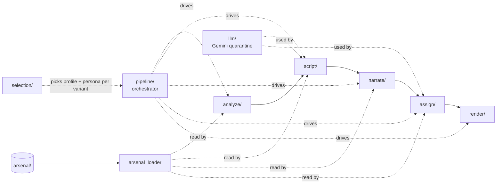

# promo/core/ — pipeline engine

This folder holds the Python that drives a clip pool from raw `.mp4` to a finished promo `.mp4`. Five subfolders correspond to the five pipeline stages; one subfolder (`pipeline/`) orchestrates them; two more (`selection/`, `llm/`) carry cross-cutting seams. Eight root-level modules carry repo-wide concerns (env config, exception types, typed payload shapes, single arsenal reader, single I/O abstraction).

For load-bearing invariants (the two-space model, the verbatim sidecar table, error taxonomy, the LLM quarantine charter), see the repo-level [`/architecture.md`](../../architecture.md). This file is a navigator into the subfolder docs — each subfolder owns a per-stage `architecture.md` for internals.

## Files (inventory)

### Stage subfolders

| Folder | Stage | Role |
|---|---|---|
| `analyze/` | 1. Describe | MiMo V2 Omni clip analysis with content-hash + (prompt+model) sidecar cache. |
| `script/` | 2. Generate (Gemini #1) | Narration script generation, prompt assembly, validation gates, pause-budget math. |
| `narrate/` | 3. Speak (TTS) | Dual-backend TTS dispatch (ElevenLabs + Gemini), batch planning, ffmpeg assembly, MMS_FA forced alignment. |
| `assign/` | 4. Assign (Gemini #2) | Per-phrase clip-assignment with hard constraint, F3 retry loop, embedding/retrieval, match-quality observability. |
| `render/` | 5. Render | Python → Remotion bridge: bind clips to narration, build props, invoke `npx remotion render`. |

### Cross-cutting subfolders

| Folder | Role |
|---|---|
| `pipeline/` | The only place that knows step ordering. Resolves voice/BGM, runs the variant loop, emits run-level sidecars. |
| `selection/` | Per-variant `FormatSelector` / `PersonaSelector` Protocols + Single/Random implementations + seeded PRNG factory. |
| `llm/` | The single allowed `import google.generativeai` site (`gemini_client.py`) plus shared retry + JSON helpers. |

### Root modules (cross-cutting)

| Module | Role |
|---|---|
| `__init__.py` | `sanitize_poi_name` + `material_poi_slug` — single source of truth for the two non-interchangeable slug forms. |
| `arsenal_loader.py` | Single thin reader for `promo/arsenal/`. LRU-cached; every consumer routes through it. |
| `backend.py` | `PromoBackend` Protocol + `LocalBackend` — abstracts the 3 external I/O ops (fetch_clips, fetch_bgm, save_output). |
| `config.py` | Typed env-var resolvers (`_require` / `_require_int` / `_require_float`); fail-fast `ConfigError`. |
| `errors.py` | 5 named exceptions: `ClipAssignmentError`, `FreezeWouldOccurError`, `ForcedAlignmentError`, `MimoAnalysisError`, `NoSuitableBGMError`. |
| `format_profiles.py` | Re-exports `SegmentPlan` / `PromoFormatProfile` + populates `FORMAT_TEMPLATES` from arsenal at module-import. |
| `logging_config.py` | Idempotent `configure_logging()` with JSON-per-line formatter. |
| `schema.py` | TypedDict shapes + frozen dataclasses (`SegmentPlan`, `PromoFormatProfile`, `NarratorPersona`, etc.) flowing between modules. |

## How they wire together

The five stages are sequential within one variant; `pipeline/` orchestrates the run-level pre-loop and the per-variant inner loop. `selection/`, `llm/`, and `arsenal_loader.py` cut across stages.

**Stage hand-offs (input → output):**

- `analyze/` reads `clip_paths: dict[str, str]` → emits `clips_metadata: list[ClipMetadata]` + writes `.mimo_cache/` sidecar.
- `script/` reads `clips_metadata` + persona + format profile → emits `Script` (segments + `pause_weight` + `target_duration_sec`).
- `narrate/` reads `Script` + voice key → emits `Narration` (audio path + `word_timestamps` + `segment_timestamps`).
- `assign/` reads `Script` + `Narration` + `clips_metadata` + `clip_durations` → emits `list[ClipAssignment]` (with F3 retry that loops back through `script/` + `narrate/` on `ClipAssignmentError`).
- `render/` reads `clip_assignments` + `Narration` + `clip_paths` + bgm → emits final `.mp4` + 3 sidecars (`clip_assignments_*.json`, `tts_metrics_*.json`, `match_quality_*.json`).

`pipeline/full_pipeline` is the only function that knows this ordering.

**Cross-cutting concerns (touched by every stage):**

- **Errors** — subfolders raise the named exceptions in `errors.py`; `pipeline/` and CLI surface decide whether to abort or recover (`ClipAssignmentError` → F3 retry; `FreezeWouldOccurError` / `MimoAnalysisError` / `NoSuitableBGMError` → variant abort).
- **Config** — `config.py` is the single env-var reader (Pluggability Charter Rule 2); `llm/gemini_client.py` is the documented carve-out for `GEMINI_MODEL`.
- **Schema** — `schema.py` carries the TypedDicts and dataclasses every cross-folder seam types against; payloads stay byte-identical, the annotations catch shape drift.
- **Arsenal** — every prompt / voice / persona / skeleton lives in `promo/arsenal/`; every read goes through `arsenal_loader.py`.
- **Slug conventions** — `sanitize_poi_name` (underscores, used in sidecars) and `material_poi_slug` (hyphens, used in material directories) are two non-interchangeable forms.

For per-stage internals, see each subfolder's `architecture.md`.
