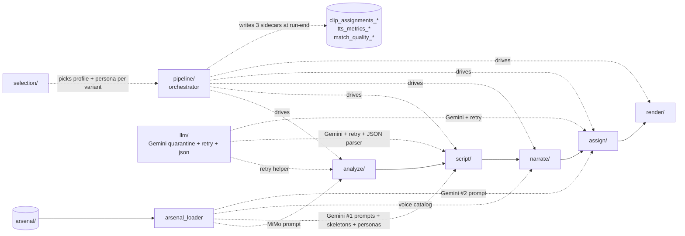

# promo/core/ — pipeline engine

This folder holds the Python that drives a clip pool from raw `.mp4` to a finished promo `.mp4`. Five subfolders correspond to the five pipeline stages; one subfolder (`pipeline/`) orchestrates them; two more (`selection/`, `llm/`) carry cross-cutting seams. Eight root-level modules carry repo-wide concerns (env config, exception types, typed payload shapes, single arsenal reader, single I/O abstraction).

For load-bearing invariants (the two-space model, the verbatim sidecar table, error taxonomy, the LLM quarantine charter), see the repo-level [`/architecture.md`](../../architecture.md). This file is a navigator into the subfolder docs — each subfolder owns a per-stage `architecture.md` for internals.

**Doc convention:** every row below describes its surface as **In / Out / Side / Raises / Consumers** — what it consumes, what it produces, what it changes outside its return value, what named exceptions it raises, and who reaches for it. Mirrors the API-service-shape principle the operator applies to code.

## Vocabulary

The terms below are project-specific and are used throughout this doc and the subfolder docs. Vendor names (MiMo, OpenRouter, Gemini, ElevenLabs, Remotion, MMS_FA) and standard CS concepts (`TypedDict`, `Protocol`, hash, retry pattern) are assumed and not redefined here.

- **POI** — Point of Interest. Always a hotel in this pipeline; the unit of work (one POI = one promo video).
- **operator** — the human running the pipeline. Distinct from "developer" only by role; usually the same person.
- **slug** — a sanitized form of a POI name suitable for filenames. Two forms exist: hyphens (`hotel-xcaret-arte`, used for `material/<slug>/` directories) and underscores (`hotel_xcaret_arte`, used in sidecar filenames). `sanitize_poi_name` produces the underscore form; `material_poi_slug` produces the hyphen form.
- **arsenal** — the operator-extensible data libraries under `promo/arsenal/` (system prompts, voice catalog, personas, format templates). All reads route through `arsenal_loader.py`.
- **sidecar** — a JSON file written by one stage and read by another (or by a future run). Used to pass state across module boundaries on disk rather than in memory. The pipeline produces several per run.
- **Gemini #1** — the first of two `gemini-2.5-pro` calls. Generates narration text from clip descriptions. Lives in `script/`.
- **Gemini #2** — the second `gemini-2.5-pro` call. Picks which clip plays during which phrase, AFTER the script has been spoken (so timing is measured, not predicted). Lives in `assign/`.
- **Why two Gemini passes?** — a single pass would have to predict TTS timing at prompt time. The two-pass design uses real measured timing for clip assignment, removing the prediction.
- **dispatch seam** — a single line of code (a backend-name check) that routes a call to the right vendor implementation. The TTS folder has one for ElevenLabs vs Gemini.
- **facade re-export pattern** — one Python file (`tts_engine.py`, `clip_assigner.py`, `script_generator.py`) acts as the public import surface; it re-imports private helpers from sibling files so external test code can patch them by short name. Used because tests grew up patching internal symbols and the indirection is cheaper than rewriting tests.
- **two-space model** — the project's load-bearing invariant. *Assigner space*: the script's last word ends at `narration_end`; Gemini #2 only worries about covering the script up to `narration_end`. *Renderer space*: the final video has to be at least `target_duration_sec` long. The gap is filled by extra clips called *bridges*. See [/architecture.md](../../architecture.md) "Two-space model" for the formal treatment.
- **narration_end** — the time when the narrator stops speaking; defined as `word_timestamps[-1].end`.
- **final_display_end** — `max(target_duration_sec, narration_end)`. The total length of the final video.
- **bridge / bridge pool / bridge_tail** — extra clips the renderer inserts when the narrator finishes before the target duration. `bridge_tail = max(0, target_duration_sec − narration_end)` is the duration to fill.
- **F3 retry** — the "single retry" policy for Gemini #2 clip-assignment failures. On `ClipAssignmentError`, the pipeline asks Gemini #1 to rewrite the script (with a tighten-hint), re-runs TTS, and tries Gemini #2 once more. A second failure aborts the variant.
- **soft hint / soft-hint contract** — retrieval narrows the clip pool Gemini #2 *sees* in its prompt, but Gemini #2 can pick clips outside that subset; the validator does not gate on `clip_id ∈ retrieved_ids`. Hence "soft."
- **Pluggability Charter** — two house rules: Rule 1 = only one file imports `google.generativeai`; Rule 2 = only one file reads env vars. Keeps vendor SDKs and config readers in single locations so a future second LLM provider drops in by adding a sibling module.
- **`pause_weight`** — an integer (1, 2, 3) on each script segment; higher = longer pause after that segment. Weight 1 = natural prosody (no explicit silence). Weight ≥ 2 inserts an explicit silence file in the audio assembly.

### Vendor mapping

The same vendor name can refer to different products. The project's nicknames map to actual IDs as follows.

| Project nickname | What it actually is |
|---|---|
| **Gemini #1**, **Gemini #2** | Both are `gemini-2.5-pro` calls; the difference is which stage calls them (script generation vs clip assignment). |
| **Gemini TTS** | `gemini-3.1-flash-tts-preview` (primary) or `gemini-2.5-flash-preview-tts` (fallback on HTTP 404/403). A different SKU from Gemini Pro. |
| **Kore** | A *voice* on Gemini TTS — not a model. The voice catalog ships `kore` for the Gemini TTS path. |
| **ElevenLabs voices** | `jarnathan`, `hope`, `heather` — three voices on the ElevenLabs `eleven_multilingual_v2` model. |
| **MiMo** | `MiMo-V2-Omni` — the video-understanding model (run via OpenRouter, not Gemini). |

## Files (inventory)

### Stage subfolders

| Folder | Stage | I/O surface (full detail in folder's architecture.md) |
|---|---|---|
| `analyze/` | 1. Describe | **In:** `clip_paths: dict[str, str]`, `cache_dir`. **Out:** `list[ClipMetadata]`. **Side:** writes per-clip `.mimo_cache/<hash>-<sfx>.json` (atomic). **Raises:** `MimoAnalysisError`. |
| `script/` | 2. Generate (Gemini #1) | **In:** `clips_metadata + persona + format profile + poi_name + location + n_variants`. **Out:** `list[Script]` (one per variant). **Side:** Gemini #1 API calls. **Raises:** `ValidationError`, `RuntimeError` (clip-pool contract). |
| `narrate/` | 3. Speak (TTS) | **In:** `script["segments"] + voice_id + output_dir + speed`. **Out:** `Narration` TypedDict. **Side:** writes `narration.mp3` + per-batch silence files into `output_dir`; ElevenLabs / Gemini TTS API calls. **Raises:** `ForcedAlignmentError` (Gemini path only). |
| `assign/` | 4. Assign (Gemini #2) | **In:** `Script + Narration + clips_metadata + clip_durations` + F3-retry callbacks. **Out:** `(final_script, final_narration, list[ClipAssignment])`. **Side:** Gemini #2 API calls; retrieval reads embedding sidecar (no writes). **Raises:** `ClipAssignmentError` (caught by F3 once; propagates on second). |
| `render/` | 5. Render | **In:** `props: dict` (built upstream by `build_props_from_script` from `clip_assignments + Narration + clip_paths + bgm`), `output_path`. **Out:** the final `.mp4`. **Side:** `npx remotion render` shell-out; stages clips + audio into `promo/remotion/public/`. **Raises:** `FreezeWouldOccurError` (bridge pool exhausted). |

### Cross-cutting subfolders

| Folder | I/O surface |
|---|---|
| `pipeline/` | **Provides:** `full_pipeline` (run-level orchestrator) + `_run_variant_loop` (per-variant orchestrator) + `sidecar_writer._emit_run_sidecars`. **In:** all stage inputs threaded as kwargs to `full_pipeline`. **Out:** `bool` (run-level success). **Side:** writes 3 per-run sidecars at run-end (`tts_metrics_*`, `match_quality_*`, `clip_assignments_*`) — these are NOT stage outputs. **Raises:** propagates whatever stages raise. |
| `selection/` | **Provides:** `FormatSelector` + `PersonaSelector` Protocols + `Single*` / `Random*` impls + `make_seeded_random` factory. **In:** `(n_variants, *, poi_name, clip_metadata)` per `select()` call. **Out:** `list[PromoFormatProfile]` or `list[NarratorPersona]` of length `n_variants`. **Side:** none (pure). **Raises:** `ConfigError` if a `RandomPersonaSelector` path is missing. **Consumers:** `pipeline/_build_variant_selections`. |
| `llm/` | **Provides:** `gemini_client.{configure_gemini, reset_for_tests, resolve_gemini_model, GeminiModel}` (Gemini SDK access — the only allowed `import google.generativeai` site in the repo) + `retry.retry_with_backoff` (the **retry helper** — wraps any function and retries it with exponential backoff if it fails) + `json_response.parse_json_response` (parses JSON from AI text responses, expects a top-level dict). **Side:** Pluggability Charter Rule 1 — no other module is allowed to `import google.generativeai`. **Raises:** `ValueError` (`json_response` on non-dict shape; `configure_gemini` on empty key). **Consumers (verified by grep):** Gemini SDK — `script/script_generator`, `assign/clip_assignment_gemini`. Retry helper — `analyze/clip_analyzer`, `script/script_gemini_caller`, `assign/clip_assignment_gemini`, `assign/clip_embedder`. JSON-response parser — `script/script_gemini_caller` only (Gemini #2 has its own list-parser). |

### Root modules (cross-cutting)

| Module | I/O surface |
|---|---|
| `__init__.py` | **Provides:** `sanitize_poi_name(name)` (underscore form — sidecar filenames) + `material_poi_slug(name)` (hyphen form — `material/<slug>/` directories). **In:** display name `str`. **Out:** sanitized slug `str` (or `"unnamed"` fallback). **Side:** none (pure). **Raises:** nothing. |
| `arsenal_loader.py` | **Provides:** `load_system_prompt`, `load_voice_catalog`, `load_persona`, `load_format_template`, `load_format_templates`, `reset_for_tests`. **In:** library / key name. **Out:** parsed Python value (`str` for system prompts, `dict` for voice catalog, `NarratorPersona`, `PromoFormatProfile`, `dict[str, PromoFormatProfile]`). **Side:** disk read — three of four loaders are LRU-cached (`load_system_prompt`, `load_voice_catalog`, `load_format_templates`); `load_persona` is uncached because path-form callers may rotate file contents between reads. **Raises:** lets `FileNotFoundError` / `KeyError` propagate. **Consumers (verified by grep — only `import yaml` site):** `analyze/clip_analyzer`, `script/script_prompt_builder`, `script/script_generator` (via `arsenal/personas/_loader` shim for `load_persona`), `narrate/tts_engine`, `assign/clip_assignment_gemini`, `format_profiles`, `selection/persona_selectors`. |
| `backend.py` | **In plain English:** an I/O abstraction layer. The pipeline says "give me clips for this hotel", "give me BGM", "save this finished MP4" — and `backend.py` decides where those files actually come from / go to. Today's only implementation is `LocalBackend` (local-disk read/write); a future `S3Backend` or `SupabaseBackend` could swap in without touching pipeline code. **Provides:** `PromoBackend` Protocol (`runtime_checkable` — any class with the matching methods qualifies as a backend) + `LocalBackend` impl. **3 ops:** `fetch_clips(poi_name, tmp_dir) → dict[clip_id, path]` (give me clips for this hotel into a scratch folder); `fetch_bgm(poi_name, tmp_dir) → str | None` (give me the BGM track, or `None` if there isn't one); `save_output(poi_name, video_path) → str` (save this finished MP4 where it belongs). Plus optional `clips_dir()` / `output_dir()` hooks for sibling-path derivation (`.mimo_cache/`, `.embedding_cache/`). **Side:** `LocalBackend` reads from `clips_dir`, copies into `tmp_dir`, copies output to `output_dir` — plain file copies. **Raises:** standard OS errors (uncaught). **Consumers:** `pipeline/full_pipeline`, `cli/compile_promo`. |
| `config.py` | **Provides:** typed env-var resolvers (`gemini_api_key()`, `elevenlabs_api_key()`, `openrouter_api_key()`, `default_duration_sec()`, `render_concurrency()`, others) + `ConfigError`. **In:** none (reads `os.environ` + `.env` once at import via `_DOTENV_LOADED` flag). **Out:** typed value. **Side:** `load_dotenv()` runs at most once. **Raises:** `ConfigError` on missing-required or type-coerce failure. **Note:** required values use `_require` / `_require_int` / `_require_float`; optional values (`OPENROUTER_HTTP_REFERER`, `PROMO_CLIP_MODEL`, `PROMO_FORMAT_SELECTOR`) use bare `os.getenv` with hardcoded defaults inside the same module. **Consumers:** every stage that needs env vars; no other module is allowed to touch `os.environ` except the documented `llm/gemini_client.GEMINI_MODEL` carve-out. |
| `errors.py` | **Provides:** 5 named exception types — each carries a recovery contract: `ClipAssignmentError` (raised by `assign/`, **caught by `assign_clips_with_f3_retry` for ONE retry**, propagates on second → variant abort); `FreezeWouldOccurError` (raised by `render/`, **no retry → variant abort**); `ForcedAlignmentError` (raised by `narrate/forced_aligner` on Gemini path, **no retry → variant abort**); `MimoAnalysisError` (raised by `analyze/` after retry budget exhausted, **aborts the run**); `NoSuitableBGMError` (raised by `pipeline/bgm_voice_resolver`, **aborts before any variant runs**). **Consumers:** every stage raises one or more; `pipeline/` and `cli/` decide abort vs recover. |
| `format_profiles.py` | **Provides:** `get_promo_format_profile(target_duration_sec) → PromoFormatProfile` + `get_clip_pool_messages(n_clips, profile) → (errors, warnings)` + `FORMAT_TEMPLATES` / `SHORT_PROFILE` / `LONG_PROFILE` / `SegmentPlan` / `PromoFormatProfile` re-exports from `schema.py`. **In:** target duration in seconds; clip-pool count. **Out:** profile / message lists. **Side:** at module-import, populates `FORMAT_TEMPLATES = arsenal_loader.load_format_templates()` — importing this module triggers an arsenal disk read. **Raises:** `KeyError` if no `short` / `long` template ships in arsenal. **Consumers:** `script/`, `assign/`, `pipeline/`, `selection/`. |
| `logging_config.py` | **Provides:** `configure_logging(level=INFO, correlation_id=None)`. **In:** log level + optional correlation_id. **Out:** none (configures root logger). **Side:** attaches a JSON-per-line handler to `logging.getLogger()`; idempotent — second call updates the existing handler in-place via the `_PROMO_HANDLER_MARK` attribute, never double-attaches. **Raises:** nothing. **Consumers:** every CLI script (typically called once at startup). |
| `schema.py` | **Provides:** TypedDicts (`WordTimestamp`, `SegmentTimestamp`, `ClipMetadata`, `ClipAssignment`, `ScriptSegment`, `Script`, `Narration`) — annotation-only, NOT runtime-enforced — plus dataclasses: `SegmentPlan` and `PromoFormatProfile` are `@dataclass(frozen=True)`; `NarratorPersona` is a regular `@dataclass` (mutable — loaders / tests rebind fields). **Consumers:** every cross-folder seam types its inputs/outputs against shapes here. |

## How they wire together

The five stages are sequential within one variant; `pipeline/full_pipeline` runs the run-level pre-loop (clip prep + voice/BGM + Gemini #1 + pause budget) and `pipeline/_run_variant_loop` runs the per-variant inner loop (TTS + Gemini #2 + render). `selection/`, `llm/`, and `arsenal_loader.py` cut across stages.

**Per-stage breakdown — what arsenal/ and llm/ each stage actually pulls in:**

| Stage | What it reads from `arsenal/` | What it uses from `llm/` |
|---|---|---|
| `analyze/` | `system_prompts/mimo_clip_analysis_v1.md` (the MiMo prompt) | retry helper only — `analyze/` calls MiMo via OpenRouter, not Gemini, so it doesn't need the Gemini SDK or the JSON parser. |
| `script/` | `system_prompts/gemini1_script_v1.md` + `gemini1_f3_retry_v1.md` (Gemini #1 prompts), `script_skeletons/*.yaml` (format templates), `personas/*.yaml` (narrator personas) | Gemini SDK + retry helper + JSON-response parser (all three) — `script/` is the only stage that uses the full `llm/` surface. |
| `narrate/` | `voices/catalog.yaml` (voice catalog — picks the right voice per backend) | nothing — `narrate/` talks to ElevenLabs / Gemini TTS via plain HTTP and manages its own retries. |
| `assign/` | `system_prompts/gemini2_assign_v1.md` (the Gemini #2 prompt) | Gemini SDK + retry helper for the Gemini #2 path; retry helper alone for `clip_embedder` (OpenRouter embeddings). Gemini #2 has its own list-parser, so it doesn't use the JSON-response parser from `llm/`. |
| `render/` | nothing — `render/` doesn't read arsenal | nothing — `render/` doesn't call any AI; it shells out to `npx remotion render`. |

**Stage hand-offs (I/O contract — these are the actual public function signatures):**

- **`analyze/` (`analyze_clips`)** — In: `clip_paths: dict[str, str]`, `cache_dir: str | None`. Out: `list[ClipMetadata]`. Side: writes per-clip `.mimo_cache/<hash>-<sfx>.json` (atomic). Raises: `MimoAnalysisError` (after retry budget exhausted → run aborts).
- **`script/` (`generate_script_variants`)** — In: `clips_metadata`, `persona`, `format profile`, `poi_name`, `location`, `n_variants`, optional `hotel_description` / `notable_details`. Out: `list[Script]` (one per variant). Side: Gemini #1 API calls via `llm/`. Raises: `ValidationError` (validation gates), `RuntimeError` (clip-pool contract).
- **`narrate/` (`generate_narration`)** — In: `script["segments"]: list[ScriptSegment]`, `voice_id`, `output_dir`, `speed`. Out: `Narration` TypedDict — `{audio_path, word_timestamps, segment_timestamps, segments}`. Side: writes `narration.mp3` + per-batch silence mp3 files into `output_dir`; ElevenLabs / Gemini API calls. Raises: `ForcedAlignmentError` on the Gemini-TTS path only, on structural alignment failures (empty normalization, empty span list from MMS_FA). Below-threshold scores are warn-only.
- **`assign/` (`assign_clips_with_f3_retry`)** — In: `Script`, `Narration`, `clips_metadata`, `clip_durations`, F3-retry callbacks (`regenerate_script_fn`, `regenerate_narration_fn`, `retrieve_clips_fn`) supplied by `pipeline/_step_assign_clips`. Out: `(final_script, final_narration, list[ClipAssignment])`. Side: Gemini #2 API calls via `llm/`; retrieval reads the embedding sidecar (no writes from this stage). Raises: `ClipAssignmentError` (caught by F3 once → triggers script + narrate regeneration; second raise propagates and aborts the variant).
- **`render/` (`render_promo`)** — In: `props: dict` (built upstream by `build_props_from_script` from clip assignments + narration + clip_paths + bgm), `output_path`, `composition_id`, `timeout`. Out: the final `.mp4` written at `output_path`. Side: `npx remotion render` shell-out; stages clips + audio into `promo/remotion/public/`. Raises: `FreezeWouldOccurError` (bridge pool exhausted before `final_display_end` → variant abort).

**Step ordering lives in two places:**

- `pipeline/full_pipeline` owns **run-level** ordering — clip prep, voice/BGM resolution, Gemini #1, pause budget, the variant loop, and the final per-run sidecar emission.
- `pipeline/_run_variant_loop` owns **per-variant** ordering — TTS (Step 4) → Gemini #2 + F3 (Step 4.5) → props build + freeze prevention (Step 7) → Remotion render (Step 8) → success-gated observability row append.

The 3 per-run sidecars (`clip_assignments_*.json`, `tts_metrics_*.json`, `match_quality_*.json`) are emitted by `pipeline/sidecar_writer._emit_run_sidecars` AFTER all variants complete — none of the stages writes these directly.

**Cross-cutting concerns:**

- **Errors** — 5 named exceptions, all in `errors.py`. Recovery taxonomy: `ClipAssignmentError` → F3 retry; `FreezeWouldOccurError` / `ForcedAlignmentError` → variant abort; `MimoAnalysisError` → run abort (after retry exhaustion); `NoSuitableBGMError` → run abort (pre-variant). Every doc surface above carries a "Raises" field — if any disagrees with this taxonomy, one of the docs is wrong.
- **Config** — `config.py` is the single env-var reader. Required values use `_require` / `_require_int` / `_require_float` (fail-fast `ConfigError`); optional values use bare `os.getenv` with hardcoded defaults inside the same module (`OPENROUTER_HTTP_REFERER`, `PROMO_CLIP_MODEL`, `PROMO_FORMAT_SELECTOR`). `llm/gemini_client.py` is the documented carve-out for `GEMINI_MODEL` (one import-cycle hop away from `config`).
- **Schema** — `schema.py` carries all cross-folder shapes. TypedDicts are annotation-only (Python doesn't enforce at runtime); dataclasses split: `SegmentPlan` and `PromoFormatProfile` are `frozen=True`, `NarratorPersona` is mutable.
- **Arsenal** — every prompt / voice / persona / skeleton lives in `promo/arsenal/`; every read goes through `arsenal_loader.py`. The 6 consumers are catalogued in the row above; no other module reads `arsenal/*.md` or `arsenal/*.yaml` directly (verified — only `import yaml` site in the repo is `arsenal_loader.py`).
- **Slug conventions** — `sanitize_poi_name` (underscores, used in sidecars) and `material_poi_slug` (hyphens, used in material directories). Two non-interchangeable forms; passing the wrong form silently misses sidecars.

For per-stage internals, see each subfolder's `architecture.md`.
