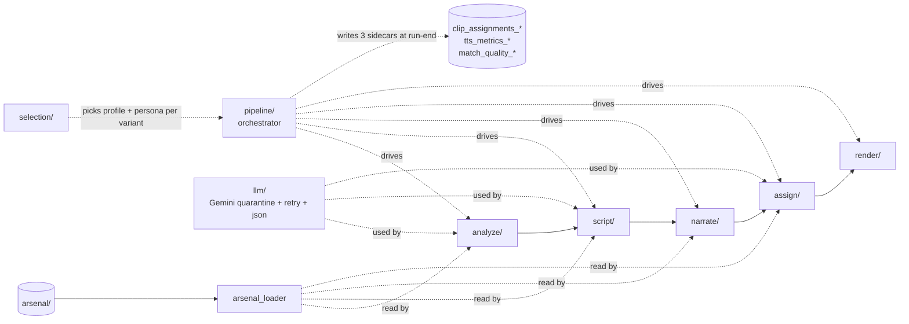

# promo/core/ — pipeline engine

This folder holds the Python that drives a clip pool from raw `.mp4` to a finished promo `.mp4`. Five subfolders correspond to the five pipeline stages; one subfolder (`pipeline/`) orchestrates them; two more (`selection/`, `llm/`) carry cross-cutting seams. Eight root-level modules carry repo-wide concerns (env config, exception types, typed payload shapes, single arsenal reader, single I/O abstraction).

For load-bearing invariants (the two-space model, the verbatim sidecar table, error taxonomy, the LLM quarantine charter), see the repo-level [`/architecture.md`](../../architecture.md). This file is a navigator into the subfolder docs — each subfolder owns a per-stage `architecture.md` for internals.

**Doc convention:** every row below describes its surface as **In / Out / Side / Raises / Consumers** — what it consumes, what it produces, what it changes outside its return value, what named exceptions it raises, and who reaches for it. Mirrors the API-service-shape principle the operator applies to code.

## Files (inventory)

### Stage subfolders

| Folder | Stage | I/O surface (full detail in folder's architecture.md) |
|---|---|---|
| `analyze/` | 1. Describe | **In:** `clip_paths: dict[str, str]`, `cache_dir`. **Out:** `list[ClipMetadata]`. **Side:** writes per-clip `.mimo_cache/<hash>-<sfx>.json` (atomic). **Raises:** `MimoAnalysisError`. |
| `script/` | 2. Generate (Gemini #1) | **In:** `clips_metadata + persona + format profile + poi_name + location + n_variants`. **Out:** `list[Script]` (one per variant). **Side:** Gemini #1 API calls. **Raises:** `ValidationError`, `RuntimeError` (clip-pool contract). |
| `narrate/` | 3. Speak (TTS) | **In:** `script["segments"] + voice_id + output_dir + speed`. **Out:** `Narration` TypedDict. **Side:** writes `narration.mp3` + per-batch silence files into `output_dir`; ElevenLabs / Gemini TTS API calls. **Raises:** `ForcedAlignmentError` (Gemini path only). |
| `assign/` | 4. Assign (Gemini #2) | **In:** `Script + Narration + clips_metadata + clip_durations` + F3-retry callbacks. **Out:** `(final_script, final_narration, list[ClipAssignment])`. **Side:** Gemini #2 API calls; retrieval reads embedding sidecar (no writes). **Raises:** `ClipAssignmentError` (caught by F3 once; propagates on second). |
| `render/` | 5. Render | **In:** `props: dict` (built upstream by `build_props_from_script` from `clip_assignments + Narration + clip_paths + bgm`), `output_path`. **Out:** the final `.mp4`. **Side:** `npx remotion render` shell-out; stages clips + audio into `promo/remotion/public/`. **Raises:** `FreezeWouldOccurError` (bridge pool exhausted). |

### Cross-cutting subfolders

| Folder | I/O surface |
|---|---|
| `pipeline/` | **Provides:** `full_pipeline` (run-level orchestrator) + `_run_variant_loop` (per-variant orchestrator) + `sidecar_writer._emit_run_sidecars`. **In:** all stage inputs threaded as kwargs to `full_pipeline`. **Out:** `bool` (run-level success). **Side:** writes 3 per-run sidecars at run-end (`tts_metrics_*`, `match_quality_*`, `clip_assignments_*`) — these are NOT stage outputs. **Raises:** propagates whatever stages raise. |
| `selection/` | **Provides:** `FormatSelector` + `PersonaSelector` Protocols + `Single*` / `Random*` impls + `make_seeded_random` factory. **In:** `(n_variants, *, poi_name, clip_metadata)` per `select()` call. **Out:** `list[PromoFormatProfile]` or `list[NarratorPersona]` of length `n_variants`. **Side:** none (pure). **Raises:** `ConfigError` if a `RandomPersonaSelector` path is missing. **Consumers:** `pipeline/_build_variant_selections`. |
| `llm/` | **Provides:** `gemini_client.{configure_gemini, reset_for_tests, resolve_gemini_model, GeminiModel}` + `retry.retry_with_backoff` + `json_response.parse_json_response`. **Side:** the only `import google.generativeai` site in the repo (Pluggability Charter Rule 1). **Raises:** `ValueError` (`json_response` on non-dict shape; `configure_gemini` on empty key). **Consumers (verified by grep):** Gemini SDK — `script/script_generator`, `assign/clip_assignment_gemini`. Retry — `analyze/clip_analyzer`, `script/script_gemini_caller`, `assign/clip_assignment_gemini`, `assign/clip_embedder`. JSON parser — `script/script_gemini_caller` only (Gemini #2 has its own list-parser). |

### Root modules (cross-cutting)

| Module | I/O surface |
|---|---|
| `__init__.py` | **Provides:** `sanitize_poi_name(name)` (underscore form — sidecar filenames) + `material_poi_slug(name)` (hyphen form — `material/<slug>/` directories). **In:** display name `str`. **Out:** sanitized slug `str` (or `"unnamed"` fallback). **Side:** none (pure). **Raises:** nothing. |
| `arsenal_loader.py` | **Provides:** `load_system_prompt`, `load_voice_catalog`, `load_persona`, `load_format_template`, `load_format_templates`, `reset_for_tests`. **In:** library / key name. **Out:** parsed Python value (`str` for system prompts, `dict` for voice catalog, `NarratorPersona`, `PromoFormatProfile`, `dict[str, PromoFormatProfile]`). **Side:** disk read — LRU-cached so module-import I/O happens once per process. **Raises:** lets `FileNotFoundError` / `KeyError` propagate. **Consumers (verified by grep — only `import yaml` site):** `analyze/clip_analyzer`, `script/script_prompt_builder`, `narrate/tts_engine`, `assign/clip_assignment_gemini`, `format_profiles`, `selection/persona_selectors`. |
| `backend.py` | **Provides:** `PromoBackend` Protocol (`runtime_checkable`) + `LocalBackend` impl. **Protocol surface:** `fetch_clips(poi_name, tmp_dir) → dict[clip_id, path]`, `fetch_bgm(poi_name, tmp_dir) → str | None`, `save_output(poi_name, video_path) → str`, plus optional `clips_dir()` / `output_dir()` hooks for sibling-path derivation (`.mimo_cache/`, `.embedding_cache/`). **Side:** `LocalBackend` reads from `clips_dir`, copies into `tmp_dir`, copies output to `output_dir`. **Raises:** standard OS errors (uncaught). **Consumers:** `pipeline/full_pipeline`, `cli/compile_promo`. |
| `config.py` | **Provides:** typed env-var resolvers (`gemini_api_key()`, `elevenlabs_api_key()`, `openrouter_api_key()`, `default_duration_sec()`, `render_concurrency()`, others) + `ConfigError`. **In:** none (reads `os.environ` + `.env` once at import via `_DOTENV_LOADED` flag). **Out:** typed value. **Side:** `load_dotenv()` runs at most once. **Raises:** `ConfigError` on missing-required or type-coerce failure. **Note:** required values use `_require` / `_require_int` / `_require_float`; optional values (`OPENROUTER_HTTP_REFERER`, `PROMO_CLIP_MODEL`, `PROMO_FORMAT_SELECTOR`) use bare `os.getenv` with hardcoded defaults inside the same module. **Consumers:** every stage that needs env vars; no other module is allowed to touch `os.environ` except the documented `llm/gemini_client.GEMINI_MODEL` carve-out. |
| `errors.py` | **Provides:** 5 named exception types — each carries a recovery contract: `ClipAssignmentError` (raised by `assign/`, **caught by `assign_clips_with_f3_retry` for ONE retry**, propagates on second → variant abort); `FreezeWouldOccurError` (raised by `render/`, **no retry → variant abort**); `ForcedAlignmentError` (raised by `narrate/forced_aligner` on Gemini path, **no retry → variant abort**); `MimoAnalysisError` (raised by `analyze/` after retry budget exhausted, **aborts the run**); `NoSuitableBGMError` (raised by `pipeline/bgm_voice_resolver`, **aborts before any variant runs**). **Consumers:** every stage raises one or more; `pipeline/` and `cli/` decide abort vs recover. |
| `format_profiles.py` | **Provides:** `get_promo_format_profile(target_duration_sec) → PromoFormatProfile` + `get_clip_pool_messages(n_clips, profile) → (errors, warnings)` + `FORMAT_TEMPLATES` / `SHORT_PROFILE` / `LONG_PROFILE` / `SegmentPlan` / `PromoFormatProfile` re-exports from `schema.py`. **In:** target duration in seconds; clip-pool count. **Out:** profile / message lists. **Side:** at module-import, populates `FORMAT_TEMPLATES = arsenal_loader.load_format_templates()` — importing this module triggers an arsenal disk read. **Raises:** `KeyError` if no `short` / `long` template ships in arsenal. **Consumers:** `script/`, `assign/`, `pipeline/`, `selection/`. |
| `logging_config.py` | **Provides:** `configure_logging(level=INFO, correlation_id=None)`. **In:** log level + optional correlation_id. **Out:** none (configures root logger). **Side:** attaches a JSON-per-line handler to `logging.getLogger()`; idempotent — second call updates the existing handler in-place via the `_PROMO_HANDLER_MARK` attribute, never double-attaches. **Raises:** nothing. **Consumers:** every CLI script (typically called once at startup). |
| `schema.py` | **Provides:** TypedDicts (`WordTimestamp`, `SegmentTimestamp`, `ClipMetadata`, `ClipAssignment`, `ScriptSegment`, `Script`, `Narration`) — annotation-only, NOT runtime-enforced — plus dataclasses: `SegmentPlan` and `PromoFormatProfile` are `@dataclass(frozen=True)`; `NarratorPersona` is a regular `@dataclass` (mutable — loaders / tests rebind fields). **Consumers:** every cross-folder seam types its inputs/outputs against shapes here. |

## How they wire together

The five stages are sequential within one variant; `pipeline/full_pipeline` runs the run-level pre-loop (clip prep + voice/BGM + Gemini #1 + pause budget) and `pipeline/_run_variant_loop` runs the per-variant inner loop (TTS + Gemini #2 + render). `selection/`, `llm/`, and `arsenal_loader.py` cut across stages.

**Stage hand-offs (I/O contract — these are the actual public function signatures):**

- **`analyze/` (`analyze_clips`)** — In: `clip_paths: dict[str, str]`, `cache_dir: str | None`. Out: `list[ClipMetadata]`. Side: writes per-clip `.mimo_cache/<hash>-<sfx>.json` (atomic). Raises: `MimoAnalysisError` (after retry budget exhausted → run aborts).
- **`script/` (`generate_script_variants`)** — In: `clips_metadata`, `persona`, `format profile`, `poi_name`, `location`, `n_variants`, optional `hotel_description` / `notable_details`. Out: `list[Script]` (one per variant). Side: Gemini #1 API calls via `llm/`. Raises: `ValidationError` (validation gates), `RuntimeError` (clip-pool contract).
- **`narrate/` (`generate_narration`)** — In: `script["segments"]: list[ScriptSegment]`, `voice_id`, `output_dir`, `speed`. Out: `Narration` TypedDict — `{audio_path, word_timestamps, segment_timestamps, segments}`. Side: writes `narration.mp3` + per-batch silence mp3 files into `output_dir`; ElevenLabs / Gemini API calls. Raises: `ForcedAlignmentError` (Gemini-TTS path only — MMS_FA confidence below 0.60 or empty span list).
- **`assign/` (`assign_clips_with_f3_retry`)** — In: `Script`, `Narration`, `clips_metadata`, `clip_durations`, F3-retry callbacks (`regenerate_script_fn`, `regenerate_narration_fn`, `retrieve_clips_fn`) supplied by `pipeline/_step_assign_clips`. Out: `(final_script, final_narration, list[ClipAssignment])`. Side: Gemini #2 API calls via `llm/`; retrieval reads the embedding sidecar (no writes from this stage). Raises: `ClipAssignmentError` (caught by F3 once → triggers script + narrate regeneration; second raise propagates and aborts the variant).
- **`render/` (`render_promo`)** — In: `props: dict` (built upstream by `build_props_from_script` from clip assignments + narration + clip_paths + bgm), `output_path`, `composition_id`, `timeout`. Out: the final `.mp4` written at `output_path`. Side: `npx remotion render` shell-out; stages clips + audio into `promo/remotion/public/`. Raises: `FreezeWouldOccurError` (bridge pool exhausted before `final_display_end` → variant abort).

**Step ordering lives in two places:**

- `pipeline/full_pipeline` owns **run-level** ordering — clip prep, voice/BGM resolution, Gemini #1, pause budget, the variant loop, and the final per-run sidecar emission.
- `pipeline/_run_variant_loop` owns **per-variant** ordering — TTS (Step 4) → Gemini #2 + F3 (Step 4.5) → props build + freeze prevention (Step 7) → Remotion render (Step 8) → success-gated observability row append.

The 3 per-run sidecars (`clip_assignments_*.json`, `tts_metrics_*.json`, `match_quality_*.json`) are emitted by `pipeline/sidecar_writer._emit_run_sidecars` AFTER all variants complete — none of the stages writes these directly.

**Cross-cutting concerns:**

- **Errors** — 5 named exceptions, all in `errors.py`. Recovery taxonomy: `ClipAssignmentError` → F3 retry; `FreezeWouldOccurError` / `ForcedAlignmentError` → variant abort; `MimoAnalysisError` → run abort (after retry exhaustion); `NoSuitableBGMError` → run abort (pre-variant). Every doc surface above carries a "Raises" field — if any disagrees with this taxonomy, one of the docs is wrong.
- **Config** — `config.py` is the single env-var reader. Required values use `_require` / `_require_int` / `_require_float` (fail-fast `ConfigError`); optional values use bare `os.getenv` with hardcoded defaults inside the same module (`OPENROUTER_HTTP_REFERER`, `PROMO_CLIP_MODEL`, `PROMO_FORMAT_SELECTOR`). `llm/gemini_client.py` is the documented carve-out for `GEMINI_MODEL` (one import-cycle hop away from `config`).
- **Schema** — `schema.py` carries all cross-folder shapes. TypedDicts are annotation-only (Python doesn't enforce at runtime); dataclasses split: `SegmentPlan` and `PromoFormatProfile` are `frozen=True`, `NarratorPersona` is mutable.
- **Arsenal** — every prompt / voice / persona / skeleton lives in `promo/arsenal/`; every read goes through `arsenal_loader.py`. The 6 consumers are catalogued in the row above; no other module reads `arsenal/*.md` or `arsenal/*.yaml` directly (verified — only `import yaml` site in the repo is `arsenal_loader.py`).
- **Slug conventions** — `sanitize_poi_name` (underscores, used in sidecars) and `material_poi_slug` (hyphens, used in material directories). Two non-interchangeable forms; passing the wrong form silently misses sidecars.

For per-stage internals, see each subfolder's `architecture.md`.
