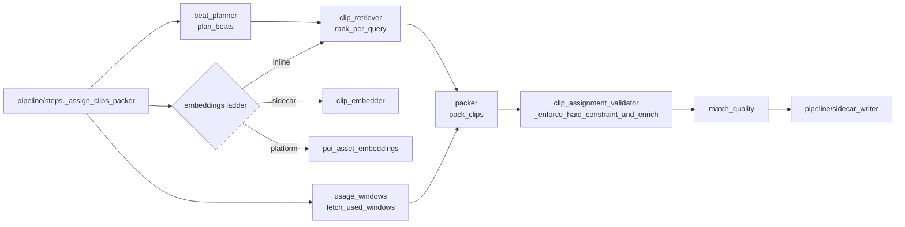

# promo/core/assign/ — deterministic clip assignment (翻转二)

Stage 4 runs AFTER real TTS timing exists, so display-span math is
measured (not predicted). Since 2026-06-11 the sole engine is the
deterministic chain — **beat planner → per-beat retrieval → packer →
validator** — selected by the same-script A/B verdict; the legacy
LLM-assigner + F3 script-regen + split-repair chain was retired the same day (1f28902; history:
`git log -- promo/core/assign/clip_assignment_gemini.py`).

This folder owns the load-bearing correctness boundary between
**assigner space** (ceiling = `narration_end`) and **renderer space**
(ceiling = `final_display_end`); see [/architecture.md](../../../architecture.md)
"Two-space model" for the verbatim invariant.

**Doc convention:** every row describes **In / Out / Side / Raises /
Consumers** — see umbrella [`core/architecture.md`](../architecture.md).

## Files (inventory)

| File | I/O surface |
|---|---|
| `__init__.py` | Stage marker; no exports. |
| `beat_planner.py` | **Provides:** `plan_beats`, `beat_text`, `DEFAULT_MAX_BEAT_SEC` (4.0) / `DEFAULT_MIN_BEAT_SEC` (2.0 — Leo's shot-pacing knobs). **`plan_beats`:** In `(script, word_timestamps, *, max_beat_sec, min_beat_sec, max_beats)`. Out `list[Beat]` (`segment/start_word_idx/end_word_idx`), semantic-first: punctuation starts a beat, <floor fragments soft-merge (never past the ceiling), >ceiling clauses grid-split. Over-ceiling beats (long authored pauses) are WARNING-logged, never silent. `max_beats` seatbelt = largest-remainder per-segment allocation + fail-loud post-check. Side: pure. Raises `ValueError` (empty/mismatched inputs). **Consumers:** `pipeline/steps._assign_clips_packer`. |
| `clip_retriever.py` | **Provides:** `rank_per_query`. In `(queries, clip_metadata, *, embed_query_fn=None)`. Out one full `[(clip_id, cosine), ...]` ranking PER query from ONE batched embed call. Stateless by design (no memo). Raises `ValueError`/`RuntimeError` on empty/mismatched inputs. **Consumers:** `_assign_clips_packer`. |
| `usage_windows.py` | **Provides:** `fetch_used_windows`, `merge_windows`, `free_windows`, `UsedWindow`, `UsageWindowError`. FIRST READER of the ledger's window fields — the conventions here are the FAMILY STANDARD (key by asset_id; every usage_role counts; window = `[trim, trim + display_len)` clamped to the row's `source_duration_sec`; stable `event_id` pagination). Fail-closed per 设计契约 ②: query errors raise; stale/malformed rows are counted + skipped. **Consumers:** `_assign_clips_packer`. |
| `packer.py` | **Provides:** `pack_clips`. In `(beats, rankings, *, word_timestamps, clip_durations, clip_metadata, used_windows, clip_to_asset)` — `clip_to_asset` keys MUST be zfill(4)-normalized. Out `(raw_assignments, provenance)`; provenance carries `picks` (−inf scores sanitized to None), `beat_count`/`unique_clip_count` (clip-burn observability), `window_exhausted_beats`, `adjacency_relaxed_beats`, `overlong_beats`. House rules in contract order: no reuse within video (hard) → coverage (hard) → window rotation (SOFT — exhaustion degrades to least-overlap + provenance flag; the platform's <3-use gate is the ONLY hard eligibility door, enforced upstream) → adjacency variety (two-pass) → motion-phase trim placement. Raises `ClipAssignmentError` when no coverable unused candidate exists. **Consumers:** `_assign_clips_packer`; output MUST be re-validated. |
| `clip_assignment_validator.py` | **Provides:** `_enforce_hard_constraint_and_enrich`, `_phrase_display_span_sec`, `_segment_phrase_layout`, `HARD_CONSTRAINT_TOL_SEC = 0.05`. The single arbiter of the renderer-facing contract (peek-ahead spans, last phrase → `narration_end`, segment tiling, zfill-normalized uniqueness). Pure; raises `ClipAssignmentError`. **Consumers:** `_assign_clips_packer` (guard on packer output), `remotion_renderer` (TOL import), beat-planner/packer contract tests. |
| `clip_embedder.py` | **Provides:** `embed_clips_for_poi`, `embed_texts`, `attach_embeddings_to_metadata`, `load_embeddings_for_poi`, `compose_embedding_text`, `current_mimo_prompt_sha1`. Local `.embedding_cache/` sidecar producer + the beat-query embedder (`text-embedding-3-small`@1536, same model+dim as the platform table). **Consumers:** `cli/build_embedding_index`, `_assign_clips_packer` (sidecar rung + `embed_texts` via retriever). |
| `clip_assignment_sidecar.py` | **Provides:** `load_latest_clip_assignments` (replay tooling reader). Writer lives in `pipeline/sidecar_writer.py`. |
| `match_quality.py` | **Provides:** `compute_overlap_score`, `build_match_quality_entries` — per-phrase narration↔scene_description overlap rows for the `match_quality_*.json` sidecar. Engine-agnostic (consumes assignments). **Consumers:** `pipeline/variant_loop`. |

## How they wire together

**Invariants:**

- **Validator is the arbiter** — every engine's output passes through
  `_enforce_hard_constraint_and_enrich`; packer bugs fail loud there.
- **Hard-constraint TOL = 0.05s**; **last-phrase ceiling = `narration_end`**
  (bridges own the buffer to `target_duration_sec`).
- **Beats ≤4s vs clips ≥5s** removes the duration constraint's normal
  failure mode — but NOT absolutely: long authored pauses can exceed the
  ceiling, and such beats are flagged (planner WARNING +
  `provenance["packer"]["overlong_beats"]`).
- **Window exhaustion is a soft preference; the <3-use platform gate is
  the only hard eligibility door** (anti-zombie clause, 2026-06-10).
- **Fail-closed ledger reads** (设计契约 ②): `UsageWindowError` aborts
  the variant; `--resume` recovers. Dev runs without an asset mapping
  skip rotation with `usage_ledger: "no_asset_mapping"` provenance.
- **Stateless retrieval** — no memo anywhere in the ranking path.
- **`clip_id.zfill(4)` normalization** before dedup/inventory/asset
  lookups, everywhere.
- **Determinism** — same inputs, same assignment, forever; no
  LLM calls anywhere in this folder.
