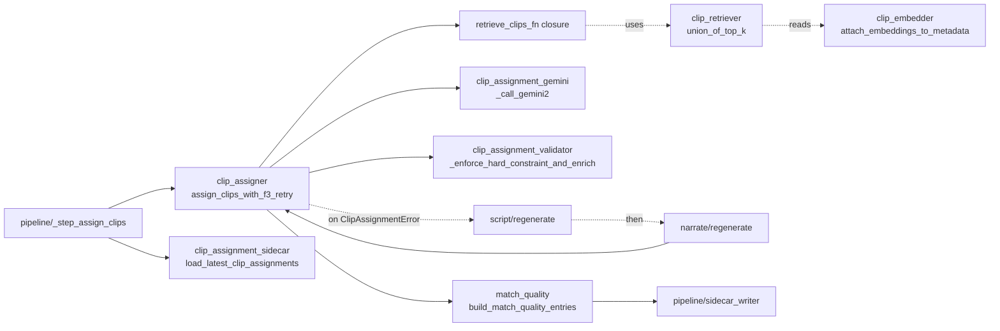

# promo/core/assign/ — Gemini #2 clip assignment + retrieval

The assigner runs AFTER real TTS timing exists, so display-span math is measured (not predicted). This is the load-bearing correctness boundary between **assigner space** (ceiling = `narration_end`) and **renderer space** (ceiling = `final_display_end`); see [/architecture.md](../../../architecture.md) "Two-space model" for the verbatim invariant.

This folder also owns the embedding-index sidecar that narrows Gemini #2's clip inventory under the soft-hint contract.

## Files (inventory)

| File | Role |
|---|---|
| `__init__.py` | Stage marker; no exports. |
| `clip_assigner.py` | **Facade** — public `assign_clips`, `assign_clips_with_f3_retry`, `build_tighten_hint`. Owns F3 retry orchestration. Re-exports siblings (load-bearing for the test patch surface). |
| `clip_assignment_validator.py` | Hard-constraint enforcer (`_enforce_hard_constraint_and_enrich`) + display-span math (`_phrase_display_span_sec`) + `HARD_CONSTRAINT_TOL_SEC = 0.05`. Six audit-fix branches live here. |
| `clip_assignment_gemini.py` | Gemini #2 prompt builder + API call + JSON parser (`_build_gemini2_prompt`, `_call_gemini2`, `_parse_gemini2_json`). Loads the prompt body from `arsenal/system_prompts/gemini2_assign_v1.md`. |
| `clip_assignment_sidecar.py` | Reader for `clip_assignments_<slug>_<dur>s.json` (writer lives in `pipeline/sidecar_writer.py`). Tolerates dict-or-list payload shapes across sprints. |
| `clip_embedder.py` | Embedding-index sidecar producer/reader (`embed_clips_for_poi`, `attach_embeddings_to_metadata`). 4-axis filename invalidation; atomic `os.replace`. |
| `clip_retriever.py` | Stateless top-k cosine retrieval (`top_k`, `top_k_by_vector`, `union_of_top_k`). No memo, no I/O — load-bearing for F3 retry correctness. |
| `match_quality.py` | Keyword-overlap observability (`compute_overlap_score`, `build_match_quality_entries`). Inline 40-word stopword list. |

## How they wire together

The hot path runs through the facade only; embedder/retriever/match_quality are sidecar-shaped (off the assignment hot path).

**Hand-offs:**

- Inputs to the facade: `Script`, `Narration` (for `word_timestamps`), `clips_metadata`, `clip_durations`. F3 retry callbacks (`regenerate_script_fn`, `regenerate_narration_fn`, `retrieve_clips_fn`) are injected by `pipeline/_step_assign_clips`.
- Output: `list[ClipAssignment]` — each phrase carries `clip_id`, `start_word_idx`, `end_word_idx`, `trim_start`, `display_span_sec`, `source_duration_sec`.
- Sidecar trail: `pipeline/sidecar_writer` persists Gemini #2's per-variant output as `clip_assignments_<slug>_<dur>s.json`; the reader in `clip_assignment_sidecar.py` is paired with that writer for replay/debug.

**Invariants:**

- **Facade re-export pattern** — `clip_assigner.py` is the single import path tests + callers target. Siblings' symbols are re-exported up so `monkeypatch.setattr(clip_assigner, "_call_gemini2", ...)` resolves through the facade's globals. Moving entry points across files would break bare-name resolution. (S2b post-mortem in `clip_assigner.py` docstring.)
- **Hard-constraint TOL = 0.05s** — display-span ≤ usable-footage check tolerates 50ms of measurement noise (TTS ~10ms, ffprobe ~1ms).
- **Last-phrase ceiling = `narration_end`** (NOT `final_display_end`). The buffer between `narration_end` and `target_duration_sec` is renderer territory — bridges live there.
- **Stateless retrieval** — no `@lru_cache`, no module-level memo. F3 retry rewrites the script; any memo would surface stale top-k.
- **Soft-hint contract** — retrieval narrows the inventory Gemini #2 *sees*, but the validator does NOT gate on `clip_id ∈ retrieved_ids`. Four fallback codes (`no_sidecar`, `m4_attach_shrinkage`, `h2_union_shortfall`, `retrieval_exception`) are recorded in the sidecar's `fallback_reason` field.
- **F3 = exactly one retry** — second `ClipAssignmentError` propagates; the variant aborts.
- **`clip_id.zfill(4)` normalization** — Gemini-emitted "7" and "0007" must converge before dedup and inventory lookup.
- **Embedding sidecar 4-axis invalidation** — `model + dim + mimo_prompt_sha1 + composition_version`. Per-clip `input` field stored alongside vectors as audit trail; mismatched cached input vs composed input triggers re-embed.
- **Atomic embedding writes** — `os.replace` (concurrent-runner-safe).
