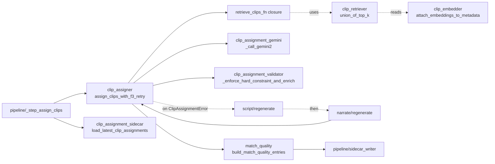

# promo/core/assign/ — Gemini #2 clip assignment + retrieval

The assigner runs AFTER real TTS timing exists, so display-span math is measured (not predicted). This is the load-bearing correctness boundary between **assigner space** (ceiling = `narration_end`) and **renderer space** (ceiling = `final_display_end`); see [/architecture.md](../../../architecture.md) "Two-space model" for the verbatim invariant.

This folder also owns the embedding-index sidecar that narrows Gemini #2's clip inventory under the soft-hint contract.

**Doc convention:** every row describes **In / Out / Side / Raises / Consumers** — see umbrella [`core/architecture.md`](../architecture.md).

> **Read upstream first:** [`README.md`](../../../README.md) → [`promo/core/architecture.md`](../architecture.md) (defines POI, sidecar, two-space model, F3 retry, soft-hint contract, facade re-export pattern, Gemini #1/#2). This doc covers stage 4 only.

## Files (inventory)

| File | I/O surface |
|---|---|
| `__init__.py` | Stage marker; no exports. |
| `clip_assigner.py` (facade) | **Provides:** `assign_clips` (single Gemini #2 pass), `assign_clips_with_f3_retry` (public entry — F3-policy wrapper), `build_tighten_hint`. Sibling symbols re-exported at module level (test patch surface). **`assign_clips_with_f3_retry`:** In `(script, narration, clips_metadata, clip_durations, *, variant_index, regenerate_script_fn, regenerate_narration_fn, retrieve_clips_fn)`. Out `(final_script, final_narration, list[ClipAssignment])`. Side: Gemini #2 API call; on F3 retry, also Gemini #1 + TTS via injected callbacks. Raises `ClipAssignmentError` on the second consecutive failure (variant abort). **Consumers:** `pipeline/_step_assign_clips` is the only public caller. |
| `clip_assignment_validator.py` | **Provides:** `_enforce_hard_constraint_and_enrich`, `_phrase_display_span_sec`, `_segment_phrase_layout`, constant `HARD_CONSTRAINT_TOL_SEC = 0.05`. **`_enforce_hard_constraint_and_enrich`:** In `(raw_assignments, script, word_timestamps, clip_durations)`. Out enriched `list[ClipAssignment]` with `display_span_sec` + `source_duration_sec` populated. Side: pure (no I/O). Raises `ClipAssignmentError` on first hard-constraint violation, missing segment, tiling gap, or duplicate clip_id. **Consumers:** `clip_assigner` (via re-export — load-bearing for `monkeypatch.setattr` resolution). |
| `clip_assignment_gemini.py` | **Provides:** `_build_gemini2_prompt`, `_call_gemini2`, `_parse_gemini2_json`, `_format_phrase_timing_block`, `_FENCE_RE`. **`_call_gemini2`:** In prompt `str`. Out `list[ClipAssignment]` (raw — pre-enrichment). Side: Gemini #2 API call via `llm.retry.retry_with_backoff` (max_retries=2, base_delay=2.0); reads prompt body from `arsenal/system_prompts/gemini2_assign_v1.md` via `arsenal_loader`. Raises `ValueError` on JSON parse failure or unrecognized response shape. **Consumers:** `clip_assigner` (via re-export). |
| `clip_assignment_sidecar.py` | **Provides:** `load_latest_clip_assignments`. In `(poi_slug, duration_sec, sidecar_search_dirs)`. Out `list | None` — most-recent-by-mtime variants list, or `None` if nothing matches. Side: file-system globbing + read. Raises nothing — silently skips malformed sidecars. Tolerates both legacy (bare list) and current (dict with `variants` key) payload shapes. **Consumers:** tests + replay tooling. (Writer for `clip_assignments_*.json` lives in `pipeline/sidecar_writer.py`, not here.) |
| `clip_embedder.py` | **Provides:** `embed_clips_for_poi`, `embed_texts`, `attach_embeddings_to_metadata`, `load_embeddings_for_poi`, `compose_embedding_text`, `current_mimo_prompt_sha1`. **`embed_clips_for_poi`:** In `(clip_metadata, cache_dir, *, mimo_prompt_sha1=None, composition_version=COMPOSITION_VERSION)`. Out `dict` (`{model, dim, mimo_prompt_sha1, composition_version, embeddings, stats, sidecar_path}`). Side: writes `material/<slug>/.embedding_cache/<sidecar>.json` (atomic `os.replace`); OpenRouter embeddings HTTP via `llm.retry`. Raises `ValueError` on empty input; `RuntimeError` on response-shape / dim mismatch. **Consumers:** `cli/build_embedding_index` (the operator harness for populating the per-POI embedding sidecar offline), `pipeline/_step_assign_clips` (via `attach_embeddings_to_metadata`), `assign/clip_retriever` (lazy import for `embed_texts`). |
| `clip_retriever.py` | **Provides:** `top_k`, `top_k_by_vector`, `union_of_top_k`. **`union_of_top_k`:** In `(narration_queries: list[str], clip_metadata, k=6, *, embed_query_fn=None)`. Out `(deduped_clip_ids: list[str], union_size: int)`. Side: one OpenRouter embeddings call (batched) via the injected `embed_query_fn` (default `clip_embedder.embed_texts`). Raises `ValueError` on empty input / k≤0; `RuntimeError` if embed returns no vectors. **Stateless by design** — no `@lru_cache`, no module memo (load-bearing for F3 retry correctness). **Consumers:** `pipeline/_step_assign_clips` wraps this into the closure passed as `retrieve_clips_fn` to `assign_clips_with_f3_retry`. |
| `match_quality.py` | **Provides:** `compute_overlap_score`, `build_match_quality_entries`. **`build_match_quality_entries`:** In `(assignments, clips_metadata, word_timestamps, variant_index)`. Out `list[dict]` per-phrase overlap entries (`segment_idx, clip_id, narration_phrase, scene_description, overlap_score, picked_category`). Side: pure (no I/O); inline 40-word stopword list. Raises nothing. **Consumers:** `pipeline/variant_loop` (per-variant observability row); rows are written to `match_quality_*.json` by `pipeline/sidecar_writer._emit_run_sidecars` at run-end. |

## How they wire together

The hot path runs through the facade only; embedder / retriever / match_quality are sidecar-shaped (off the assignment hot path).

**Folder-level I/O contract:**

- **In:** `Script`, `Narration` (for `word_timestamps`), `clips_metadata: list[ClipMetadata]`, `clip_durations: dict[clip_id, float]`. F3-retry callbacks (`regenerate_script_fn`, `regenerate_narration_fn`, `retrieve_clips_fn`) injected by `pipeline/_step_assign_clips`.
- **Out:** `(final_script, final_narration, list[ClipAssignment])` — each `ClipAssignment` carries `clip_id`, `start_word_idx`, `end_word_idx`, `trim_start`, `display_span_sec`, `source_duration_sec`.
- **Side:** Gemini #2 API calls; reads embedding sidecar; on F3 retry, drives Gemini #1 + ElevenLabs/Gemini TTS via the injected callbacks. No direct file writes from this folder — `clip_assignments_*.json` is written by `pipeline/sidecar_writer` at run-end. `clip_embedder` produces the `.embedding_cache/` sidecar but only when invoked from `cli/build_embedding_index` (off the hot path).
- **Raises:** `ClipAssignmentError` (caught by F3 once, propagates on second → variant abort).

**Invariants:**

- **Facade re-export pattern** — `clip_assigner.py` is the single import path tests + callers target. Sibling symbols are re-exported up so `monkeypatch.setattr(clip_assigner, "_call_gemini2", ...)` resolves through the facade's globals. Moving entry points across files would break bare-name resolution (post-mortem context lives in `clip_assigner.py` docstring).
- **Hard-constraint TOL = 0.05s** — display-span ≤ usable-footage check tolerates 50ms of measurement noise (TTS ~10ms, ffprobe ~1ms).
- **Last-phrase ceiling = `narration_end`** (NOT `final_display_end`). The buffer between `narration_end` and `target_duration_sec` is renderer territory — bridges live there.
- **Stateless retrieval** — no `@lru_cache`, no module-level memo. F3 retry rewrites the script; any memo would surface stale top-k.
- **Soft-hint contract** — retrieval narrows the inventory Gemini #2 *sees*, but the validator does NOT gate on `clip_id ∈ retrieved_ids`. Four fallback codes (`no_sidecar`, `m4_attach_shrinkage`, `h2_union_shortfall`, `retrieval_exception`) are recorded in the sidecar's `fallback_reason` field.
- **F3 = exactly one retry** — second `ClipAssignmentError` propagates; the variant aborts.
- **`clip_id.zfill(4)` normalization** — Gemini-emitted "7" and "0007" must converge before dedup and inventory lookup.
- **Embedding sidecar 4-axis invalidation** — `model + dim + mimo_prompt_sha1 + composition_version`. Per-clip `input` field stored alongside vectors as audit trail; mismatched cached input vs composed input triggers re-embed.
- **Atomic embedding writes** — `os.replace` (concurrent-runner-safe).
