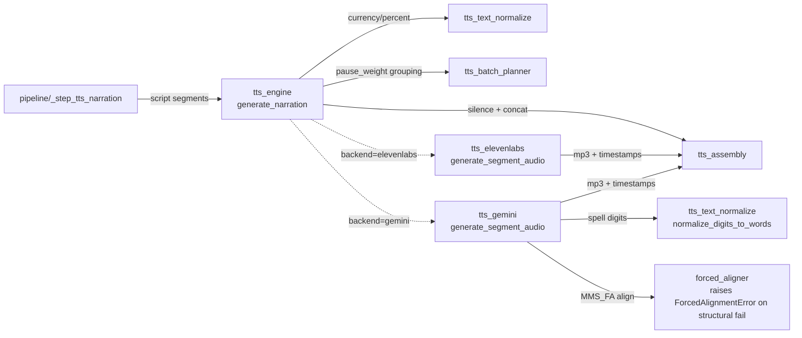

# promo/core/narrate/ — Stage 3: dual-backend TTS + alignment

Generates the spoken narration. Both ElevenLabs v2 and Gemini 3.1 Flash TTS coexist behind a single dispatch seam in `generate_narration`; both backends return identically-shaped `(path, duration_sec, word_timestamps)` tuples so every downstream consumer (`_back_allocate_timestamps`, `_ffmpeg_concat_mp3s`, the assign stage, captions) is backend-agnostic.

The folder was previously split from a single-file module: `tts_engine.py` is now a facade that re-exports private helpers from 6 sibling modules; `forced_aligner.py` predates the split and is invoked only on the Gemini path.

> **Read upstream first:** [`README.md`](../../../README.md) → [`promo/core/architecture.md`](../architecture.md) (defines dispatch seam, facade re-export pattern, `pause_weight`, sidecar). This doc covers stage 3 only.

## Vocabulary (new terms in this doc)

- **forced aligner** — a model that takes audio + a known transcript and computes per-word start/end times. The Gemini-TTS path needs this because Gemini's API does not return alignment; ElevenLabs returns alignment natively. The project's forced aligner is MMS_FA (Meta's `torchaudio.pipelines.MMS_FA`, a wav2vec2-CTC model).
- **back-allocate** — `_back_allocate_timestamps` maps per-batch TTS alignments onto per-segment timelines. The TTS API returns one alignment per batch (which may cover multiple segments); back-allocation re-tags each word with its original segment index so downstream consumers (caption renderer, the assign stage) can address words by `segment_index + word_offset`.
- **batch-merge rule** — `plan_tts_batches` groups consecutive `pause_weight == 1` segments into one TTS call (natural prosody carries STANDARD pauses); `pause_weight ≥ 2` terminates a batch and an explicit `_generate_silence_mp3` is stitched in between batches.

## Files (inventory)

| File | I/O surface |
|---|---|
| `__init__.py` | Stage marker; no exports. |
| `tts_engine.py` | **Facade.** **Provides:** public `generate_narration` (the single dispatch seam) + re-exports of every private sibling helper (test mock-patch surface — `mock.patch("promo.core.narrate.tts_engine._normalize_for_tts", ...)` works because the dispatcher resolves them via this module's globals). **In:** `script["segments"]`, `voice_id`, `output_dir`, `speed`. **Out:** `Narration` TypedDict. **Side:** ONE `backend ==` check inside `generate_narration` resolves the per-batch backend from `VOICE_CATALOG[voice_key]["backend"]`. **Consumers:** `pipeline/_step_tts_narration`. |
| `tts_text_normalize.py` | **Provides:** `normalize_for_tts` (currency / percent → words; runs on BOTH backends), `normalize_digits_to_words` (Gemini-only second pass; spells `900` → `nine hundred` because MMS_FA's vocab is letter-only). **Side:** pure (regex + word-form tables). **Consumers:** `tts_engine`, `tts_gemini`. |
| `tts_batch_planner.py` | **Provides:** `plan_tts_batches(segments) → list[batch dict]`. Groups by `pause_weight`. **Side:** pure. **Consumers:** `tts_engine`. |
| `tts_elevenlabs.py` | **Provides:** `_generate_segment_audio_elevenlabs(segment, voice_id, ...) → (duration_sec, word_timestamps)`. **In:** segment text + voice + speed. **Out:** API-returned `normalized_alignment` projected to the unified tuple shape. **Side:** REST call to ElevenLabs (`requests` import lives here, not in the facade). **Consumers:** `tts_engine` dispatch. |
| `tts_gemini.py` | **Provides:** `_generate_segment_audio_gemini(segment, voice_key, ...) → (duration_sec, word_timestamps)`. **In:** segment text + Gemini voice key + speed + style prompt. **Out:** PCM 24kHz → WAV → ffmpeg-encoded mp3 at 44.1kHz; word_timestamps from `forced_aligner.align_words`. **Side:** REST call to Gemini TTS (`requests` import here too); primary/fallback model on HTTP 404/403. **Consumers:** `tts_engine` dispatch. |
| `tts_assembly.py` | Library-shape (operator-blessed exception). **Provides:** `_run_ffmpeg`, `_generate_silence_mp3`, `_ffmpeg_concat_mp3s`, `_ffprobe_duration`, `_validate_word_timestamps`, `_back_allocate_timestamps`. **Side:** ffmpeg shell-outs + audio file I/O. **Raises:** `RuntimeError` on ffmpeg failures. **Consumers:** `tts_engine` (concat/silence), `tts_elevenlabs` + `tts_gemini` (probe duration). |
| `forced_aligner.py` | **Provides:** `align_words(audio_path, script_tokens) → list[WordTimestamp]`. Wraps `torchaudio.pipelines.MMS_FA` (wav2vec2-CTC). Invoked ONLY on the Gemini-TTS path (ElevenLabs has native alignment). **In:** mp3 path + script token list. **Out:** per-word `(token, start, end)` tuples. **Side:** ffmpeg preconvert to 16kHz mono (bypassing `torchaudio.load`'s `torchcodec` requirement); MMS_FA inference. Below-threshold scores warn only (see Invariants for the threshold). **Raises:** `ForcedAlignmentError` only on structural failures — empty normalization (non-alphabetic token) or empty span list from MMS_FA. **Consumers:** `tts_gemini`. |

## How they wire together

**Cross-file seams:**

- `tts_engine` (facade) reads `VOICE_CATALOG` via `arsenal_loader.load_voice_catalog()` to resolve `backend` per voice key; the dispatch site is the only place a `backend == "gemini"` / `"elevenlabs"` check lives in production code.
- `tts_assembly` is shared infrastructure between both backends + the dispatcher: ffmpeg primitives, silence generation, concat, back-allocate.
- `forced_aligner` shells out to `ffmpeg` for 16kHz mono preconversion (bypassing `torchaudio.load`'s `torchcodec` requirement), runs MMS_FA on a stdlib-`wave`-loaded tensor, and converts CTC frame indices to seconds.
- Consumed by `pipeline/_step_tts_narration`; the produced `Narration` (word_timestamps) flows into the `assign/` stage (beat planner → retrieval → packer → validator) for deterministic clip assignment.

**Invariants:**

- **Single dispatch seam** (operator-blessed) — exactly one `backend ==` check inside `generate_narration`. All other production sites consume the unified tuple shape `(path, duration_sec, word_timestamps)`.
- **44.1 kHz mono mp3 throughout** — silence files (`anullsrc -ar 44100`), ElevenLabs output (`mp3_44100_128`), and Gemini PCM→mp3 conversion all share format constants in `tts_assembly` so the concat demuxer streams mixed-source files without re-encoding artifacts.
- **Pause tags NEVER sent to either backend** — Gemini's pause tags spike σ up to 719ms (TTS-spike measurement); ElevenLabs `<break>` is compressed by their model. Declarative pauses are exclusively `_generate_silence_mp3` between batches.
- **`ForcedAlignmentError` raises only on structural failures** — empty normalization (non-alphabetic token) or empty span list from MMS_FA. No silent contraction of the output list.
- **Below-threshold MMS_FA scores are warn-only** — per-word avg CTC below 0.60 logs a diagnostic warning. The warn-only policy preserves best-effort timestamps so a single low-confidence token does not abort the variant.
- **Batch-merge rule** — `plan_tts_batches` groups consecutive weight==1 segments into one ElevenLabs call. Weight≥2 terminates the current batch; explicit `_generate_silence_mp3` follows. The last segment's `pause_weight` is ignored (no gap after it).
- **`tts_assembly` is a library-shape exception** — not a 1-IO API service like the rest of `narrate/`; operator-blessed. The cohesive ffmpeg + timestamp primitives compose differently than 1-input-1-output modules.
- **Facade re-export pattern** — `tts_engine.py` is the single import path tests + callers target. Same constraint as `script/script_generator`.
