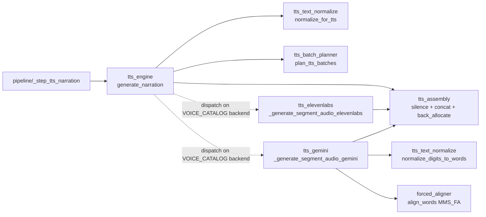

# promo/core/narrate/ — Stage 3: dual-backend TTS + alignment

Generates the spoken narration. Both ElevenLabs v2 and Gemini 3.1 Flash TTS coexist behind a single dispatch seam in `generate_narration`; both backends return identically-shaped `(path, duration_sec, word_timestamps)` tuples so every downstream consumer (`_back_allocate_timestamps`, `_ffmpeg_concat_mp3s`, `clip_assigner`, captions) is backend-agnostic.

S2a split the original `tts_engine.py` into a facade plus 6 siblings; `forced_aligner.py` is invoked only on the Gemini path and predates the split.

## Files (inventory)

| File | Role |
|---|---|
| `__init__.py` | Stage marker; no exports. |
| `tts_engine.py` | **Facade (S2a)** — public `generate_narration` is the single dispatch seam. Re-exports siblings (test mock-patch surface). |
| `tts_text_normalize.py` | Pre-TTS text fixups. `normalize_for_tts` (currency / percent, BOTH backends), `normalize_digits_to_words` (Gemini-only second pass — spells digits for MMS_FA's letter-only vocab). |
| `tts_batch_planner.py` | `plan_tts_batches` — groups segments by `pause_weight`. Consecutive weight==1 segments share a batch; weight≥2 terminates one. |
| `tts_elevenlabs.py` | ElevenLabs backend. `_generate_segment_audio_elevenlabs` — single-segment TTS via REST, returns `(duration_sec, word_timestamps)` from API-returned `normalized_alignment`. |
| `tts_gemini.py` | Gemini 3.1 Flash TTS backend. `_generate_segment_audio_gemini` — PCM 24kHz → WAV → ffmpeg-encoded mp3 at 44.1kHz. Primary/fallback model on HTTP 404/403. |
| `tts_assembly.py` | Library-shape ffmpeg + timestamp utilities. `_run_ffmpeg`, `_generate_silence_mp3`, `_ffmpeg_concat_mp3s`, `_ffprobe_duration`, `_validate_word_timestamps`, `_back_allocate_timestamps`. |
| `forced_aligner.py` | Wraps `torchaudio.pipelines.MMS_FA`. Invoked ONLY on the Gemini path (ElevenLabs has native alignment). p95 = 44.6ms on the 99-word test script. Raises `ForcedAlignmentError` on below-threshold tokens. |

## How they wire together

The dispatcher (inside `generate_narration`) chooses the per-batch backend from `VOICE_CATALOG[voice_key]["backend"]` and routes to either `_generate_segment_audio_elevenlabs` or `_generate_segment_audio_gemini`. Inter-batch silence is always declarative (ffmpeg `anullsrc`); pause tags are never sent to either backend.

**Cross-file seams:**

- `tts_engine` (facade) reads `VOICE_CATALOG` via `arsenal_loader.load_voice_catalog()` to resolve `backend` per voice key; the dispatch site is the only place a `backend == "gemini"` / `"elevenlabs"` check lives in production code.
- `tts_assembly` is shared infrastructure: both backends call `_ffprobe_duration` and `_run_ffmpeg`; the dispatcher calls `_generate_silence_mp3` between batches and `_ffmpeg_concat_mp3s` to assemble the final audio; `_back_allocate_timestamps` maps per-batch alignments onto per-segment timelines.
- `forced_aligner` is a one-call utility for `tts_gemini`: it shells out to `ffmpeg` for 16kHz mono preconversion (bypassing `torchaudio.load`'s `torchcodec` requirement), runs MMS_FA on a stdlib-`wave`-loaded tensor, and converts CTC frame indices to seconds.
- `errors.ForcedAlignmentError` raised by `forced_aligner.align_words` on per-word avg CTC score below 0.60 or on empty span lists. No silent contraction — the error propagates with the offending token + script position.
- Consumed by `pipeline/_step_tts_narration`; the produced `Narration` (audio path + `word_timestamps` + `segment_timestamps`) flows into `assign/clip_assigner` for Gemini #2.

**Invariants:**

- **Single dispatch seam (contract N3 — operator-blessed)** — exactly one `backend ==` check inside `generate_narration`. All other production sites consume the unified tuple shape `(path, duration_sec, word_timestamps)`.
- **44.1 kHz mono mp3 throughout** — silence files (`anullsrc -ar 44100`), ElevenLabs output (`mp3_44100_128`), and Gemini PCM→mp3 conversion all share format constants in `tts_assembly` so the concat demuxer streams mixed-source files without re-encoding artifacts.
- **Pause tags NEVER sent to either backend** — Gemini's pause tags spike σ up to 719ms (TTS-Spike N1); ElevenLabs `<break>` is compressed by their model. Declarative pauses are exclusively `_generate_silence_mp3` between batches.
- **MMS_FA confidence floor = 0.60 avg CTC** — below-threshold tokens raise `ForcedAlignmentError` with token + position. Empty span lists or failed alignment also raise. No silent contraction of the output list (Phase 3 L-003 guard).
- **Batch-merge rule** — `plan_tts_batches` groups consecutive weight==1 segments into one ElevenLabs call (natural prosody carries STANDARD pauses). Weight≥2 terminates the current batch; explicit `_generate_silence_mp3` follows. The last segment's `pause_weight` is ignored (no gap after it).
- **`tts_assembly` is a library-shape exception** — not a 1-IO API service like the rest of `narrate/`; operator-blessed at S2a Q3. The cohesive ffmpeg + timestamp primitives compose differently than 1-input-1-output modules.
- **Facade re-export pattern (S2a)** — `tts_engine.py` is the single import path tests + callers target. Same constraint as `assign/clip_assigner` (S2b) and `script/script_generator` (S2c).
