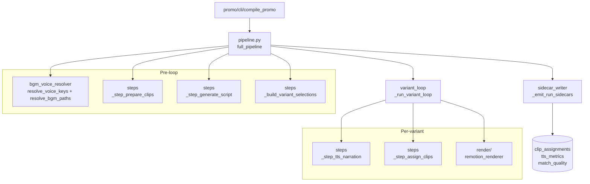

# promo/core/pipeline/ — orchestration

`full_pipeline` is the **only function in the repo that knows the ordering of all five pipeline stages.** It runs a pre-loop sequence (clip prep + voice/BGM resolution + Gemini #1 + pause budget), hands the per-variant body to `_run_variant_loop`, then emits three run-level sidecars. Extracted from `compile_promo.py` in promo-handoff-readiness Sprint 4 A-001 — behavior byte-identical to the pre-extraction site.

## Files (inventory)

| File | Role |
|---|---|
| `__init__.py` | Public re-export of `full_pipeline` only. The submodule layout is deliberately private — tests reach for private symbols via the specific submodule path. |
| `pipeline.py` | `full_pipeline` — the orchestrator. The only place that knows step ordering across all 5 stages. |
| `steps.py` | 5 step helpers (`_step_prepare_clips`, `_step_generate_script`, `_step_tts_narration`, `_step_assign_clips`) + 2 selection seams (`_build_variant_selections`, `_build_variant_tts_metrics`) + the `RETRIEVAL_TOP_K = 6` calibration constant. |
| `variant_loop.py` | `_run_variant_loop` — per-variant inner body. Runs Step 4 (TTS), Step 4.5 (Gemini #2 + F3), Step 7 (props build + freeze prevention), Step 8 (Remotion render). Mutates 3 observability accumulators in place; success-gates row appends. |
| `sidecar_writer.py` | `_emit_run_sidecars` — writes the 3 per-run JSONs (`clip_assignments_*`, `tts_metrics_*`, `match_quality_*`). `_write_sidecar` — generic collision-bumped writer (`-2.json`, `-3.json`, ...). |
| `bgm_voice_resolver.py` | `_resolve_voice_keys` (round-robin rotation when `--voice` unset), `_resolve_bgm_paths` (round-robin BGM rotation), `_discover_bgm_files`, `_variant_output_path`, `_empty_retrieval_provenance`. |

## How they wire together

`full_pipeline` is the only consumer of `bgm_voice_resolver`, `sidecar_writer`, and `variant_loop`; `steps.py` is consumed by both `pipeline.py` (pre-loop) and `variant_loop.py` (per-variant body) so the step helpers stay a flat library beneath the orchestrators.

**Cross-file seams:**

- `steps.py` reaches across all 5 stages: `analyze.clip_analyzer.analyze_clips` (lazy-imported), `script.{script_generator, pause_budget, script_validator}`, `narrate.tts_engine`, `assign.{clip_assigner, clip_embedder, clip_retriever, match_quality}`. This is the only module allowed to import from every stage subfolder; `pipeline.py` and `variant_loop.py` consume `steps.py`'s helpers without reaching past them.
- `variant_loop.py` calls `render.{build_props_from_script, validate_props, stage_media, render_promo}` directly (the per-variant render is the variant body's terminal step) and `assign.match_quality.build_match_quality_entries` (per-variant observability row).
- `sidecar_writer._emit_run_sidecars` writes 3 sidecars per run; the readers live in their respective stage modules (`assign.clip_assignment_sidecar.load_latest_clip_assignments` for replay, `script.pause_budget.load_calibrated_wpm` for next-run WPM bootstrap, human review for `match_quality_*.json`).
- `bgm_voice_resolver` raises `errors.NoSuitableBGMError` when `--bgm-dir` contains no track meeting `min_duration_sec`. Imports `render.REMOTION_DIR` only to default-resolve the BGM directory to `promo/remotion/public/`.
- Consumed by `promo/cli/compile_promo.py` (the only public caller).

**Invariants:**

- **`full_pipeline` is the only place step ordering lives** — `pipeline.py` owns the pre-loop sequence; `variant_loop.py` owns the per-variant sequence; `steps.py` provides stage-helper primitives but does not orchestrate. Adding a new stage means editing exactly one file.
- **Three per-run sidecars, all collision-safe** — `_emit_run_sidecars` writes `clip_assignments_<slug>_<dur>s.json`, `tts_metrics_<slug>_<dur>s.json`, `match_quality_<slug>_<dur>s.json` via `_write_sidecar`. Same-POI same-duration reruns get `-2.json`, `-3.json`, ... suffixes; the matching `.mp4` output uses the same `-N` suffix algorithm so sidecars and videos pair by suffix.
- **Sidecar-write failure flips `all_ok`** — if any sidecar write fails (no `sidecar_dir`, OSError, etc.), `_write_sidecar` returns False and the caller flips the run-level `all_ok` flag to surface the failure (Sprint 09b C2 M-1/D-004 — replaced the silent log-and-continue path).
- **Shared `_empty_retrieval_provenance`** — both `_step_assign_clips` (per-variant) and `full_pipeline` (run-level) start from the same provenance dict shape so the sidecar's `retrieval_active` / `embedded_pool_size` / `fallback_reason` keys are present even on the no-retrieval path.
- **Voice-key rotation order = `VOICE_CATALOG` order** — Gemini-first by convention. When `--voice` is unset, `_resolve_voice_keys` rotates round-robin in that order across variants.
- **`RETRIEVAL_TOP_K = 6`** — single calibration constant in `steps.py`; consumed by `_step_assign_clips`'s closure log line, the `union_of_top_k` call, and any future analytical consumer in lockstep.
- **Submodule layout is deliberately private** — only `full_pipeline` is re-exported from `__init__.py`; the other modules' public symbols are addressed via their specific paths (or via `compile_promo`'s back-compat re-exports for the public-test surfaces).
