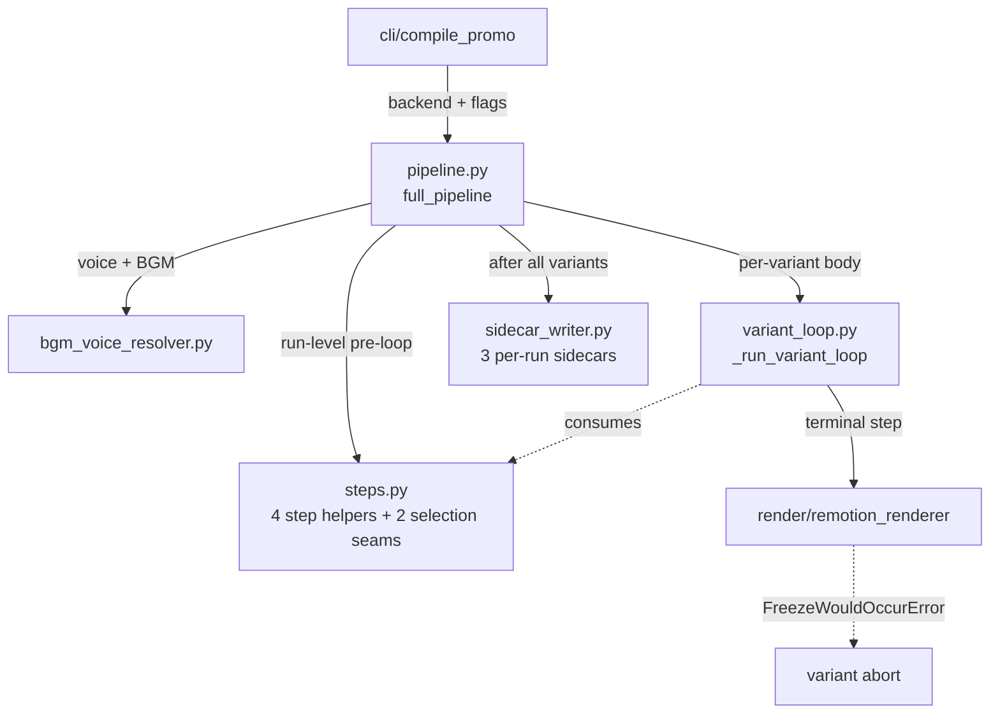

# promo/core/pipeline/ — orchestration

`full_pipeline` runs the **run-level** ordering (clip prep + voice/BGM resolution + Gemini #1 + pause budget); `_run_variant_loop` runs the **per-variant** ordering (TTS + deterministic clip assignment + Remotion render). After all variants complete, `_emit_run_sidecars` writes the 3 per-run sidecar JSONs. The submodule was extracted from `compile_promo.py` so the orchestration code lives separately from the CLI shell.

> **Read upstream first:** [`README.md`](../../../README.md) → [`promo/core/architecture.md`](../architecture.md) (defines sidecar, the two-space model, the 5 named exceptions). This doc covers the cross-cutting orchestration submodule.

## Vocabulary (new terms in this doc)

- **run-level vs per-variant ordering** — the pipeline has two ordering scopes. *Run-level* (`full_pipeline`) owns the sequence: clip prep → voice/BGM → Gemini #1 → pause budget → variant loop → run-end sidecar emission. *Per-variant* (`_run_variant_loop`) owns the per-variant body: TTS → deterministic clip assignment → props build → Remotion render → success-gated observability row append. Adding a new pipeline stage means identifying which scope it belongs to and editing exactly one of these two files.
- **observability accumulators** — three lists (`tts_metrics_rows`, `match_quality_rows`, `clip_assignments_rows`) that `variant_loop` mutates in place. Each row appends only on variant-level success (success-gated) so failed variants never pollute the run-level sidecars.
- **collision-bumped sidecar naming** — when same-POI + same-duration is rerun, `_write_sidecar` appends `-2.json`, `-3.json`, ... The same algorithm applies to MP4 outputs so sidecar JSONs and `.mp4` files pair by suffix.

## Files (inventory)

| File | I/O surface |
|---|---|
| `__init__.py` | Public re-export of `full_pipeline` only. The submodule layout is deliberately private — tests reach for private symbols via the specific submodule path. |
| `pipeline.py` | **Provides:** `full_pipeline(poi_name, ...)` — the run-level orchestrator. **In:** all stage inputs threaded as kwargs. **Out:** `bool` (run-level success). **Side:** orchestrates the 5-stage flow and emits 3 per-run sidecars at run-end. **Raises:** propagates whatever stages raise (no own raise paths). **Consumers:** `cli/compile_promo` (only public caller). |
| `steps.py` | **Provides:** 4 step helpers (`_step_prepare_clips`, `_step_generate_script`, `_step_tts_narration`, `_step_assign_clips`) + 2 selection seams (`_build_variant_selections`, `_build_variant_tts_metrics`) + `analyze_clips_for_script` lazy-import shim. **In:** stage-specific kwargs per helper. **Out:** stage outputs (clips dict, scripts list, narration, assignments). **Side:** each helper calls into one stage subfolder. **Consumers:** `pipeline.py` (run-level pre-loop) + `variant_loop.py` (per-variant body). |
| `variant_loop.py` | **Provides:** `_run_variant_loop(...)` — per-variant inner body. **In:** per-variant kwargs (clip_paths, scripts, voices, output_path, accumulators). **Out:** `bool` (variant success). **Side:** runs Step 4 (TTS) → 4.5 (deterministic clip assignment) → 7 (props build + freeze prevention) → 8 (Remotion render); mutates the 3 observability accumulator lists in place; success-gated row append. **Raises:** catches `FreezeWouldOccurError` + `ClipAssignmentError` → variant abort, accumulators not appended. **Consumers:** `pipeline.py`. |
| `sidecar_writer.py` | **Provides:** `_emit_run_sidecars(...)` (writes the 3 per-run JSONs once all variants complete) + `_write_sidecar(sidecar_dir, base_name, payload, description)` (generic collision-bumped writer). **Side:** atomic file writes; sidecar filename collision-bumps to `-2.json`, `-3.json`, ... **Raises:** none — flips the run-level `all_ok` flag to False on failure (replaces an older silent log-and-continue path that let runs report success despite missing sidecars). **Consumers:** `pipeline.py`. |
| `bgm_voice_resolver.py` | **Provides:** `_resolve_voice_keys` (round-robin rotation when `--voice` unset), `_resolve_bgm_paths` (round-robin BGM rotation), `_discover_bgm_files`, `_variant_output_path`, `_empty_retrieval_provenance`. **In:** `--voice` / `--bgm-dir` flags + variant count. **Out:** per-variant voice + BGM path lists. **Side:** disk read for BGM discovery. **Raises:** `errors.NoSuitableBGMError` when `--bgm-dir` contains no track meeting `min_duration_sec`. Imports `render.REMOTION_DIR` only to default-resolve the BGM dir. **Consumers:** `pipeline.py`. |

## How they wire together

**Cross-file seams:**

- `steps.py` reaches across all 5 stages: `analyze.clip_analyzer.analyze_clips` (lazy-imported), `script.{script_generator, pause_budget, script_validator}`, `narrate.tts_engine`, `assign.{beat_planner, clip_retriever, usage_windows, packer, clip_assignment_validator, clip_embedder, match_quality}`. This is the only module allowed to import from every stage subfolder.
- `variant_loop.py` calls `render.{build_props_from_script, validate_props, stage_media, render_promo}` directly (the per-variant render is the variant body's terminal step) and `assign.match_quality.build_match_quality_entries` (per-variant observability row).
- `sidecar_writer._emit_run_sidecars` writes 3 sidecars per run; the readers live in their respective stage modules (`assign.clip_assignment_sidecar.load_latest_clip_assignments` for replay, `script.pause_budget.load_calibrated_wpm` for next-run WPM bootstrap, human review for `match_quality_*.json`).

**Invariants:**

- **Step ordering lives in two places** — `pipeline.py` (`full_pipeline`) owns the run-level sequence; `variant_loop.py` (`_run_variant_loop`) owns the per-variant sequence. `steps.py` provides primitives but does not orchestrate. Adding a new stage means editing exactly one of `pipeline.py` or `variant_loop.py` depending on scope.
- **Three per-run sidecars, all collision-safe** — `_emit_run_sidecars` writes `clip_assignments_<slug>_<dur>s.json`, `tts_metrics_<slug>_<dur>s.json`, `match_quality_<slug>_<dur>s.json`. Same-POI same-duration reruns get `-2.json`, `-3.json`, ... suffixes; the matching `.mp4` output uses the same `-N` algorithm so sidecars and videos pair by suffix.
- **Sidecar-write failure flips `all_ok`** — if any sidecar write fails (no `sidecar_dir`, OSError, etc.), `_write_sidecar` returns False and the caller flips the run-level `all_ok` flag to surface the failure (replaced an older silent log-and-continue path that let runs report success despite missing sidecars).
- **Shared `_empty_retrieval_provenance`** — both `_step_assign_clips` (per-variant) and `full_pipeline` (run-level) start from the same provenance dict shape so the sidecar's `retrieval_active` / `embedded_pool_size` / `fallback_reason` keys are present even on the no-retrieval path.
- **Voice-key rotation order = `VOICE_CATALOG` order** — Gemini-first by convention. When `--voice` is unset, `_resolve_voice_keys` rotates round-robin in that order across variants.
- **Per-beat retrieval, no truncation** — `_assign_clips_packer` embeds each beat's text once (`clip_embedder`) and ranks the POI's full clip pool via `clip_retriever.rank_per_query` (stateless — no top-k truncation, no memo); the packer applies its house rules over the full ranking.
- **Submodule layout is deliberately private** — only `full_pipeline` is re-exported from `__init__.py`; the other modules' public symbols are addressed via their specific paths (or via `compile_promo`'s back-compat re-exports for the public-test surfaces).
