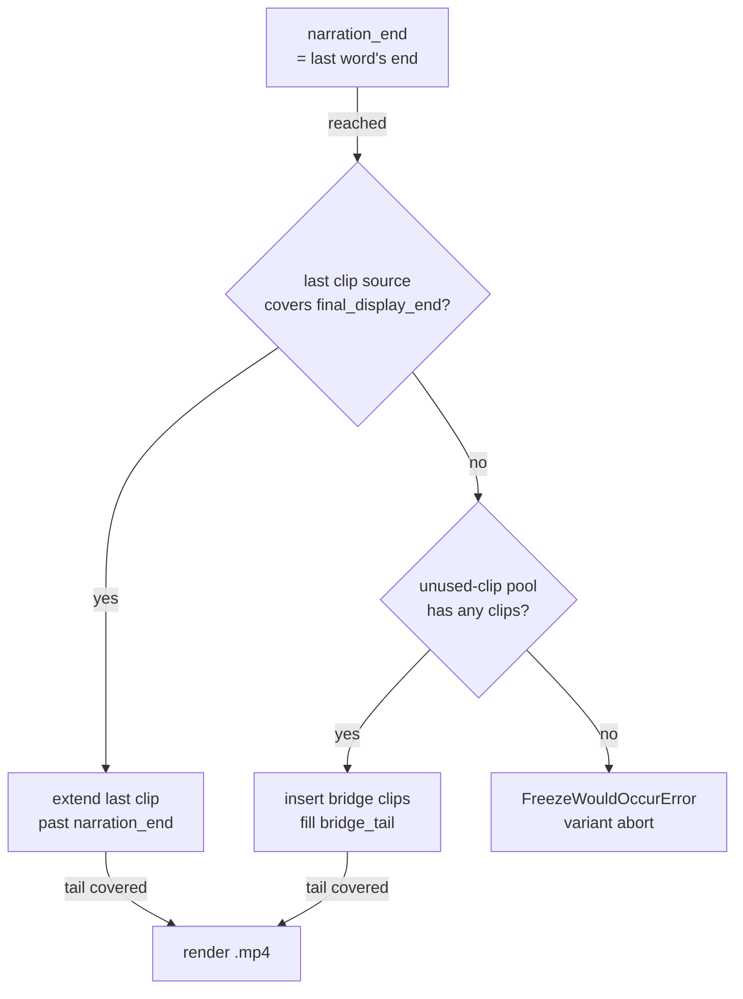

# promo/core/render/ — Stage 5: Python → Remotion bridge

The final stage. Reads the deterministic clip assignments + the TTS narration + the BGM track, builds a `props.json` for the Remotion `HotelPromo` composition, validates it, and shells out to `npx remotion render` to produce the final `.mp4`. This is the **only module that knows about `final_display_end` and the bridge pool** — everything past `narration_end` lives here.

> **Read upstream first:** [`README.md`](../../../README.md) → [`promo/core/architecture.md`](../architecture.md) (defines two-space model, narration_end, final_display_end, bridge family). This doc covers stage 5 only.

## Vocabulary (new terms in this doc)

- **bridge fire** — when the renderer actually inserts a clip from the unused-clip pool (instead of just extending the last clip's source across `narration_end`). A `bridge_tail > 0` render with **0 bridges fired** is healthy: the last clip's source happened to cover the gap. A render is unhealthy only when bridges *would have* fired but the pool was empty.
- **freeze-prevention exit** — the loud-failure path that fires when bridges can't fill `bridge_tail` (pool empty AND last clip source exhausted before `final_display_end`). `FreezeWouldOccurError` raises here with no retry — the variant aborts. Replaces an older "log and continue into a freeze-prone render" behavior where freeze-prone variants were shipped silently.

## Files (inventory)

| File | I/O surface |
|---|---|
| `__init__.py` | Stage marker; no exports. |
| `remotion_renderer.py` | The whole stage. **Provides:** `build_props_from_script`, `validate_props`, `stage_media`, `render_promo` (public hot path) + private `_bind_clips_to_narration` (the bridge-mechanism core). Module-level `REMOTION_DIR` resolves the sibling `promo/remotion/` TypeScript project. **`render_promo`:** In `props: dict` (built upstream from clip assignments + narration + clip_paths + bgm), `output_path`, `composition_id`, `timeout`. Out: the final `.mp4` written at `output_path`. **Side:** `npx remotion render` shell-out from `REMOTION_DIR`; stages clips + audio into `promo/remotion/public/` via `stage_media`. **Raises:** `FreezeWouldOccurError` when the bridge pool is empty AND the last-clip source is exhausted before `final_display_end`. **Consumers:** `pipeline/variant_loop` invokes the four-step sequence (`build_props_from_script` → `validate_props` → `stage_media` → `render_promo`) once per variant. |

## How it wires together

The diagram is what `_bind_clips_to_narration` decides for each variant. Healthy paths: extension OR bridge fire. The error node is the only freeze-prevention exit.

**Cross-file seams:**

- Imports `HARD_CONSTRAINT_TOL_SEC` from `assign/clip_assignment_validator` so the renderer-side display-span check uses the same 50ms tolerance as the validator.
- Types against `schema.{ClipAssignment, Narration, ScriptSegment, SegmentTimestamp, WordTimestamp}` for the Python-side payload contracts.

**Invariants:**

- **Renderer space ceiling = `final_display_end = max(target_duration_sec, narration_end)`** — the renderer is the only module that knows this. The buffer between `narration_end` and `target_duration_sec` (= `bridge_tail`) is renderer territory; assigner space stops at `narration_end`.
- **`ffmpeg` is a required system dependency** — the renderer itself only shells out to Remotion, but Remotion's encode pipeline plus `narrate/`'s audio assembly both depend on `ffmpeg` being on `PATH`.
- **Vertical 1080×1920 / 30 fps defaults** — short-form vertical promo. BGM volume 0.35 (ducked to 0.18 during narration with a 0.3s ramp).
