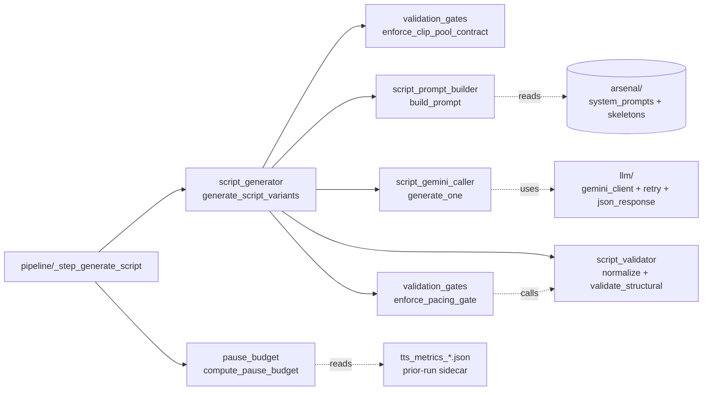

# promo/core/script/ — Stage 2: Gemini #1 narration generation

Builds the per-variant promo script — a 4-segment narration with `pause_weight` per segment, sized to a `PromoFormatProfile` (short/long), persona-driven, validated through a 5-gate system (Gate 0 normalize → Gate 4 pacing). Output is a `Script` dict consumed by `narrate/tts_engine`.

S2c split the original 779-line `script_generator.py` into a facade plus 3 extracted siblings; `script_validator.py` and `pause_budget.py` predate the split and remain standalone.

## Files (inventory)

| File | Role |
|---|---|
| `__init__.py` | Stage marker; no exports. |
| `script_generator.py` | **Facade (S2c)** — public `generate_script_variants`, `regenerate_single_variant_with_hint`, `NarratorPersona` re-export. Owns Gate 2 (LLM quality scoring) + Gate 3 (dedup). Re-exports siblings (test patch surface). |
| `script_prompt_builder.py` | Pure prompt assembly (no I/O beyond arsenal MDs). `HOOK_TECHNIQUES`, `_DEFAULT_PERSONA_PATH`, `build_variant_plans`, `format_clip_inventory` (also consumed by `assign/clip_assignment_gemini`), `format_examples`, `build_prompt`. |
| `script_gemini_caller.py` | Single Gemini #1 call wrapper. `generate_one(prompt, model)` — wraps `retry_with_backoff` + `parse_json_response`. |
| `script_validation_gates.py` | Pre/post-generation raise-or-pass gates. `enforce_clip_pool_contract` (pre, pool size), `enforce_pacing_gate` (post, calls `script_validator.validate_pacing`; LONG-mode warnings promoted to `ValidationError`). |
| `script_validator.py` | Pre-S2c validator. `normalize_script` (Gate 0 — soft fixups), `validate_structural` (Gate 1), `validate_pacing` (Gate 4). `ValidationError`. Pure; no I/O. |
| `pause_budget.py` | Dynamic per-segment pause-budget math. `compute_pause_budget` (only weight≥2 gaps get explicit silence ms), `bootstrap_wpm_for_backend`, `load_calibrated_wpm` (reads prior `tts_metrics_*.json` sidecar), `measure_wpm`. |

## How they wire together

The facade's per-attempt loop drives the prompt builder, the Gemini call, and the validation gates; on success it hands a `Script` to `pipeline` for TTS dispatch. `pause_budget` runs after the script is accepted to compute per-segment `pause_after_ms` from the per-segment `pause_weight`.

**Cross-file seams:**

- `script_generator` (facade) imports `llm.gemini_client.resolve_gemini_model`, `format_profiles.PromoFormatProfile`, and the typed shapes from `schema`. The siblings stay stateless; the facade owns per-attempt orchestration.
- `script_prompt_builder.format_clip_inventory` is cross-folder consumed by `assign/clip_assignment_gemini` — Gemini #1 and Gemini #2 share the inventory rendering. Operator-locked at S2c Q1 (intentional design, not coupling).
- `pause_budget.load_calibrated_wpm` reads the most recent matching `tts_metrics_*.json` from prior runs (same POI + same duration); bootstraps (`OBSERVED_ELEVENLABS_WPM = 195`, `OBSERVED_GEMINI_WPM_BOOTSTRAP = 148`) fire only on the first run of a new POI+duration combo.
- `script_validation_gates.enforce_pacing_gate` lazy-imports `script_validator` to avoid the circular dependency the entry points already manage.

**Invariants:**

- **Facade re-export pattern (S2c)** — `script_generator.py` is the single import path tests + callers target. Sibling symbols re-exported up so `unittest.mock.patch("promo.core.script.script_generator._generate_one", ...)` resolves through the facade's globals. Same constraint as `assign/clip_assigner` and `narrate/tts_engine`.
- **Gate 0 is a soft normalizer, not a rejector** — strips forbidden openers, trims trailing sentences on word-count overshoot. Hard rejects come in Gate 1 and beyond. `FORBIDDEN_OPENERS = {"imagine", "discover"}` (Sprint 09b C5 narrowed from 5 to 2 — the pruned bullets were AI-authored bloat).
- **`pause_after_ms` only on weight≥2 gaps** — Sprint 08.5 design. Weight==1 (STANDARD) gaps stay inside a single ElevenLabs batch where natural prosody carries the beat. Per-gap silence inflated by `SILENCE_BUFFER_SCALE = 1.10`, capped at `PER_GAP_CAP_MS`.
- **WPM bootstraps are voice-and-backend-specific** — calibrated against the Gemini-2.5-Pro × ElevenLabs (speed=0.95) and Gemini-2.5-Pro × Kore (with directorial prompt) combos. Either side swap requires recalibration via a fresh `tts_metrics` sidecar.
- **Pacing gate severity is mode-conditional** — LONG-mode pacing warnings are promoted to `ValidationError` (per-attempt loop catches and re-rolls); SHORT-mode warnings are observational only.
- **`HOOK_TECHNIQUES` is Python-resident** — 6 hook seed strings hard-coded in `script_prompt_builder.py`; tracked as BACKLOG S4 for arsenal externalization.
- **`_DEFAULT_PERSONA_PATH` is duplicated** between `script_prompt_builder.py` and `selection/persona_selectors.py`; tracked as BACKLOG S6.
