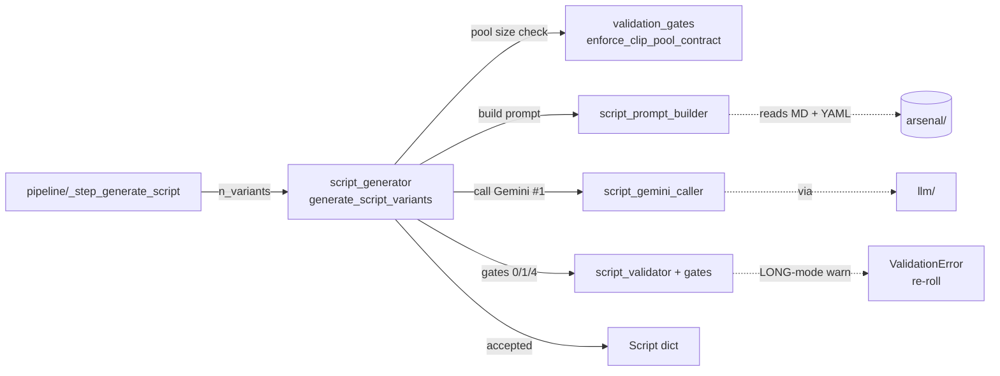

# promo/core/script/ — Stage 2: Gemini #1 narration generation

Builds the per-variant promo script — a 4-segment narration with `pause_weight` per segment, sized to a `PromoFormatProfile` (short/long), persona-driven, validated through 5 gates before acceptance. Output is a `Script` dict consumed by `narrate/tts_engine`.

The 779-line `script_generator.py` was previously split into a facade plus 3 extracted siblings (`script_prompt_builder`, `script_gemini_caller`, `script_validation_gates`); `script_validator.py` and `pause_budget.py` predate the split and remain standalone.

> **Read upstream first:** [`README.md`](../../../README.md) → [`promo/core/architecture.md`](../architecture.md) (defines POI, sidecar, Gemini #1, why two passes, facade re-export pattern, pause_weight). This doc covers stage 2 only.

## Vocabulary (new terms in this doc)

- **5-gate validation** — five named checks the script generator runs before accepting Gemini #1's output. Gate 0 = soft normalize (strip forbidden openers, trim word overflow); Gate 1 = structural (clip_id in inventory, segment word counts in profile range); Gate 3 = dedup (no two variants share the same opener); Gate 4 = pacing (LONG-mode warnings promoted to `ValidationError`, triggers a re-roll). Gate 2 (LLM quality scoring) is documented historically but is no longer present in current code.
- **WPM bootstrap / WPM calibration** — the script generator estimates how many words fit in the target duration via `duration_sec × WPM`. First run for a (POI, duration) combo uses hardcoded bootstraps (`OBSERVED_ELEVENLABS_WPM = 195`, `OBSERVED_GEMINI_WPM_BOOTSTRAP = 148`); subsequent runs read the prior run's `tts_metrics_*.json` sidecar for the actual measured WPM (POI-scoped self-calibration).
- **`HOOK_TECHNIQUES`** — hook seed strings loaded from `promo/arsenal/script_hooks.yaml` and rotated across variants to diversify the script openers.

## Files (inventory)

| File | I/O surface |
|---|---|
| `__init__.py` | Stage marker; no exports. |
| `script_generator.py` | **Facade.** **Provides:** `generate_script_variants` (public), `regenerate_single_variant_with_hint` (used by F3 retry), `NarratorPersona` re-export. Owns the per-attempt loop and Gate 3 (dedup). Re-exports siblings up so test patches (`unittest.mock.patch("promo.core.script.script_generator._generate_one", ...)`) resolve through the facade's globals — moving entry points across files would break bare-name resolution. **Consumers:** `pipeline/_step_generate_script`. |
| `script_prompt_builder.py` | **Provides:** `HOOK_TECHNIQUES`, `_DEFAULT_PERSONA_PATH`, `build_variant_plans`, `format_clip_inventory`, `format_examples`, `build_prompt`. Pure prompt assembly (no I/O beyond `arsenal_loader` calls). **Side:** reads MD prompt templates + YAML skeletons + hook seeds via `arsenal_loader`. **Note:** `format_clip_inventory` is also called from `assign/clip_assignment_gemini` so Gemini #1 and Gemini #2 share the inventory rendering — operator-locked design, not coupling. **Consumers:** `script_generator` facade. |
| `script_gemini_caller.py` | **Provides:** `generate_one(prompt, model)` — wraps a single Gemini #1 call with `llm.retry.retry_with_backoff` + `llm.json_response.parse_json_response`. **In:** prompt str + `GeminiModel`. **Out:** parsed dict. **Raises:** `ValueError` on JSON parse failure. **Consumers:** `script_generator` facade. |
| `script_validation_gates.py` | **Provides:** `enforce_clip_pool_contract` (pre-generation pool-size check) + `enforce_pacing_gate` (post-generation; calls `script_validator.validate_pacing` and promotes LONG-mode warnings to `ValidationError`). **Side:** lazy-imports `script_validator` to avoid the circular dependency. **Raises:** `RuntimeError` (clip-pool contract violation), `ValidationError` (pacing failures in LONG mode). **Consumers:** `script_generator` facade. |
| `script_validator.py` | **Provides:** `normalize_script` (Gate 0 — soft fixups: forbidden openers, word-count trim), `validate_structural` (Gate 1 — clip_ids in inventory, per-segment word counts), `validate_pacing` (Gate 4 — duration vs WPM math), `ValidationError`. Pure; no I/O. **Consumers:** `script_generator` facade (Gates 0, 1) + `script_validation_gates` (Gate 4 via lazy import). |
| `pause_budget.py` | **Provides:** `compute_pause_budget` (only weight≥2 gaps get explicit silence ms), `bootstrap_wpm_for_backend`, `load_calibrated_wpm` (reads prior-run `tts_metrics_*.json`), `measure_wpm`. **In:** `Script`, voice key, target duration. **Out:** `pause_after_ms` per segment + WPM estimate. **Side:** disk read for the self-calibration sidecar. **Raises:** nothing (returns bootstraps when no sidecar found). **Consumers:** `pipeline/_step_generate_script` (after script acceptance). |

## How they wire together

Pause-budget runs *after* this flow accepts a script: `pipeline` calls `pause_budget.compute_pause_budget` to derive per-segment `pause_after_ms` from each segment's `pause_weight`. `pause_budget.load_calibrated_wpm` reads the prior run's `tts_metrics_*.json` sidecar (same POI + same duration) for self-calibrated WPM, falling back to the hardcoded bootstrap on the first run.

**Invariants:**

- **Facade re-export pattern** — `script_generator.py` is the single import path tests + callers target. Sibling symbols re-exported up so `monkeypatch.setattr(script_generator, "_generate_one", ...)` resolves through the facade's globals. Same constraint as `assign/clip_assigner` and `narrate/tts_engine`.
- **Gate 0 is a soft normalizer, not a rejector** — strips forbidden openers, trims trailing sentences on word-count overshoot. Hard rejects come in Gate 1 and beyond. `FORBIDDEN_OPENERS = {"imagine", "discover"}` (narrowed from a longer historical set; the pruned bullets were AI-authored bloat).
- **`pause_after_ms` only on weight≥2 gaps** — weight==1 (STANDARD) gaps stay inside a single ElevenLabs batch where natural prosody carries the beat. Per-gap silence inflated by `SILENCE_BUFFER_SCALE = 1.10`, capped at `PER_GAP_CAP_MS`.
- **WPM bootstraps are voice-and-backend-specific** — calibrated against Gemini-2.5-Pro × ElevenLabs (speed=0.95) and Gemini-2.5-Pro × Kore (with directorial prompt). Either side swap requires recalibration via a fresh `tts_metrics` sidecar.
- **Pacing gate severity is mode-conditional** — LONG-mode warnings promoted to `ValidationError` (per-attempt loop catches and re-rolls); SHORT-mode warnings are observational only.
- **`HOOK_TECHNIQUES` is arsenal-resident** — loaded from `promo/arsenal/script_hooks.yaml`; changing the order changes variant rotation.
- **`_DEFAULT_PERSONA_PATH` is duplicated** between `script_prompt_builder.py` and `selection/persona_selectors.py`; tracked in [`BACKLOG.md`](../../../docs/BACKLOG.md).
