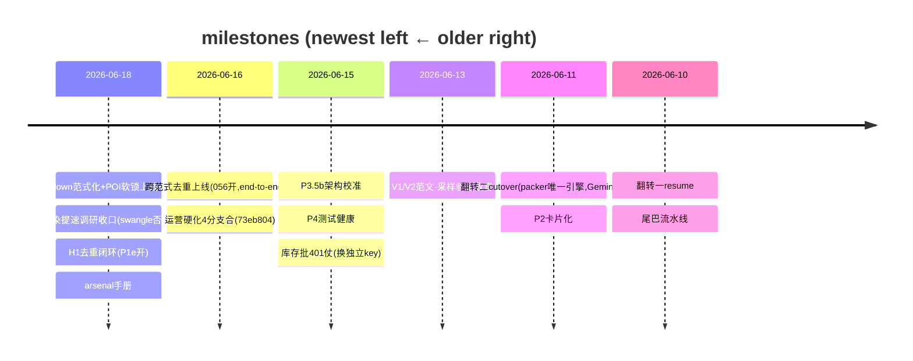

# PGC Pipeline — Forward Roadmap

**Protocol: see the `roadmap-discipline` skill** (3-layer division · single-writer · done-migrate-out · event-triggered update · milestones-not-PRs).
Position layer; PR detail → `gh pr list`; operating red-lines → `CLAUDE.md`; history → `workflow/daily-log.md`; **deep detail / design contracts / full execution log → `docs/ROADMAP.md`** (the heavy doc — this points to it).
**Visual rule:** arrows + stable → Mermaid; status / path (churns daily) → text; real grid → table.
**Last verified:** 2026-06-18 (reviewer checked vs code/Supabase; 2 feature branches not yet on main).

> Mermaid color note: status is in the node LABEL (✅/▶/⚰️) + a STROKE accent only — no hard `fill:` hex (stays readable on light AND dark themes).

---

## One-line feed (fastest morning re-orient)

引擎成熟、库存满(169 approved)、新 POI 基本用光 → **PGC 转入闲置期,手头无活**。今天(06-18)全部收口并入 main + **部署到 VPS**(`main_20260618T_cooldownlock`,下次跑批生效):cooldown 范式各算自己、POI 软锁(+原子写,真库烟测过)、arsenal 手册/决策树、渲染提速调研收口(现设置已最优、swangle 否决、GPU 没用)、H1 跨范式去重**端到端闭环**(P1e 确认开)。**唯一还开着的活 = H2 hotel_description(AIGC 前置,不是 PGC 的活)。** 真瓶颈仍在上游素材供给 / 脱 720,**不在 PGC 手里**。

## Where the system is (journey arc)

## Cross-repo (PGC ↔ AIGC asset_platform)

> in-flight dep 就一个(H2 hotel_description),用列表不画图。

- 去重主线 H1(`recipe_input → 056 → P1e`)✅ **闭环(P1e 已确认开)**。当前唯一 in-flight = **H2 hotel_description**(AIGC 发列 → PGC 写读-转发桥)。Board: `workflow/CROSS-REPO.md`。Iron rule: board ≠ 锁,正确性在 `release_candidates` DB 约束。

## 排期 / Scheduled (decided / in progress · with path)

**跨范式去重 H1** · owner: PGC + AIGC · ✅ **闭环(2026-06-18)**
= 两条范式都发片,但同内容绝不双发(共享 `release_candidates` + 指纹去重)
recipe_input ✅ + 056 盖指纹 ✅ + **P1e 唯一索引真拦 ✅(Leo 确认开了)** + 实测 0 重复 ✅
余:P1g 活体抓真 23505 错形状(降为可观测性、不急)。

**库存生产** · owner: operator
= 720-only 政策补库存(每条强制 WaveSpeed 升级)
◀ stock_4x3 12/12 干净 ✅　▶ 暂停(库存已 169 + fresh POI 池≈干)
blocker: 上游 fresh POI 供给(非 PGC;soft-cooldown 已避免硬饿死)

**POI 档案 hotel_description H2** · owner: AIGC(前置)+ PGC(桥)
= 给 POI 补真实事实描述,治脚本瞎编;**一列**自由文本(Leo 2026-06-18)
◀ 跨仓对齐 + AIGC reviewer 双向 sync ✅　▶ AIGC 发列(contract PR §1.1+视图)　⏳ PGC 写读-转发桥(`_SNAPSHOT_FIELDS`+run_batch 转发+`safe_substitute`)→ done
blocker: AIGC 前置(PGC 不抢跑);详 `workflow/CROSS-REPO.md` H2

## 排队 / Queued (might do · not scheduled)

- ✅ **速度 — 实测收口(2026-06-18,详 `docs/research/render-speedup-2026-06.md`)**:现有设置(conc 6 / 不传 gl)**已最优,main 一行未动**。swangle **否决**(实测 2.2× 慢,非白嫖);concurrency 保持 6(4 慢 13%、是将来跟并行一起拉的牌);**8 核并行被 ffmpeg ~5 线程地板堵死**(单条 load~9,两条=18>8)→ 真并行只能加核/换机(= Lambda/横扩)。GPU 没用 / 渲小再升否。`--jobs>1` 留到加核 + 1080 后(还有同-POI staged-dir 坑)。
- ⭐ **输出调优**:arsenal 操作手册已成文(`promo/arsenal/README.md`);脚本"事实地基"走 **H2**(见排期)。
- ✅ **本轮已上线 + 部署**:cooldown 范式化、POI 软锁(+原子写,真库烟测过)、arsenal 手册/决策树 全在 main(`325c6a6`)+ 部署 worktree `main_20260618T_cooldownlock`。分支已清。

## 触发 / Triggered (parked · revisit only when the condition fires)

| Deferred item | Trigger condition |
|---|---|
| 脱离 720-only(原生 1080) | 素材库出现足量原生 1080 → 同时解速度长尾 + POI 荒 |
| 加新视频类型(type):120s(现仅 65s) | 想做长视频时;每店素材门槛 50→~90-100 + 对齐 AIGC |
| 翻转三(分发数据回流) | 远期;manifest 钩子已留好 |

## History (milestone timeline — newest on LEFT)

> 全量历史细节 → `docs/ROADMAP.md` §执行日志 + `workflow/daily-log.md`。Grows leftward over time.

## projects directory

Active project detail → `workflow/projects/<name>/`(已有 pgc-batch-production / shared-poi-asset-library 等);this file holds only the global position layer.
