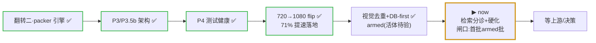
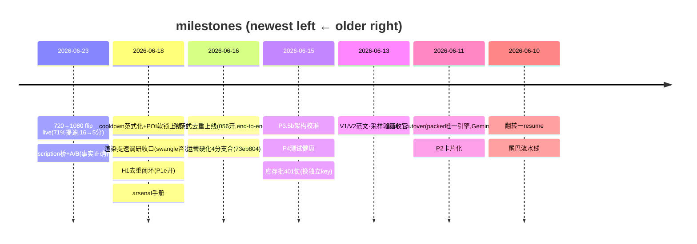

# PGC Pipeline — Forward Roadmap

**Protocol: see the `roadmap-discipline` skill** (3-layer division · single-writer · done-migrate-out · event-triggered update · milestones-not-PRs).
Position layer; PR detail → `gh pr list`; operating red-lines → `CLAUDE.md`; history → `workflow/daily-log.md`; **deep detail / design contracts / full execution log → `docs/ROADMAP.md`** (the heavy doc — this points to it).
**Visual rule:** arrows + stable → Mermaid; status / path (churns daily) → text; real grid → table.
**Last verified:** 2026-07-01 22:44(**VPS ground truth 纠错**:「首批 armed 未跑」不成立——06-27/28 已有 **5 个 armed 生产批 63/63 complete、0 quarantine**(`/home/deploy/pgc_runs/`,receipt 逐一核过);两个 watched 义务事实闭环:claim-2 零硬拒 + 视觉闸门真喂料 `visual_embeddings_attached` 82–117/条。此前账面(含 21:04 那版)沿袭了 roadmap 自己的过时宣称——教训=验位置先验 VPS,不只验 git)。

> Mermaid color note: status is in the node LABEL (✅/▶/⚰️) + a STROKE accent only — no hard `fill:` hex (stays readable on light AND dark themes).

---

## One-line feed (fastest morning re-orient)

引擎全面成熟、所有大杠杆落地。**720→1080 切换 live**(min_width@1080,**71% 提速落地**,16→5分/条)+ **poi_description 事实地基 live**(A/B 证「事实正确性刹车」)+ cooldown范式化 / POI软锁 / H1去重(P1e)全上线实证。**新常态 = 1080 生产、~5分/条**;代价 = 能产店暂时变少(102存活 / 27搁浅),随上游补 1080 自愈。**当前在干(2026-07-01 晚更新):① 检索分诊已回+已 cross-check——84% 假警报(度量假象:碎拍子+营销抽象句),后-flip 真实中位 0.376、<0.20 仅 7.6%,「检索70%大工程」证据不支持,待 regroup 裁决;② watched 闸口已过(06-27/28 五批事实履行);③ 跑着 skill 无人值守探针批(fresh-context 操作员+决策 journal);④ 硬化线接下来 = wrapper+视觉覆盖率地板+死代码清扫**。真瓶颈仍在上游素材供给,**不在 PGC 手里**。

## Where the system is (journey arc)

## Cross-repo (PGC ↔ AIGC asset_platform)

- 去重 H1(`recipe_input → 056 → P1e`)✅ **闭环** · 720→1080 flip H3 ✅ **PGC 完成**(AIGC 并行同拆)。当前 in-flight = **H2 hotel_description**:PGC 桥已上线 + A/B 正面 → **球回 AIGC**(接 onboarding 自动生成)。Board: `workflow/CROSS-REPO.md`。Iron rule: board ≠ 锁,正确性在 `release_candidates` DB 约束。

## 排期 / Scheduled (decided / in progress · with path)

**跨范式去重 H1** · owner: PGC + AIGC · ✅ **闭环(2026-06-18)**
= 两条范式都发片,但同内容绝不双发(共享 `release_candidates` + 指纹去重)
recipe_input ✅ + 056 盖指纹 ✅ + **P1e 唯一索引真拦 ✅(Leo 确认开了)** + 实测 0 重复 ✅
余:P1g 活体抓真 23505 错形状(降为可观测性、不急)。

**库存生产** · owner: operator
= **1080 native 政策**(min_width@1080,不再 upscale;~5分/条)
◀ flip live smoke 2/2 干净 ✅　▶ 随时可跑(能产池 102 店;27 搁浅待上游补 1080 自愈)
blocker: 上游 fresh POI / 原生 1080 供给(非 PGC)

**POI 档案 hotel_description H2** · owner: AIGC + PGC · poi_description 列名
= 给 POI 补真实事实描述,治脚本瞎编;一列自由文本
◀ AIGC 发列 ✅ + PGC 读-转发桥 live ✅ + A/B 正面(事实正确性刹车)✅　▶ **球回 AIGC:onboarding 自动生成**
blocker: AIGC 下一棒(自动生成);详 `workflow/CROSS-REPO.md` H2

## 排队 / Queued (might do · not scheduled)

- ✅ **速度大杠杆落地**:720→1080 flip 砍掉 **71%**(16→5分/条)。render 现成最大头;再提速 = ffmpeg 换引擎 / 加核并行(**deferred**,8核被 ffmpeg ~5 线程地板堵)。详 `docs/research/render-speedup-2026-06.md`。
- ⚠️ **输出调优(停滞,待 Leo 定去留)**:`feat/arsenal-quality` 实况 = 1 ahead / 48 behind main,最后动静 06-22,实质产出仅「质量轴 vs 雷同轴」两轴总纲 doc(`1361fba`)。建议摘 doc 进 main 后归档分支;方向等检索分诊结果再定。事实地基(poi_description)已 live。
- ▶ **后-flip 残留清理(并入 2026-07-01 硬化线)**:原记的 `chore/post-flip-cleanup` 分支**不存在**(账面误记,未开工)。实清单已由 07-01 死代码侦察落实:6 个根目录 `research_*.py` 草稿 + `promo/cli/retrieval_dry_run.py` + ~10 已合并分支/worktree;`clip_assignment_sidecar.py` 不删(测试 replay 在用);**不删回滚基础设施**(WaveSpeed 客户端/transition 模式休眠保留)。
- ✅ **DONE 2026-06-26 · #1 素材近似去重 — 直接上【视觉版】(leapfrog 了文字兜底)**:不是文字-embedding MMR 兜底,而是直接做 DINOv2 **视觉** 去重并 **armed 进生产**:① packer 视觉近重复软闸(`--near-dup-threshold 0.85`)+ ② 下载选片视觉 max-min(`--download-diversity`,resume安全)。65s 真考题:残留近重复对 Huatulco 1→0 / Bonnet 3→0、~零相关性代价、肉眼+独立dHash双证。旗标烤进 SKILL/runbook(main `9e16f64`)。**唯一余项**:第一批 armed 活体验证 `visual_pool>0`(② 经 run_batch 仅代码层确认 env 继承)。详 memory `project_visual_dedup_armed`。原"文字兜底 / 跨视频 phase-2"路线作废(视觉直接覆盖)。
- ▶ **P0 · 片↔旁白 relevance — 分配(25%)✅DONE,检索(70%)仍开口** · 2026-06-27:**分配** = 全局指派(贪心→Hungarian,扎眼错配9→0/5→0)+ **DB-first**(全库选片、download-after,拿掉top-30上限,13/13/12片来自旧池外)**已 armed 进生产标准**(main d627ecc,SKILL/runbook;默认关代码=急停旗标;三方验816绿/多变体证据链/resume安全)。⚠️ 首批 watched:claim-2 fail-loud 会拒绝覆盖缺口POI(旧法硬凑略残片)。详 `workflow/projects/db-first-assignment/PLAN.md` + memory `project_visual_dedup_armed`。**仍开口 = 检索(70%,最大杠杆)**:选中片对旁白文字余弦中位仅0.305、18%beat<0.20 = text-embedding天花板 + 脚本不绑片;要richer描述/query改写(Medium)或CLIP视觉-文字联合空间(Large)。下一个真该投的方向。
  ↳ **swarm 调查底料(2026-06-26,16 agent 对抗验证 run3x3 185 beat;留给"检索"那条接手)**:arm 的视觉去重实测**仅占痛感 ~5%**(0 对 ≥0.85、源池 2.7× 够、整批就 2 对在 0.70-0.84)。真问题 = **配的片跟旁白只是勉强相关**(选中片文字余弦中位 0.305、18% beat <0.20)。**⚠️ 但绝对余弦低 ≠ Mimo 描述差(Leo 质疑成立)**:0.3 可能是"营销腔旁白 vs 场景描述"两种文风短句的【正常值】;关键看【排序能否把对的片排第一】——swarm 冲浪例子里 3 张真冲浪片排名 0/1/2(排序 work),那处**败在分配**不是匹配。**待办先做【排序质量测试】分清三种病**:(a) 匹配方法弱/文字模态(描述 vs 旁白文字,非像素)(b) 分配吃片(greedy+no-reuse 无回溯:对的片被前面 beat 用掉)(c) 真覆盖缺口。**ROI**:全局分配/稀缺片预留(Medium,不用视觉模型,救最扎眼错配)> 检索质量(richer 描述/query 改写 Medium ~ CLIP 视觉-文字联合空间 Large)> 近似阈值(Quick,~5%)。**确认指标**:选中片余弦中位 + <0.20 占比(只动 packer 不动这俩 = 治错病)。详 task 输出 `waz1ixy48`。
- 🅿️ **毛病 A · 清晰度(软-但-1080)**:有些片标 1088 实际清晰度差,**今天无任何字段能判**(宽高同、码率弱代理)。根治 = 跨仓请 AIGC 入库加**视觉指纹 + 清晰度评分**;PGC 只能选片时按它过滤。比 #1 重、优先级低、且不在 PGC 手里。
- ✅ **本轮全上线 + 部署**:cooldown范式化 / POI软锁 / H1去重 / poi_description桥+护栏 / 720→1080 flip — 全在 main(`281fb2a`)+ 部署 worktree `cooldownlock @ 2c03d9a`。
- 🅿️ **PGC 部署模型简化(常驻 deploy 替代 per-batch worktree 堆积)** · proposal 2026-06-26:现状每批 `git worktree add origin/main` 切新树跑、留底 → ~20 个 worktree 堆积(维护味)。worktree 的两个卖点(并行隔离 / 铁钉版审计)在 PGC 实际【串行、偶发、手动】用法下基本用不上;music_remix(AIGC)是常驻服务式单部署 = 更简单。**提案**:留一个常驻 deploy 永远跟 `origin/main`(跑前 `git fetch && git reset --hard origin/main`,把 commit 写进 `RUN_RECEIPT` 保留可审计),**只在真跑并行多批时**才另切 worktree。收益:稳定地方 + 去堆积 + 保留钉版审计。纪律:跑批中绝不 fetch(同现模式)。**背景**:worktree 模式是 2 起事故的防御反应(手滑 2 批撞车 [[project_concurrency_poi_lock]] + red-line 旧码写坏 recipe_input),非深思最佳实践。不阻塞当前 arm 量产;先记着,Leo 决定做不做。

## 触发 / Triggered (parked · revisit only when the condition fires)

| Deferred item | Trigger condition |
|---|---|
| ~~脱离 720-only(原生 1080)~~ ✅ **PGC 完成 2026-06-23**(min_width@1080 + upscale 拆,live 实证;71% 提速落地;102存活/27搁浅) | done — AIGC 并行同拆 |
| 加新视频类型(type):120s(现仅 65s) | 想做长视频时;每店素材门槛 50→~90-100 + 对齐 AIGC |
| 翻转三(分发数据回流) | 远期;manifest 钩子已留好 |

## History (milestone timeline — newest on LEFT)

> 全量历史细节 → `docs/ROADMAP.md` §执行日志 + `workflow/daily-log.md`。Grows leftward over time.

## projects directory

Active project detail → `workflow/projects/<name>/`(已有 pgc-batch-production / shared-poi-asset-library 等);this file holds only the global position layer.
