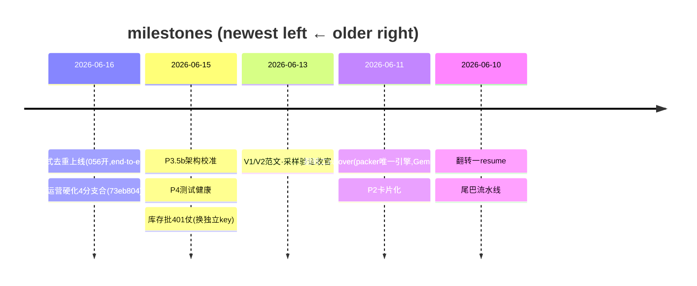

# PGC Pipeline — Forward Roadmap

**Protocol: see the `roadmap-discipline` skill** (3-layer division · single-writer · done-migrate-out · event-triggered update · milestones-not-PRs).
Position layer; PR detail → `gh pr list`; operating red-lines → `CLAUDE.md`; history → `workflow/daily-log.md`; **deep detail / design contracts / full execution log → `docs/ROADMAP.md`** (the heavy doc — this points to it).
**Visual rule:** arrows + stable → Mermaid; status / path (churns daily) → text; real grid → table.
**Last verified:** 2026-06-17 (scribe checked vs Supabase `release_candidates` + main HEAD `93f652e`).

> Mermaid color note: status is in the node LABEL (✅/▶/⚰️) + a STROKE accent only — no hard `fill:` hex (stays readable on light AND dark themes).

---

## One-line feed (fastest morning re-orient)

引擎成熟、库存满(169 条 approved ≈ 50+ package)、新 POI 基本用光 → PGC 没硬性要做的活;产品主线就剩 P5(可能是个小旋钮,Leo 倾向暂不做)。今天落地:跨范式去重 live + 运营硬化四分支合入。真瓶颈在上游素材供给 / 脱 720,**不在 PGC 手里**。

## Where the system is (journey arc)

## Cross-repo (PGC ↔ AIGC asset_platform)

> in-flight dep 就一个(AIGC P1e),用列表不画图。

- 主线 = 跨范式去重 `recipe_input → 056 → P1e`。Board: `workflow/CROSS-REPO.md`。in-flight = AIGC P1e 唯一索引**待确认**。Iron rule: board ≠ 锁,正确性在 `release_candidates` DB 约束。

## 排期 / Scheduled (decided / in progress · with path)

**跨范式去重 H1** · owner: PGC + AIGC
= 两条范式都发片,但同内容绝不双发(共享 `release_candidates` + 指纹去重)
◀ recipe_input 上线 + 056 触发器开 ✅　▶ 等 AIGC P1e 唯一索引(真"拦重复")　⏳ P1g 活体抓真 23505 → done
blocker: P1e 开没开未确认(跟踪 `workflow/CROSS-REPO.md`)

**库存生产** · owner: operator
= 720-only 政策补库存(每条强制 WaveSpeed 升级)
◀ stock_4x3 12/12 干净 ✅　▶ 暂停(库存已 169 + fresh POI 池≈干)
blocker: 上游 fresh POI 供给(非 PGC;soft-cooldown 已避免硬饿死)

## 排队 / Queued (might do · not scheduled)

- ⭐ **速度/并行研究**(现在太慢):提并行 + 提速;评估 Remotion→ffmpeg 换引擎拿更多 worker。
- ⭐ **最终输出调优**(学习+优化):视频 ① size ② 结构 ③ hook;先摸清现状实现(模块名待定)。
- 跨范式 cooldown 设计拍板(PGC 选片该不该跨范式数 usage)— Leo 决定(soft-cooldown 已解痛点)。

## 触发 / Triggered (parked · revisit only when the condition fires)

| Deferred item | Trigger condition |
|---|---|
| 脱离 720-only(原生 1080) | 素材库出现足量原生 1080 → 同时解速度长尾 + POI 荒 |
| 加新视频类型(type):120s(现仅 65s) | 想做长视频时;每店素材门槛 50→~90-100 + 对齐 AIGC |
| POI 档案信息:给 POI 补"可被脚本引用的真实信息"(治脚本瞎编价格/数字) | Leo 拍板(禁价 or 用真 facts);⚠️ facts **供给**大概率是上游(AIGC ingest 写 `poi_asset_pois`)的活,PGC 只消费 → 需跟 AIGC 谈边界 |
| 翻转三(分发数据回流) | 远期;manifest 钩子已留好 |

## History (milestone timeline — newest on LEFT)

> 全量历史细节 → `docs/ROADMAP.md` §执行日志 + `workflow/daily-log.md`。Grows leftward over time.

## projects directory

Active project detail → `workflow/projects/<name>/`(已有 pgc-batch-production / shared-poi-asset-library 等);this file holds only the global position layer.
