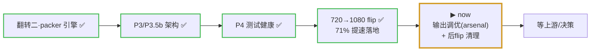
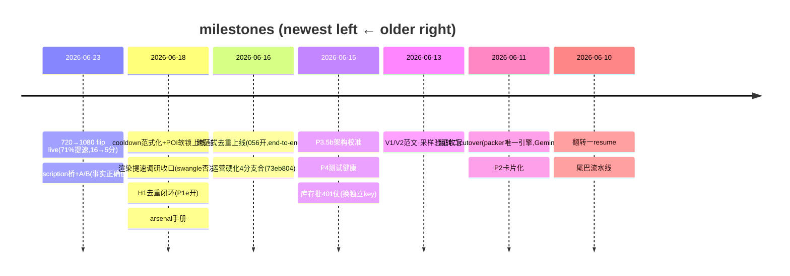

# PGC Pipeline — Forward Roadmap

**Protocol: see the `roadmap-discipline` skill** (3-layer division · single-writer · done-migrate-out · event-triggered update · milestones-not-PRs).
Position layer; PR detail → `gh pr list`; operating red-lines → `CLAUDE.md`; history → `workflow/daily-log.md`; **deep detail / design contracts / full execution log → `docs/ROADMAP.md`** (the heavy doc — this points to it).
**Visual rule:** arrows + stable → Mermaid; status / path (churns daily) → text; real grid → table.
**Last verified:** 2026-06-23 (reviewer checked vs code/Supabase/live batch; 720→1080 flip live-verified, main `281fb2a`).

> Mermaid color note: status is in the node LABEL (✅/▶/⚰️) + a STROKE accent only — no hard `fill:` hex (stays readable on light AND dark themes).

---

## One-line feed (fastest morning re-orient)

引擎全面成熟、所有大杠杆落地。**720→1080 切换 live**(min_width@1080,**71% 提速落地**,16→5分/条)+ **poi_description 事实地基 live**(A/B 证「事实正确性刹车」)+ cooldown范式化 / POI软锁 / H1去重(P1e)全上线实证。**新常态 = 1080 生产、~5分/条**;代价 = 能产店暂时变少(102存活 / 27搁浅),随上游补 1080 自愈。**当前在干:① 输出调优(arsenal 两轴总纲 + 调真 input)② 后-flip 残留清理**。真瓶颈仍在上游素材供给,**不在 PGC 手里**。

## Where the system is (journey arc)

## Cross-repo (PGC ↔ AIGC asset_platform)

- 去重 H1(`recipe_input → 056 → P1e`)✅ **闭环** · 720→1080 flip H3 ✅ **PGC 完成**(AIGC 并行同拆)。当前 in-flight = **H2 hotel_description**:PGC 桥已上线 + A/B 正面 → **球回 AIGC**(接 onboarding 自动生成)。Board: `workflow/CROSS-REPO.md`。Iron rule: board ≠ 锁,正确性在 `release_candidates` DB 约束。

## 排期 / Scheduled (decided / in progress · with path)

**跨范式去重 H1** · owner: PGC + AIGC · ✅ **闭环(2026-06-18)**
= 两条范式都发片,但同内容绝不双发(共享 `release_candidates` + 指纹去重)
recipe_input ✅ + 056 盖指纹 ✅ + **P1e 唯一索引真拦 ✅(Leo 确认开了)** + 实测 0 重复 ✅
余:P1g 活体抓真 23505 错形状(降为可观测性、不急)。

**库存生产** · owner: operator
= **1080 native 政策**(min_width@1080,不再 upscale;~5分/条)
◀ flip live smoke 2/2 干净 ✅　▶ 随时可跑(能产池 102 店;27 搁浅待上游补 1080 自愈)
blocker: 上游 fresh POI / 原生 1080 供给(非 PGC)

**POI 档案 hotel_description H2** · owner: AIGC + PGC · poi_description 列名
= 给 POI 补真实事实描述,治脚本瞎编;一列自由文本
◀ AIGC 发列 ✅ + PGC 读-转发桥 live ✅ + A/B 正面(事实正确性刹车)✅　▶ **球回 AIGC:onboarding 自动生成**
blocker: AIGC 下一棒(自动生成);详 `workflow/CROSS-REPO.md` H2

## 排队 / Queued (might do · not scheduled)

- ✅ **速度大杠杆落地**:720→1080 flip 砍掉 **71%**(16→5分/条)。render 现成最大头;再提速 = ffmpeg 换引擎 / 加核并行(**deferred**,8核被 ffmpeg ~5 线程地板堵)。详 `docs/research/render-speedup-2026-06.md`。
- ▶ **输出调优(进行中)**:`feat/arsenal-quality` worker 落「质量轴 vs 雷同轴」两轴总纲 + 调真 input(范文→format/hook→persona 接线),每步同-POI 盲评。事实地基(poi_description)已 live。
- ▶ **后-flip 残留清理(进行中)**:`chore/post-flip-cleanup` — 文档 de-720 + 死代码 + bucket 孤儿;**不删回滚基础设施**(WaveSpeed 客户端/transition 模式休眠保留)。
- ✅ **本轮全上线 + 部署**:cooldown范式化 / POI软锁 / H1去重 / poi_description桥+护栏 / 720→1080 flip — 全在 main(`281fb2a`)+ 部署 worktree `cooldownlock @ 2c03d9a`。

## 触发 / Triggered (parked · revisit only when the condition fires)

| Deferred item | Trigger condition |
|---|---|
| ~~脱离 720-only(原生 1080)~~ ✅ **PGC 完成 2026-06-23**(min_width@1080 + upscale 拆,live 实证;71% 提速落地;102存活/27搁浅) | done — AIGC 并行同拆 |
| 加新视频类型(type):120s(现仅 65s) | 想做长视频时;每店素材门槛 50→~90-100 + 对齐 AIGC |
| 翻转三(分发数据回流) | 远期;manifest 钩子已留好 |

## History (milestone timeline — newest on LEFT)

> 全量历史细节 → `docs/ROADMAP.md` §执行日志 + `workflow/daily-log.md`。Grows leftward over time.

## projects directory

Active project detail → `workflow/projects/<name>/`(已有 pgc-batch-production / shared-poi-asset-library 等);this file holds only the global position layer.
